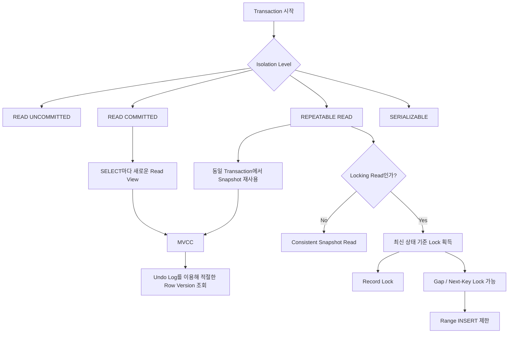

# 누누의 MySQL 트랜잭션 격리 수준
[https://youtu.be/OJs0SsbUdqw?si=DtkvqesYi6sOTN9k](https://youtu.be/OJs0SsbUdqw?si=DtkvqesYi6sOTN9k)

# 누누의 MySQL 트랜잭션 격리 수준
* toc
{:toc}

---

## MySQL 트랜잭션 격리 수준 이해하기: READ COMMITTED와 REPEATABLE READ는 무엇이 다를까?

백엔드 애플리케이션에서는 동시에 수많은 요청이 들어온다.

예를 들어 한 사용자의 포인트가 다음과 같다고 하자.

```text
Member

id = 1
point = 10,000
```

동시에 두 개의 요청이 발생한다.

```text
Request A

5,000원 사용
```

```text
Request B

7,000원 사용
```

두 요청이 아무런 제어 없이 동시에 같은 데이터를 읽고 수정한다면 예상하지 못한 결과가 만들어질 수 있다.

데이터베이스에서는 이러한 동시성 문제를 다루기 위해 **Transaction**이라는 개념을 제공한다.

그리고 여러 Transaction이 동시에 실행될 때 서로의 변경사항을 어느 정도까지 볼 수 있게 할지를 결정하는 것이 **Transaction Isolation Level**, 즉 트랜잭션 격리 수준이다.

---

## 트랜잭션이란 무엇인가?

트랜잭션은 여러 데이터베이스 작업을 하나의 논리적인 작업 단위로 묶는 것이다.

대표적인 예가 계좌이체다.

A 계좌에서 10만 원을 출금하고 B 계좌에 10만 원을 입금한다고 하자.

```text
A 계좌

-100,000원

↓

B 계좌

+100,000원
```

두 작업 중 하나만 성공하면 안 된다.

```text
A 출금 성공

B 입금 실패
```

이런 상태가 발생하면 돈이 사라진다.

따라서 다음 두 작업은 하나의 단위로 처리되어야 한다.

```text
출금 성공
+
입금 성공

→ Commit
```

또는

```text
출금 실패
또는
입금 실패

→ Rollback
```

트랜잭션은 이러한 작업의 원자성과 데이터 정합성을 관리하는 기본 단위다.

---

## ACID와 Isolation

트랜잭션을 설명할 때 일반적으로 ACID라는 네 가지 특성을 이야기한다.

| 속성          | 의미                                |
| ----------- | --------------------------------- |
| Atomicity   | 트랜잭션 작업은 모두 성공하거나 모두 실패한다         |
| Consistency | 트랜잭션 전후 데이터의 규칙이 유지되어야 한다         |
| Isolation   | 동시에 실행되는 트랜잭션이 서로 영향을 주는 정도를 제어한다 |
| Durability  | Commit된 결과는 지속되어야 한다              |

이번에 집중해서 살펴볼 부분은 **Isolation**이다.

---

## 왜 Isolation이 필요할까?

Transaction A와 Transaction B가 동시에 하나의 데이터를 수정한다고 해보자.

초기 값은 다음과 같다.

```text
score = 29
```

Transaction A가 값을 조회한다.

```sql
SELECT score
FROM member
WHERE id = 1;
```

결과는 다음과 같다.

```text
29
```

그 사이 Transaction B가 값을 변경한다.

```sql
UPDATE member
SET score = 40
WHERE id = 1;
```

이때 중요한 질문이 생긴다.

```text
Transaction B가 아직 Commit하지 않았다면

Transaction A는 40을 볼 수 있을까?
```

또 다른 질문도 있다.

```text
Transaction B가 Commit했다면

아직 끝나지 않은 Transaction A는
다시 조회했을 때 29를 봐야 할까?

아니면 40을 봐야 할까?
```

이러한 문제에 대한 정책을 결정하는 것이 Isolation Level이다.

---

## MySQL InnoDB의 트랜잭션 격리 수준

InnoDB는 네 가지 표준적인 Isolation Level을 지원한다.

```text
READ UNCOMMITTED

↓

READ COMMITTED

↓

REPEATABLE READ

↓

SERIALIZABLE
```

아래로 갈수록 일반적으로 격리 수준은 강해진다.

하지만 격리를 강하게 만드는 것은 공짜가 아니다.

동시성이 제한되거나 Lock 대기가 증가할 수 있다.

그래서 Isolation Level을 선택하는 문제는 결국 다음의 Trade-off다.

```text
데이터 일관성

VS

동시성 / Lock 비용
```

---

## 네 가지 Isolation Level

간단하게 정리하면 다음과 같다.

| Isolation Level  | 핵심 특징                                            |
| ---------------- | ------------------------------------------------ |
| READ UNCOMMITTED | 다른 Transaction의 Commit되지 않은 변경도 읽을 수 있음          |
| READ COMMITTED   | Commit된 데이터만 읽음                                  |
| REPEATABLE READ  | 같은 Transaction의 Consistent Read가 같은 Snapshot을 사용 |
| SERIALIZABLE     | 가장 강한 수준의 직렬화에 가까운 격리 제공                         |

MySQL InnoDB에서는 `REPEATABLE READ`가 기본 Isolation Level이다.

---

## READ UNCOMMITTED

`READ UNCOMMITTED`는 가장 낮은 Isolation Level이다.

다른 Transaction이 아직 Commit하지 않은 변경사항도 읽을 수 있다.

다음 상황을 생각해보자.

초기 데이터다.

```text
score = 29
```

Transaction A가 데이터를 읽는다.

```sql
START TRANSACTION;

SELECT score
FROM member
WHERE id = 1;
```

결과는 다음과 같다.

```text
29
```

이제 Transaction B가 데이터를 수정한다.

```sql
START TRANSACTION;

UPDATE member
SET score = 40
WHERE id = 1;
```

아직 Commit하지 않았다.

```text
Transaction B

score = 40

COMMIT X
```

그런데 READ UNCOMMITTED에서는 Transaction A가 다시 조회했을 때 Transaction B의 Commit되지 않은 변경을 볼 수 있다.

```text
Transaction A

첫 번째 조회
→ 29

두 번째 조회
→ 40
```

---

## Dirty Read

이러한 현상을 **Dirty Read**라고 한다.

```text
다른 Transaction에서
Commit되지 않은 값을 읽는 것
```

왜 위험할까?

Transaction A가 40이라는 값을 읽었다고 하자.

그런데 Transaction B가 문제가 생겨 Rollback한다.

```sql
ROLLBACK;
```

실제 데이터는 다시 다음과 같다.

```text
score = 29
```

하지만 Transaction A는 존재하지 않게 될 데이터인

```text
score = 40
```

을 이미 사용했다.

즉 다음과 같다.

```text
Transaction B

29 → 40

아직 Commit X


Transaction A

40을 읽음


Transaction B

Rollback


실제 값

29
```

Transaction A는 결과적으로 데이터베이스에 확정되지 않은 값을 사용한 셈이다.

---

## READ COMMITTED

`READ COMMITTED`는 이름 그대로 **Commit된 데이터만 읽을 수 있는 Isolation Level**이다.

따라서 Dirty Read를 방지할 수 있다.

초기 데이터가 다음과 같다고 하자.

```text
score = 29
```

Transaction A가 조회한다.

```sql
START TRANSACTION;

SELECT score
FROM member
WHERE id = 1;
```

결과는

```text
29
```

이다.

Transaction B가 값을 변경한다.

```sql
START TRANSACTION;

UPDATE member
SET score = 40
WHERE id = 1;
```

아직 Commit하지 않았다.

이 상태에서 Transaction A가 조회해도 Commit되지 않은 40을 읽지 않는다.

```text
Transaction A

SELECT

→ 29
```

그러면 InnoDB는 어떻게 이전 값을 보여줄 수 있을까?

여기에서 MVCC와 Undo Log가 중요해진다.

---

## InnoDB의 MVCC

MySQL InnoDB를 이해할 때 Isolation Level과 함께 알아야 하는 핵심 개념이 **MVCC**, Multi-Version Concurrency Control이다.

직역하면

```text
Multi Version

여러 버전의 데이터를 이용한

Concurrency Control

동시성 제어
```

라고 볼 수 있다.

핵심 아이디어는 단순하다.

```text
Reader가 데이터를 읽는다고 해서

Writer를 무조건 막지 않고

필요한 데이터 Version을 보여준다.
```

즉 모든 읽기 작업을 Lock으로 직렬화하는 것이 아니라 데이터의 여러 Version을 이용해 Reader와 Writer의 동시성을 높인다.

---

## Undo Log

InnoDB에서는 데이터가 변경될 때 이전 Version을 재구성할 수 있도록 Undo 정보가 사용된다.

예를 들어

```text
29

↓

40
```

으로 변경되었다고 하자.

개념적으로 다음과 같은 Version 관계를 생각할 수 있다.

```text
현재 Version

40

↓

이전 Version

29
```

다른 Transaction이 어떤 Version을 볼 수 있는지는 현재 Transaction의 Read View와 Isolation Level 등에 따라 결정된다.

따라서 Undo Log를 단순히

```text
Rollback할 때 사용하는 데이터
```

라고만 이해하면 부족하다.

MVCC 기반의 Consistent Read에서도 매우 중요한 역할을 한다.

---

## READ COMMITTED에서는 SELECT마다 새로운 Snapshot을 본다

READ COMMITTED에서 중요한 특징이 하나 있다.

**각 Consistent Read가 새로운 Snapshot을 사용한다.**

Transaction A가 첫 번째 SELECT를 실행한다.

```text
현재 Commit된 값

29
```

따라서

```text
SELECT #1

→ 29
```

가 반환된다.

그 뒤 Transaction B가 값을 변경하고 Commit한다.

```text
Transaction B

29 → 40

COMMIT
```

이제 Transaction A가 다시 SELECT한다.

READ COMMITTED에서는 두 번째 SELECT가 새로운 Snapshot을 만든다.

따라서

```text
SELECT #2

→ 40
```

을 볼 수 있다.

MySQL 공식 문서에서도 READ COMMITTED는 같은 트랜잭션 안에서도 각각의 Consistent Read가 새로운 Snapshot을 생성한다고 설명한다.

---

## Non-Repeatable Read

이제 다음 상황이 만들어졌다.

```text
Transaction A

SELECT #1
→ 29


Transaction B

UPDATE
→ 40

COMMIT


Transaction A

SELECT #2
→ 40
```

Transaction A는 종료되지 않았다.

그런데 같은 Row를 같은 조건으로 읽었는데 값이 달라졌다.

이 현상을 **Non-Repeatable Read**라고 한다.

```text
같은 Transaction

같은 Row 조회

↓

첫 번째 값과
두 번째 값이 다름
```

즉 반복해서 읽었는데 같은 값을 보장받을 수 없다.

---

## READ COMMITTED의 특징

READ COMMITTED를 간단히 정리하면 다음과 같다.

```text
Dirty Read

방지
```

하지만

```text
Non-Repeatable Read

가능
```

하다.

왜냐하면 각 SELECT가 최신 Commit 상태를 기준으로 자신의 Snapshot을 만들 수 있기 때문이다.

---

## REPEATABLE READ

다음은 `REPEATABLE READ`다.

이름 그대로 같은 Transaction에서 반복적으로 읽었을 때 일관된 결과를 제공하는 것을 목표로 한다.

MySQL InnoDB의 기본 Isolation Level도 REPEATABLE READ다.

READ COMMITTED와 가장 중요한 차이는 Snapshot의 범위다.

---

## REPEATABLE READ에서는 Snapshot을 재사용한다

일반적인 Consistent Read에서 첫 번째 조회가 수행된다고 하자.

```sql
START TRANSACTION;

SELECT score
FROM member
WHERE id = 1;
```

결과가

```text
29
```

라고 하자.

이 시점에 Transaction의 Read View가 만들어진다.

이후 Transaction B가 값을 변경한다.

```sql
UPDATE member
SET score = 40
WHERE id = 1;

COMMIT;
```

실제 최신 Commit 값은 40이다.

하지만 Transaction A의 일반 SELECT는 기존 Snapshot을 기준으로 데이터를 읽는다.

```sql
SELECT score
FROM member
WHERE id = 1;
```

결과는 다시

```text
29
```

이다.

---

## READ COMMITTED와 REPEATABLE READ의 핵심 차이

가장 중요한 차이를 비교하면 다음과 같다.

### READ COMMITTED

```text
SELECT #1

↓

Snapshot A


다른 Transaction Commit


SELECT #2

↓

Snapshot B
```

### REPEATABLE READ

```text
SELECT #1

↓

Snapshot A


다른 Transaction Commit


SELECT #2

↓

Snapshot A
```

즉 REPEATABLE READ에서는 동일 Transaction의 일반적인 Consistent Read가 첫 번째 Read에서 만들어진 Snapshot을 재사용한다.

---

## Read View는 단순히 Transaction ID 하나를 비교하는 것이 아니다

REPEATABLE READ를 설명할 때 흔히

```text
내 Transaction ID보다
작은 Transaction의 데이터만 읽는다.
```

정도로 단순화하기도 한다.

개념을 처음 이해할 때는 도움이 될 수 있지만 실제 MVCC 동작은 더 복잡하다.

InnoDB는 Read View를 이용해 어떤 Transaction이

```text
Snapshot 생성 시점에

이미 Commit되었는가?

아직 진행 중이었는가?

현재 Transaction 자신의 변경인가?
```

등을 판단하고 적절한 Row Version을 선택한다.

따라서 더 정확한 핵심은 다음과 같다.

```text
REPEATABLE READ

↓

Transaction의 Consistent Snapshot을 기준으로

현재 Transaction에서 볼 수 있는
Row Version을 결정한다.
```

---

## REPEATABLE READ는 Non-Repeatable Read를 막는다

앞선 예제를 다시 보면

```text
Transaction A

SELECT
→ 29


Transaction B

UPDATE
→ 40

COMMIT


Transaction A

SELECT
→ 29
```

이다.

같은 Transaction 안에서 같은 Row를 반복 조회해도 Snapshot이 유지되기 때문에 같은 결과를 볼 수 있다.

따라서 일반적인 Consistent Read에서는 Non-Repeatable Read가 방지된다.

---

## Phantom Read란 무엇인가?

이번에는 Row의 값이 변하는 것이 아니라 **조회되는 Row의 개수가 달라지는 상황**을 생각해보자.

초기 데이터가 다음과 같다.

```text
id    name
1     Alice
```

Transaction A가 다음 Query를 실행한다.

```sql
SELECT *
FROM member
WHERE id >= 1;
```

결과는 한 건이다.

```text
1 Alice
```

그 사이 Transaction B가 새로운 Row를 추가한다.

```sql
INSERT INTO member(id, name)
VALUES (2, 'Brown');

COMMIT;
```

Transaction A가 다시 같은 Query를 실행했을 때

```text
1 Alice
2 Brown
```

처럼 새로운 Row가 나타난다면 처음에는 없었던 Row가 유령처럼 등장한 것이다.

이를 **Phantom Read**라고 한다.

MySQL 문서도 같은 Query를 두 번 실행했을 때 두 번째 결과에 새로운 Row가 등장하는 현상을 Phantom 문제로 설명한다.

---

## MySQL InnoDB의 REPEATABLE READ는 조금 특별하다

SQL 표준 수준의 설명만 외우면 흔히 다음 표를 접한다.

```text
REPEATABLE READ

Dirty Read X
Non-Repeatable Read X
Phantom Read 가능
```

하지만 MySQL InnoDB에서는 실제 구현을 조금 더 구체적으로 봐야 한다.

일반적인 **Non-Locking Consistent Read**에서는 동일 Transaction이 같은 Snapshot을 사용한다.

따라서 다른 Transaction이 중간에 Row를 INSERT하고 Commit하더라도 기존 Snapshot의 일반 SELECT에는 그 Row가 보이지 않는다.

즉 단순히

```text
MySQL REPEATABLE READ에서는
무조건 Phantom Read가 발생한다.
```

라고 설명하면 정확하지 않다.

---

## Consistent Read와 Locking Read를 구분해야 한다

MySQL InnoDB를 이해할 때 가장 중요한 구분 중 하나다.

일반 SELECT는 보통 **Consistent Non-Locking Read**로 동작한다.

```sql
SELECT *
FROM member
WHERE id >= 1;
```

반면 다음 Query는 Locking Read다.

```sql
SELECT *
FROM member
WHERE id >= 1
FOR UPDATE;
```

둘은 완전히 같은 방식으로 데이터를 읽지 않는다.

---

## 일반 SELECT는 Snapshot을 읽는다

REPEATABLE READ에서 일반 SELECT는 Read View를 기준으로 Snapshot을 읽는다.

```text
Transaction A

SELECT
→ Snapshot


Transaction B

INSERT
COMMIT


Transaction A

SELECT
→ 기존 Snapshot
```

따라서 Transaction B가 새로 추가한 Row가 두 번째 SELECT에 바로 보이지 않는다.

---

## SELECT FOR UPDATE는 목적이 다르다

`SELECT ... FOR UPDATE`는 단순히 과거의 Snapshot을 보기 위한 Query가 아니다.

조회한 데이터를 이어서 변경하려고 하기 때문에 실제로 해당 Row와 Index Record에 Lock을 걸어야 한다.

```sql
SELECT *
FROM member
WHERE id >= 1
FOR UPDATE;
```

과거 Undo Version에는 실제 Lock을 걸 수 없다.

따라서 Locking Read는 최신 상태를 기준으로 Lock을 획득하는 방식으로 동작한다.

MySQL 공식 문서도 과거 Record Version은 Lock할 수 없으며, `FOR UPDATE`는 실제 Index Record에 Lock을 획득한다고 설명한다.

---

## 같은 Transaction에서 일반 SELECT와 FOR UPDATE의 결과가 달라질 수 있다

이 부분이 MySQL REPEATABLE READ에서 특히 헷갈리는 지점이다.

Transaction A가 일반 SELECT를 수행한다.

```sql
SELECT *
FROM member
WHERE id >= 1;
```

Snapshot 결과가 다음과 같다.

```text
1 Alice
```

Transaction B가 새 Row를 추가하고 Commit한다.

```text
2 Brown
```

Transaction A가 다시 일반 SELECT하면 기존 Snapshot을 사용한다.

```text
1 Alice
```

하지만 이후 Locking Read를 수행한다.

```sql
SELECT *
FROM member
WHERE id >= 1
FOR UPDATE;
```

Locking Read는 최신 상태를 대상으로 Lock을 잡아야 하기 때문에 Snapshot Read와 다른 결과를 볼 수 있다.

MySQL 공식 문서도 REPEATABLE READ Transaction 안에서 Non-Locking SELECT와 Locking Statement를 혼합하면 서로 다른 데이터베이스 상태를 볼 수 있어 이해하기 어려운 결과가 만들어질 수 있다고 경고한다.

---

## 그렇다면 Phantom을 어떻게 막을까?

Locking Read에서 새로운 Row가 중간에 들어오는 것을 막아야 하는 경우가 있다.

예를 들어 다음 데이터를 조회하고 이후 변경하려고 한다.

```sql
SELECT *
FROM member
WHERE id > 100
FOR UPDATE;
```

현재 Row가 다음과 같다고 하자.

```text
90

102
```

Query 조건은

```text
id > 100
```

이다.

현재 조건에 맞는 Row는 102다.

그런데 다른 Transaction이 다음 데이터를 INSERT한다면 어떻게 될까?

```text
101
```

기존 Row 102만 Lock하는 것으로는 101이라는 새로운 Row의 삽입을 막을 수 없다.

그래서 InnoDB에서는 **Gap Lock과 Next-Key Lock**이라는 개념이 등장한다.

---

## Gap Lock

Gap Lock은 Row 자체가 아니라 Index Record 사이의 **공간**에 대한 Lock이다.

예를 들어 Index가 다음과 같다고 하자.

```text
90

↓

Gap

↓

102
```

`id > 100` 범위를 Lock해야 한다면 현재 존재하는 Row만 Lock해서는 부족하다.

```text
102 Lock
```

만 해서는

```text
101 INSERT
```

가 가능하기 때문이다.

따라서 Row가 존재하지 않는 공간까지 보호할 필요가 있다.

```text
90

[ Gap Lock ]

102
```

---

## Next-Key Lock

InnoDB의 Phantom 방지에서 더 정확한 핵심은 **Next-Key Locking**이다.

Next-Key Lock은

```text
Record Lock

+

해당 Record 앞의 Gap Lock
```

을 결합한 형태다.

MySQL 공식 문서에서는 InnoDB가 Phantom을 방지하기 위해 Index Record Lock과 Gap Lock을 조합하는 Next-Key Locking을 사용한다고 설명한다.

---

## 범위 검색과 Next-Key Lock

다음 Query를 생각해보자.

```sql
SELECT *
FROM member
WHERE id > 100
FOR UPDATE;
```

InnoDB는 조건에 해당하는 Index 범위를 Scan한다.

그리고 필요한 범위의 Record와 Gap에 Lock을 설정한다.

개념적으로 다음과 같다.

```text
90

[Locked Gap]

102

[Locked Gap]

+∞
```

다른 Transaction이 다음을 실행한다.

```sql
INSERT INTO member(id, name)
VALUES (101, 'Brown');
```

101은 Lock된 Gap에 들어가야 하기 때문에 대기할 수 있다.

```text
Transaction B

INSERT 101

↓

Gap / Next-Key Lock 충돌

↓

WAIT
```

Transaction A가 Commit하거나 Rollback해야 INSERT가 진행될 수 있다.

---

## 모든 SELECT가 Gap Lock을 거는 것은 아니다

여기에서 매우 중요한 부분이 있다.

다음 일반 SELECT가 있다고 하자.

```sql
SELECT *
FROM member
WHERE id > 100;
```

REPEATABLE READ의 일반 Consistent Read는 MVCC Snapshot을 이용한다.

조회했다고 해서 다른 Transaction의 INSERT를 무조건 막는 것은 아니다.

반면

```sql
SELECT *
FROM member
WHERE id > 100
FOR UPDATE;
```

처럼 Locking Read를 수행하면 범위 조건과 Index 사용 방식에 따라 Record Lock, Gap Lock 또는 Next-Key Lock이 발생할 수 있다.

따라서

```text
REPEATABLE READ

=

모든 SELECT에서 Gap Lock
```

이라고 이해하면 안 된다.

---

## Unique Index 단건 조회에서는 Lock 범위도 달라진다

다음 Query를 생각해보자.

```sql
SELECT *
FROM member
WHERE id = 1
FOR UPDATE;
```

`id`가 Unique Index이고 정확히 하나의 Row를 검색하는 조건이라면 InnoDB는 일반적인 범위 검색처럼 모든 주변 Gap을 Lock할 필요가 없다.

반면 다음과 같은 Range Query는 다르다.

```sql
SELECT *
FROM member
WHERE score >= 80
FOR UPDATE;
```

조회 과정에서 Scan하는 Index 범위에 대해 더 넓은 Lock이 필요할 수 있다.

MySQL 공식 문서에서도 Unique Index를 Unique 조건으로 검색하는 경우와 범위 검색의 Lock 방식이 다르다고 명시한다.

즉 Lock 범위를 이해하려면 Isolation Level만 볼 것이 아니라 반드시

```text
Index

WHERE 조건

Unique 여부

Range Scan 여부
```

까지 함께 봐야 한다.

---

## SERIALIZABLE

`SERIALIZABLE`은 네 Isolation Level 중 가장 강한 수준이다.

목표는 여러 Transaction이 동시에 실행되더라도 논리적으로 순차 실행된 것과 유사한 결과를 제공하는 것이다.

```text
Transaction A

↓

Transaction B

↓

Transaction C
```

처럼 보이게 만드는 방향이다.

그만큼 동시성에 대한 제약이 커질 수 있다.

그래서 일반적인 고트래픽 웹 서비스의 모든 Transaction에 무조건 적용하기보다는 강한 일관성이 필요한 특별한 상황에서 신중하게 선택해야 한다.

---

## 세 가지 대표적인 이상 현상

Isolation Level을 공부할 때 흔히 세 가지 현상을 비교한다.

### Dirty Read

```text
Commit되지 않은 값을 읽음
```

### Non-Repeatable Read

```text
같은 Row를 두 번 읽었는데

값이 달라짐
```

### Phantom Read

```text
같은 범위를 두 번 조회했는데

Row가 나타나거나 사라짐
```

차이를 이해하는 것이 중요하다.

---

## Non-Repeatable Read와 Phantom Read 차이

둘을 헷갈리기 쉽다.

Non-Repeatable Read는 보통 **기존 Row의 값이 달라지는 문제**에 초점을 맞춘다.

```text
첫 조회

id = 1
score = 29


두 번째 조회

id = 1
score = 40
```

같은 Row인데 값이 달라졌다.

Phantom Read는 **조건에 맞는 Row 집합이 달라지는 문제**다.

```text
첫 조회

id = 1


두 번째 조회

id = 1
id = 2
```

새로운 Row가 등장했다.

---

## 격리 수준을 표로 정리하면

개념적인 SQL 표준 관점에서는 다음처럼 정리할 수 있다.

| Isolation Level  | Dirty Read | Non-Repeatable Read | Phantom Read |
| ---------------- | ---------: | ------------------: | -----------: |
| READ UNCOMMITTED |         가능 |                  가능 |           가능 |
| READ COMMITTED   |         방지 |                  가능 |           가능 |
| REPEATABLE READ  |         방지 |                  방지 |       표준상 가능 |
| SERIALIZABLE     |         방지 |                  방지 |           방지 |

하지만 MySQL InnoDB에서는 구현 특성을 함께 봐야 한다.

특히 REPEATABLE READ의 일반 Consistent Read는 같은 Snapshot을 사용하고, Locking Read에서는 Next-Key Lock을 통해 Phantom 삽입을 제어한다.

따라서 실무에서는 단순 표만 외우는 것보다

```text
현재 Query가

Snapshot Read인가?

Locking Read인가?

어떤 Index를 Scan하는가?
```

를 함께 보는 것이 훨씬 중요하다.

---

## READ COMMITTED에서는 Gap Lock이 완전히 사라질까?

READ COMMITTED에서는 검색과 Index Scan을 위한 Gap Lock이 크게 줄어든다.

MySQL 공식 문서에서도 READ COMMITTED에서는 검색 및 Index Scan에 대한 Gap Locking이 비활성화되고, Foreign Key Constraint와 Duplicate Key Checking 같은 일부 상황에는 Gap Lock이 사용될 수 있다고 설명한다.

따라서 다음처럼 표현하는 것이 더 정확하다.

```text
READ COMMITTED에서는
Gap Lock을 절대 사용하지 않는다.
```

가 아니라

```text
READ COMMITTED에서는

일반적인 검색과 Scan에서
Gap Lock 사용 범위가 크게 줄어든다.
```

이다.

---

## READ COMMITTED가 동시성에서 유리할 수 있는 이유

REPEATABLE READ에서 범위 Locking Read가 발생한다고 생각해보자.

```sql
SELECT *
FROM reservation
WHERE reservation_date = '2026-09-18'
FOR UPDATE;
```

Index 범위를 보호하기 위해 Next-Key Lock이 설정될 수 있다.

다른 Transaction이 같은 범위에 데이터를 추가하려고 한다.

```sql
INSERT INTO reservation (...)
VALUES (...);
```

그러면 Lock 대기가 발생할 수 있다.

```text
Transaction A

Range Lock


Transaction B

INSERT

↓

WAIT
```

Lock 범위가 넓어질수록 동시성이 낮아질 수 있다.

READ COMMITTED에서는 이러한 Gap Lock 범위가 줄어들기 때문에 특정 Workload에서 Lock 경합과 Deadlock 가능성을 낮추는 데 도움이 될 수 있다.

MySQL도 Deadlock을 줄이는 방법 중 하나로 상황에 따라 READ COMMITTED 같은 낮은 Isolation Level 사용을 고려할 수 있다고 설명한다. 하지만 Deadlock이 완전히 사라진다는 의미는 아니다.

---

## REPEATABLE READ에서는 왜 Deadlock 가능성이 커질 수 있을까?

다음과 같은 두 Transaction이 있다고 하자.

Transaction A가 어떤 범위를 Lock한다.

```text
Range A
Lock
```

Transaction B도 다른 범위를 Lock한다.

```text
Range B
Lock
```

이후 A가 B가 가진 범위에 접근한다.

```text
A

↓

B Lock 대기
```

B도 A가 가진 범위에 접근한다.

```text
B

↓

A Lock 대기
```

그러면 다음 상태가 된다.

```text
A waits for B

B waits for A
```

이것이 Deadlock이다.

Gap Lock이나 Next-Key Lock은 보호하는 범위를 넓힐 수 있기 때문에 잘못된 Query와 Index 설계가 결합되면 Lock 경합 가능성을 높일 수 있다.

하지만

```text
REPEATABLE READ
=
항상 Deadlock이 많다.
```

라고 단정할 수는 없다.

Deadlock은 다음 요소에도 크게 영향을 받는다.

```text
Query 실행 순서

Index 설계

Transaction 길이

조회 범위

Update 순서

Lock 획득 순서
```

---

## Index가 Isolation과 연결되는 이유

Transaction Isolation을 공부하다 보면 결국 Index까지 연결된다.

왜냐하면 InnoDB의 Row Lock은 실제로 Index Record를 기준으로 동작하기 때문이다.

예를 들어 다음 Query가 있다고 하자.

```sql
UPDATE member
SET status = 'ACTIVE'
WHERE email = 'user@example.com';
```

`email` Index가 없다면 많은 Record를 Scan해야 할 수 있다.

Scan 범위가 커지면 Lock 대상도 커질 가능성이 있다.

반면 적절한 Index가 있다면 필요한 Record를 훨씬 정확하게 찾을 수 있다.

```text
좋은 Index

↓

Scan 범위 감소

↓

Lock 범위 감소 가능

↓

Lock 경합 감소
```

MySQL 역시 Deadlock을 줄이는 방법으로 적절한 Index를 사용해 Query가 더 적은 Index Record를 Scan하도록 하는 것을 권장한다.

즉 트랜잭션 문제를 해결할 때 Isolation Level만 변경하는 것은 항상 좋은 해결책이 아니다.

---

## Transaction은 짧게 유지하는 것이 중요하다

다음 코드가 있다고 생각해보자.

```java
@Transactional
public void reserve() {

    Reservation reservation =
            reservationRepository.findWithLock(...);

    externalPaymentApi.call();

    externalNotificationApi.call();

    reservation.confirm();
}
```

Lock을 획득한 상태에서 외부 API를 여러 개 호출한다.

외부 API가 3초 걸린다면 Transaction도 오랫동안 유지될 수 있다.

```text
DB Lock

↓

외부 API 3초

↓

외부 API 2초

↓

Commit
```

그동안 다른 Transaction은 Lock을 기다릴 수 있다.

Isolation Level이 무엇이든 긴 Transaction은 동시성에 부담을 준다.

따라서 실제 성능 문제에서는

```text
Isolation Level이 너무 높은가?
```

뿐 아니라

```text
Transaction이 너무 긴가?

외부 I/O가 Transaction 안에 있는가?

Lock을 너무 일찍 획득하는가?
```

도 확인해야 한다.

---

## 웹 서비스라면 무조건 READ COMMITTED가 좋을까?

여기에서 가장 조심해야 할 결론이 있다.

```text
웹 서비스

→ READ COMMITTED가 정답
```

처럼 하나의 Isolation Level을 모든 시스템에 적용하는 것은 적절하지 않다.

READ COMMITTED는 높은 동시성이 중요한 Workload에서 좋은 선택이 될 수 있다.

반면 REPEATABLE READ의 동일 Snapshot이 필요한 작업도 있다.

MySQL 자체도 InnoDB의 기본 격리 수준을 REPEATABLE READ로 제공하고 있으며, READ COMMITTED는 Locking Overhead를 줄이고 더 최신 Snapshot을 읽고 싶은 상황에서 선택할 수 있는 별도의 Trade-off다.

결국 요구사항을 보고 결정해야 한다.

---

## READ COMMITTED를 고려할 수 있는 경우

예를 들어 다음 특성을 가진 서비스가 있다고 하자.

```text
동시에 많은 Request가 들어온다.

짧은 Transaction이 많다.

최신 Commit 데이터를 보는 것이 중요하다.

같은 Transaction에서
동일 Snapshot을 유지할 필요가 크지 않다.

범위 Lock 경합을 줄이는 것이 중요하다.
```

이런 Workload에서는 READ COMMITTED가 적절할 수 있다.

---

## REPEATABLE READ를 고려할 수 있는 경우

반대로 다음 요구가 중요할 수 있다.

```text
하나의 Transaction 안에서

여러 번 조회하더라도

일관된 Snapshot을 보고 싶다.
```

예를 들어 여러 Query 결과가 동일한 시점의 데이터 상태를 기준으로 분석되어야 할 수 있다.

이러한 경우 REPEATABLE READ의 Consistent Snapshot이 장점이 될 수 있다.

---

## Isolation Level보다 비즈니스 동시성 제어가 더 중요한 경우도 있다

Isolation Level을 높였다고 모든 동시성 문제가 해결되는 것도 아니다.

예를 들어 마지막 재고 한 개에 동시에 주문이 들어온다고 하자.

```text
stock = 1
```

Transaction A가 읽는다.

```text
stock = 1
```

Transaction B도 읽는다.

```text
stock = 1
```

둘 다 주문 가능하다고 판단한다.

이런 문제는 단순히

```text
REPEATABLE READ니까 안전하다.
```

라고 해결되지 않을 수 있다.

상황에 따라 다음과 같은 별도의 전략이 필요하다.

```text
Pessimistic Lock

Optimistic Lock

Atomic UPDATE

Unique Constraint

조건부 UPDATE

분산 환경이라면 별도 동시성 제어
```

즉 Isolation Level과 Business Concurrency Control을 같은 것으로 생각하면 안 된다.

---

## Lost Update도 생각해야 한다

격리 수준을 공부할 때 Dirty Read, Non-Repeatable Read, Phantom Read만 외우기 쉽다.

하지만 실제 서비스에서는 **Lost Update**도 매우 중요하다.

초기 값은 다음과 같다.

```text
stock = 10
```

Transaction A가 읽는다.

```text
10
```

Transaction B도 읽는다.

```text
10
```

A가 1개를 차감한다.

```text
10 - 1

→ 9
```

B도 자신이 읽었던 10을 기준으로 1개를 차감한다.

```text
10 - 1

→ 9
```

실제로는 두 번 감소했으므로 8이 되어야 한다.

그런데 최종 값은

```text
9
```

가 될 수 있다.

한 Transaction의 변경이 다른 Transaction에 의해 덮어써진 것이다.

이런 문제를 해결하려면 Isolation Level만 외우는 것이 아니라 실제 Update Query와 Lock 전략을 함께 설계해야 한다.

---

## SELECT FOR UPDATE는 언제 사용할까?

다음 로직을 생각해보자.

```text
현재 재고 조회

↓

재고가 있으면

↓

재고 감소
```

조회 이후 같은 Row를 변경해야 하고 그 사이 다른 Transaction의 변경을 막아야 한다면 Locking Read를 고려할 수 있다.

```sql
SELECT stock
FROM product
WHERE id = 1
FOR UPDATE;
```

해당 Transaction이 끝날 때까지 관련 Row를 다른 Transaction이 수정하지 못하도록 보호할 수 있다.

하지만 강력한 만큼 비용이 있다.

```text
Lock Wait

Deadlock

Transaction 지연

동시성 감소
```

그래서

```text
동시성 문제 발생

↓

무조건 FOR UPDATE
```

보다는 왜 Lock이 필요한지 먼저 판단해야 한다.

---

## Isolation Level 확인하기

MySQL에서는 현재 Isolation Level을 확인할 수 있다.

```sql
SELECT @@transaction_isolation;
```

예를 들어 결과가 다음과 같을 수 있다.

```text
REPEATABLE-READ
```

현재 Session의 격리 수준을 변경하려면 상황에 따라 다음과 같이 설정할 수 있다.

```sql
SET SESSION TRANSACTION ISOLATION LEVEL READ COMMITTED;
```

이후 새 Transaction에서 해당 격리 정책을 적용할 수 있다.

운영 환경에서는 Application Connection Pool과 Session 설정의 관계도 함께 확인해야 한다.

---

## Spring의 @Transactional과 Isolation Level

Spring에서는 `@Transactional`에서도 Isolation Level을 지정할 수 있다.

예를 들어 다음과 같다.

```java
@Transactional(
        isolation = Isolation.READ_COMMITTED
)
public void reserve() {
    // ...
}
```

REPEATABLE READ를 명시할 수도 있다.

```java
@Transactional(
        isolation = Isolation.REPEATABLE_READ
)
public void reserve() {
    // ...
}
```

하지만 모든 Service Method마다 무작정 Isolation Level을 지정하는 것은 좋은 접근이 아니다.

먼저 데이터베이스 기본값과 서비스의 동시성 요구사항을 확인하는 것이 중요하다.

```text
Database 기본 Isolation

↓

Business 요구사항

↓

동시성 문제 분석

↓

필요한 경우 Isolation 변경
```

---

## Spring에서 DEFAULT는 무엇을 의미할까?

다음과 같이 많이 사용한다.

```java
@Transactional
public void order() {
}
```

Isolation을 지정하지 않았다.

이 경우 Spring의 기본 Isolation 설정은 `DEFAULT`다.

```text
Isolation.DEFAULT
```

이는

```text
Spring이 무조건
READ COMMITTED를 사용한다.
```

라는 뜻이 아니다.

기본적으로 사용하는 데이터베이스와 JDBC Connection의 Isolation 정책을 따르는 방향이다.

따라서 MySQL InnoDB를 기본 설정으로 사용하고 있다면 실제 Database Isolation이 REPEATABLE READ일 수 있다.

---

## 전체 동작 구조

MySQL InnoDB에서 Transaction Isolation과 MVCC를 연결하면 다음처럼 이해할 수 있다.



여기에서 중요한 것은 REPEATABLE READ 하나만 보고 동작을 판단해서는 안 된다는 것이다.

```text
Isolation Level

+

Read 종류

+

Index

+

Query 조건

+

Transaction 범위
```

를 함께 봐야 한다.

---

## 실무에서 Isolation 문제를 분석하는 순서

동시성 문제가 발생했을 때 바로 Isolation Level부터 변경하는 것보다 다음 순서로 확인하는 것이 좋다.

### 1. 현재 Isolation Level 확인

```sql
SELECT @@transaction_isolation;
```

### 2. 일반 SELECT인지 Locking Read인지 확인

```sql
SELECT ...
```

인지

```sql
SELECT ... FOR UPDATE
```

인지 구분한다.

### 3. 어떤 Index를 사용하는지 확인

```sql
EXPLAIN
SELECT ...
```

을 이용해 Scan 범위를 살펴본다.

### 4. Transaction 범위를 확인

```text
Transaction이 너무 오래 유지되고 있지 않은가?
```

### 5. Lock 획득 순서를 확인

여러 Transaction이 서로 다른 순서로 Row를 Lock하고 있지 않은지 확인한다.

### 6. Business 요구사항을 확인

```text
반드시 같은 Snapshot이어야 하는가?

최신 Commit 값이 더 중요한가?

동시에 수정하는 것을 막아야 하는가?
```

### 7. 그다음 Isolation Level 변경을 검토

Isolation Level은 문제를 해결하는 여러 수단 중 하나다.

---

## 격리 수준을 선택할 때 생각해야 할 10가지

### 1. 같은 Transaction에서 동일 Snapshot이 필요한가?

필요하다면 REPEATABLE READ의 특성이 유용할 수 있다.

### 2. 항상 최신 Commit 데이터를 보는 것이 중요한가?

READ COMMITTED를 검토할 수 있다.

### 3. Range Locking Read가 많은가?

Gap 또는 Next-Key Lock의 영향을 확인해야 한다.

### 4. Transaction이 긴가?

Isolation Level보다 Transaction Length가 더 큰 문제가 될 수 있다.

### 5. 적절한 Index가 있는가?

Index가 부적절하면 Scan과 Lock 범위가 커질 수 있다.

### 6. FOR UPDATE를 정말 사용해야 하는가?

불필요한 Locking Read는 동시성을 떨어뜨린다.

### 7. Deadlock이 반복되는가?

Query 순서와 Lock 획득 순서부터 분석해야 한다.

### 8. Lost Update 문제가 있는가?

Optimistic Lock이나 조건부 UPDATE가 더 적절할 수도 있다.

### 9. 조회 정합성과 쓰기 동시성을 구분했는가?

Snapshot을 유지하는 문제와 동시에 쓰는 문제는 동일하지 않다.

### 10. 측정한 뒤 결정했는가?

Isolation Level은 성능과 정합성의 Trade-off이므로 실제 Workload를 측정하면서 선택해야 한다.

---

## 정리

트랜잭션 격리 수준은 동시에 실행되는 Transaction들이 서로의 변경사항을 어느 정도까지 볼 수 있게 할지를 결정하는 정책이다.

MySQL InnoDB에서는 네 가지 Isolation Level을 제공한다.

```text
READ UNCOMMITTED

READ COMMITTED

REPEATABLE READ

SERIALIZABLE
```

READ UNCOMMITTED에서는 Commit되지 않은 데이터까지 읽을 수 있기 때문에 Dirty Read가 발생할 수 있다.

```text
Commit되지 않은 값

↓

다른 Transaction이 조회

↓

Dirty Read
```

READ COMMITTED에서는 Commit된 데이터만 읽는다.

하지만 각 Consistent Read가 새로운 Snapshot을 사용하기 때문에 같은 Transaction 안에서도 다른 Transaction이 Commit한 변경사항을 볼 수 있다.

```text
SELECT #1
→ 29

다른 Transaction Commit

SELECT #2
→ 40
```

이것이 Non-Repeatable Read로 이어질 수 있다.

REPEATABLE READ에서는 일반적인 Consistent Read가 같은 Snapshot을 이용한다.

```text
SELECT #1

↓

Snapshot A


다른 Transaction Commit


SELECT #2

↓

Snapshot A
```

따라서 같은 Transaction에서 반복되는 일반 SELECT는 일관된 결과를 볼 수 있다.

여기에서 MySQL InnoDB를 이해하려면 **Consistent Read와 Locking Read를 반드시 구분해야 한다.**

```sql
SELECT ...
```

는 Snapshot을 사용하는 일반적인 Consistent Read이고,

```sql
SELECT ... FOR UPDATE
```

는 실제 최신 데이터에 Lock을 획득해야 하는 Locking Read다.

Range Locking Read에서는 다른 Transaction의 INSERT를 제어하기 위해 Gap Lock과 Next-Key Lock이 사용될 수 있다.

```text
Record Lock

+

Gap Lock

↓

Next-Key Lock
```

이를 통해 범위 내에 새로운 Row가 들어오는 것을 막을 수 있다.

하지만 Lock 범위가 넓어지면

```text
Lock Wait

Deadlock 가능성

동시성 감소
```

라는 비용도 발생한다.

그래서

```text
웹 서비스니까
READ COMMITTED
```

또는

```text
MySQL 기본값이니까
REPEATABLE READ
```

처럼 선택해서는 안 된다.

보다 중요한 질문은 다음과 같다.

```text
우리 서비스에서는

같은 Transaction에서
동일 Snapshot이 필요한가?

최신 Commit 데이터를 보는 것이 중요한가?

Locking Read가 많은가?

Range Query가 많은가?

Transaction이 얼마나 긴가?

동시에 수정되는 데이터는 무엇인가?
```

그리고 실제 동시성 문제가 발생하면 Isolation Level만 볼 것이 아니라

```text
Isolation Level

+

MVCC

+

Read View

+

Undo Log

+

Index

+

Record Lock

+

Gap Lock

+

Next-Key Lock

+

Transaction Boundary
```

를 함께 확인해야 한다.

결국 Isolation Level은 단순히 네 개의 이름을 외우는 주제가 아니다.

**동시에 실행되는 Transaction에게 어떤 데이터를 보여주고, 어떤 데이터에 Lock을 걸며, 그 대가로 어느 정도의 동시성을 허용할 것인가를 결정하는 데이터베이스의 동시성 제어 전략**이다.

### 한 줄 요약

**MySQL InnoDB의 트랜잭션 격리 수준은 MVCC·Read View·Undo Log와 Lock을 조합해 동시 Transaction의 데이터 가시성을 제어하며, READ COMMITTED와 REPEATABLE READ 중 무엇이 적절한지는 단순한 성능 비교가 아니라 Snapshot 일관성, Lock 범위, Index, Transaction 길이와 비즈니스 동시성 요구사항을 함께 고려해 결정해야 한다.**
