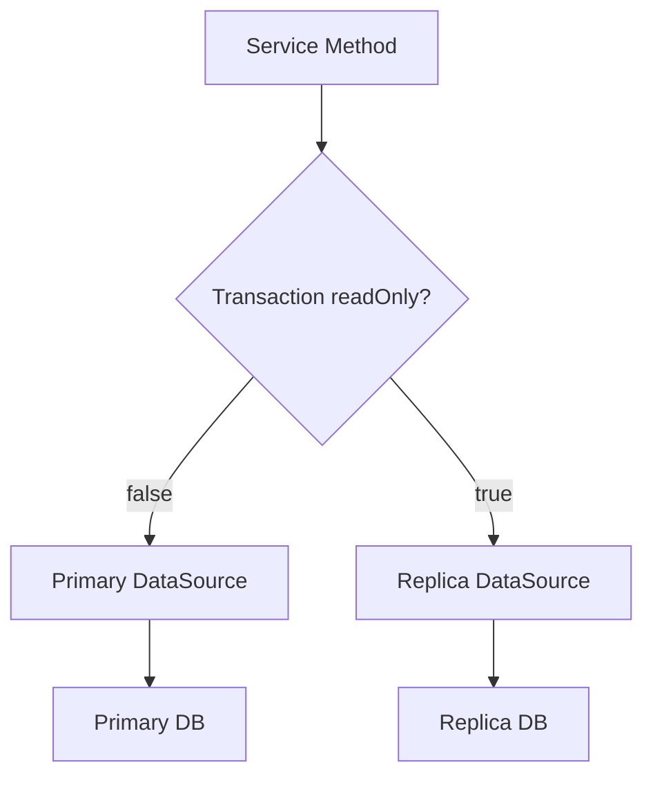
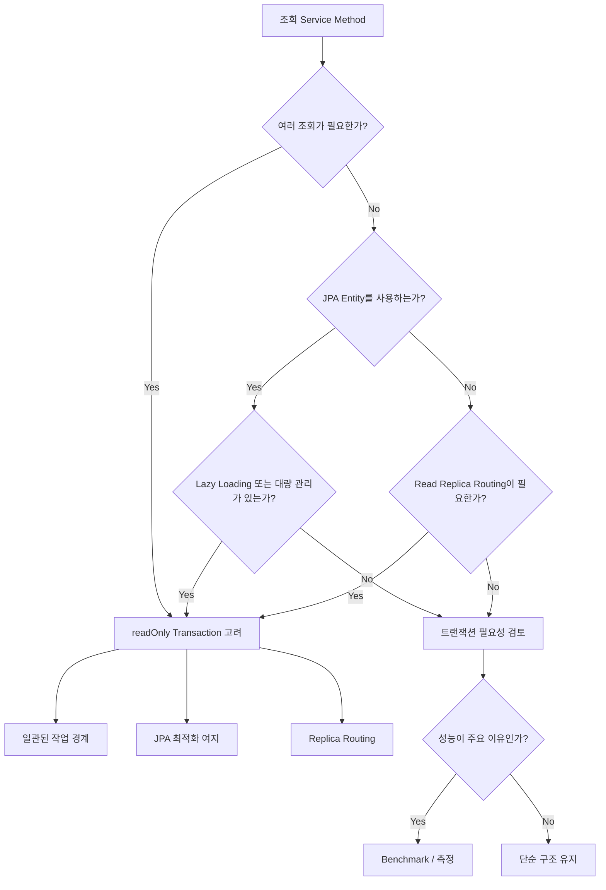

# 밤밤의 단순 조회에도 읽기 전용 트랜잭션이 필요할까?
[https://youtu.be/idncmjH1_7g?si=TKKbTEsZpDKEczij](https://youtu.be/idncmjH1_7g?si=TKKbTEsZpDKEczij)

# 밤밤의 단순 조회에도 읽기 전용 트랜잭션이 필요할까?
* toc
{:toc}

---

## 단순 조회에도 @Transactional(readOnly = true)가 필요할까?

Spring에서 Service 계층의 조회 메서드를 작성하다 보면 다음과 같은 코드를 자주 보게 된다.

```java
@Transactional(readOnly = true)
public ReservationResponse findById(Long reservationId) {
    Reservation reservation = reservationRepository.findById(reservationId)
            .orElseThrow();

    return ReservationResponse.from(reservation);
}
```

조회만 한다.

엔티티를 수정하지 않는다.

새로운 데이터를 저장하지도 않는다.

그런데도 `@Transactional(readOnly = true)`가 붙어 있다.

여기서 자연스럽게 한 가지 의문이 생긴다.

```text
단순 SELECT만 수행하는데
정말 트랜잭션이 필요한가?
```

조금 더 구체적으로는 다음 두 코드를 비교할 수 있다.

### 읽기 전용 트랜잭션을 사용하는 경우

```java
@Transactional(readOnly = true)
public ReservationResponse findById(Long id) {
    return reservationRepository.findById(id)
            .map(ReservationResponse::from)
            .orElseThrow();
}
```

### 트랜잭션을 사용하지 않는 경우

```java
public ReservationResponse findById(Long id) {
    return reservationRepository.findById(id)
            .map(ReservationResponse::from)
            .orElseThrow();
}
```

둘 다 결과는 동일해 보인다.

그렇다면 굳이 읽기 전용 트랜잭션을 사용할 이유가 있을까?

이 질문에 답하려면 `readOnly = true`를 단순한 성능 옵션으로만 보면 안 된다.

읽기 일관성, JPA 동작, 커넥션과 트랜잭션 비용, 읽기 전용 DB 라우팅 같은 여러 관점에서 함께 볼 필요가 있다.

---

## 먼저 비교 대상을 명확히 하자

이번 주제에서 비교하는 대상은 크게 두 가지다.

첫 번째는 읽기 전용 트랜잭션이다.

```java
@Transactional(readOnly = true)
public ReservationResponse findById(Long id) {
    // 조회
}
```

두 번째는 트랜잭션 자체를 선언하지 않는 방식이다.

```java
public ReservationResponse findById(Long id) {
    // 조회
}
```

여기서 중요한 것은

```text
readOnly = true

VS

readOnly = false
```

만을 비교하는 것이 아니라,

```text
읽기 전용 트랜잭션

VS

서비스 메서드 수준의 명시적인 트랜잭션 없음
```

을 비교한다는 점이다.

---

## @Transactional(readOnly = true)는 무엇을 의미할까?

`@Transactional(readOnly = true)`를 보면 이름 때문에 다음처럼 생각하기 쉽다.

```text
읽기만 가능하게 만드는 트랜잭션
```

하지만 실제로는 조금 더 넓게 이해할 필요가 있다.

`readOnly = true`는 기본적으로

```text
이 트랜잭션은
읽기 중심으로 사용된다.
```

라는 의도를 전달하는 설정이다.

즉 애플리케이션과 하위 데이터 접근 계층에

```text
이 작업에서는
데이터 변경이 목적이 아니다.
```

라는 정보를 제공한다.

이 정보는 사용하는 데이터 접근 기술과 설정에 따라 여러 최적화나 라우팅의 기준으로 활용될 수 있다.

---

## 읽기 전용 트랜잭션의 첫 번째 장점: 여러 조회를 하나의 범위로 묶을 수 있다

단순 조회라고 해서 항상 SQL이 하나만 실행되는 것은 아니다.

예를 들어 예약 상세 화면을 만든다고 해보자.

응답에는 다음 정보가 필요하다.

```text
예약 정보

예약 시간

테마 정보

예약자 정보
```

하나의 Service 메서드 안에서 여러 조회가 발생할 수 있다.

```java
@Transactional(readOnly = true)
public ReservationDetailResponse findDetail(Long reservationId) {

    Reservation reservation =
            reservationRepository.findById(reservationId)
                    .orElseThrow();

    Theme theme = reservation.getTheme();

    Member member = reservation.getMember();

    return ReservationDetailResponse.of(
            reservation,
            theme,
            member
    );
}
```

겉으로 보기에는 Repository 호출이 하나뿐이지만 연관 객체에 접근하는 과정에서 추가 조회가 발생할 수도 있다.

결국 하나의 응답을 만드는 동안 여러 SQL이 실행될 수 있다.

```text
SELECT Reservation

↓

SELECT Theme

↓

SELECT Member

↓

Response 생성
```

읽기 전용 트랜잭션을 사용하면 이러한 조회 작업들을 하나의 트랜잭션 범위 안에 둘 수 있다.

---

## 읽기 일관성이라는 관점

여러 번의 조회가 하나의 비즈니스 응답을 구성하는 경우에는 각 조회가 서로 다른 시점의 데이터를 보게 되는 상황을 생각해볼 수 있다.

예를 들어 첫 번째 조회에서는

```text
Reservation.status = WAITING
```

이었다.

그 사이 다른 요청이 데이터를 변경했다.

```text
Reservation.status = CONFIRMED
```

그리고 같은 Service 흐름의 두 번째 조회가 변경된 값을 본다면 응답 내부의 데이터가 서로 다른 시점을 기준으로 구성될 가능성이 있다.

따라서 여러 조회를 하나의 트랜잭션으로 묶는 것은 단순 성능 최적화 외에도 **하나의 작업 범위라는 의미**를 만들어준다.

다만 실제로 어느 수준의 읽기 일관성이 보장되는지는 사용하는 DB의 트랜잭션 격리 수준과 조회 방식에 영향을 받는다.

즉

```text
readOnly = true를 붙였다

=

모든 조회가 무조건 완전히 동일한 데이터 상태를 본다
```

라고 단순하게 생각해서는 안 된다.

하지만 최소한 애플리케이션 관점에서는 조회 작업의 경계를 명확하게 표현할 수 있다.

---

## 두 번째 장점: 읽기/쓰기 DB 분리의 기준으로 사용할 수 있다

서비스 규모가 커지면 DB를 하나만 사용하지 않을 수 있다.

예를 들어 다음 구조를 생각해보자.

```text
Application

        ↓

Primary DB
쓰기 담당

+

Replica DB
읽기 담당
```

쓰기 요청은 Primary DB로 보낸다.

```text
INSERT

UPDATE

DELETE

↓

Primary DB
```

조회 요청은 Replica DB로 보낸다.

```text
SELECT

↓

Replica DB
```

이때 애플리케이션은 어떻게 현재 요청이 읽기인지 쓰기인지 구분할까?

한 가지 방법으로 Transaction의 `readOnly` 속성을 사용할 수 있다.

개념적으로는 다음과 같다.

```text
@Transactional

↓

Primary DB
```

```text
@Transactional(readOnly = true)

↓

Replica DB
```

즉 `readOnly = true`가 단순히 JPA 최적화를 위한 힌트가 아니라 **DB Routing을 결정하는 메타데이터**가 될 수 있다.

---

## 읽기 전용 DB 라우팅 구조

개념적인 구조를 보면 다음과 같다.



이런 구조에서는 `readOnly = true` 여부가 단순한 성능 비교 이상의 의미를 가진다.

즉

```text
0.1ms 빨라지는가?
```

보다

```text
읽기 부하를
Replica로 분산할 수 있는가?
```

가 훨씬 중요할 수 있다.

---

## 세 번째 장점: JPA 최적화 여지가 생긴다

JPA 환경에서는 읽기 전용 트랜잭션이 조금 더 의미를 가진다.

JPA는 엔티티를 조회하면 영속성 컨텍스트에서 관리한다.

```text
Database

↓

Entity 조회

↓

Persistence Context

↓

Managed Entity
```

영속성 컨텍스트가 엔티티를 관리하면 변경 감지를 위한 작업도 연결된다.

일반적인 흐름은 다음과 같다.

```text
Entity 조회

↓

영속성 컨텍스트 등록

↓

상태 관리

↓

변경 감지

↓

Flush
```

그런데 조회 전용 작업에서는 엔티티를 변경할 의도가 없다.

```text
조회

↓

DTO 변환

↓

응답
```

그렇다면 변경 감지를 위한 일부 작업은 불필요할 수 있다.

읽기 전용 트랜잭션은 JPA 구현체에게

```text
이 작업은 조회 중심이다.
```

라는 정보를 전달함으로써 불필요한 처리 비용을 줄일 여지를 제공한다.

---

## JPA에서 readOnly가 의미를 가지는 이유

다음 코드를 생각해보자.

```java
@Transactional
public ReservationResponse find(Long id) {

    Reservation reservation =
            reservationRepository.findById(id)
                    .orElseThrow();

    return ReservationResponse.from(reservation);
}
```

엔티티를 수정하지 않더라도 일반 트랜잭션에서는 JPA가 엔티티를 관리한다.

반면 다음과 같이 선언한다.

```java
@Transactional(readOnly = true)
public ReservationResponse find(Long id) {

    Reservation reservation =
            reservationRepository.findById(id)
                    .orElseThrow();

    return ReservationResponse.from(reservation);
}
```

조회 전용이라는 의도를 Framework에 전달할 수 있다.

특히 조회하는 엔티티 수가 많아질수록 영속성 컨텍스트가 관리해야 하는 객체 수도 많아진다.

```text
1건

↓

10건

↓

1,000건

↓

50,000건
```

이때 읽기 전용 설정으로 줄일 수 있는 비용이 있다면 대량 조회일수록 상대적인 의미가 커질 수 있다.

---

## 그렇다고 readOnly 트랜잭션이 공짜인 것은 아니다

여기에서 중요한 점이 있다.

```text
readOnly = true

=

트랜잭션 비용이 없다
```

는 아니다.

읽기 전용이어도 결국 트랜잭션이다.

트랜잭션을 시작하고 종료하는 과정이 존재한다.

개념적으로는 다음과 같다.

```text
Method 호출

↓

Transaction 시작

↓

Connection 관련 처리

↓

조회

↓

Commit 또는 종료 처리

↓

Transaction Context 정리
```

따라서 매우 단순한 조회에서는 실제 SQL 실행보다 트랜잭션 처리 비용의 비중이 상대적으로 크게 느껴질 수도 있다.

---

## 단건 조회에서는 트랜잭션 비용이 상대적으로 크게 보일 수 있다

예를 들어 조회 자체가 매우 빠르다고 생각해보자.

```text
SELECT 한 건

0.1ms
```

여기에 트랜잭션 시작과 종료 비용이 추가된다면 전체 시간에서 차지하는 비율이 커질 수 있다.

반면 5만 건을 조회한다고 해보자.

```text
SELECT 50,000건

수십 ms
```

이 경우에는 동일한 트랜잭션 부가 비용이 있더라도 전체 실행 시간에서 차지하는 비율은 작아진다.

개념적으로 다음과 같다.

```text
단건 조회

Query 비용        작음
Transaction 비용  상대적으로 크게 보임
```

```text
대량 조회

Query 비용        큼
Transaction 비용  상대적으로 작게 보임
```

그래서 단순히

```text
트랜잭션이 느리다.
```

라고 볼 것이 아니라 **전체 요청 비용에서 어느 정도 비중을 차지하는지**를 봐야 한다.

---

## JDBC Template에서는 어떤 차이가 있을까?

JDBC Template은 JPA와 비교하면 영속성 컨텍스트와 변경 감지 같은 기능이 없다.

예를 들어 다음과 같다.

```java
public ReservationResponse find(Long id) {

    return jdbcTemplate.queryForObject(
            "SELECT ...",
            rowMapper,
            id
    );
}
```

JPA처럼

```text
Entity 관리

Snapshot 관리

Dirty Checking
```

같은 메커니즘을 사용하지 않는다.

따라서 `readOnly = true`를 통해 얻을 수 있는 JPA 특유의 최적화 효과가 상대적으로 적다.

그 결과 아주 단순한 JDBC 조회에서는 트랜잭션을 추가했을 때 발생하는 부가 비용이 조금 더 직접적으로 드러날 수 있다.

---

## 단건 JDBC 조회에서는 어떤 결과가 나올 수 있을까?

한 가지 측정 환경에서는 단건 조회에서 다음과 같은 결과가 나타났다.

```text
readOnly Transaction

약 0.294ms
```

```text
Transaction 없음

약 0.073ms
```

단건 조회 자체가 워낙 가볍기 때문에 트랜잭션 처리에 들어가는 고정 비용의 비율이 크게 드러난 결과로 볼 수 있다.

하지만 이 숫자를 그대로 일반화해서는 안 된다.

실행 환경에 따라 다음 요소들이 영향을 줄 수 있다.

```text
DBMS

JDBC Driver

Connection Pool

Network

JVM

Warm-up

SQL

Index

데이터 상태
```

중요한 것은 절대적인 숫자가 아니라 **단순 조회일수록 고정 비용이 상대적으로 크게 보일 수 있다는 경향**이다.

---

## 대량 JDBC 조회에서는 차이가 줄어들 수 있다

같은 환경에서 대량 데이터를 조회했을 때는 차이가 훨씬 작아졌다.

```text
readOnly Transaction

약 25.155ms
```

```text
Transaction 없음

약 24.278ms
```

둘의 차이는 존재하지만 단건 조회와 비교하면 상대적인 비율은 크게 줄었다.

이유를 단순화하면 다음과 같다.

```text
대량 조회

↓

데이터 읽기 비용 증가

↓

Row Mapping 비용 증가

↓

전체 실행 시간 증가

↓

Transaction 고정 비용의 비율 감소
```

---

## JPA 단순 조회에서는 차이가 작을 수도 있다

JPA로 연관관계가 없는 단순 엔티티를 조회했다고 하자.

단건 조회에서는 다음과 같이 거의 차이가 없을 수 있다.

```text
readOnly

0.238ms
```

```text
Transaction 없음

0.236ms
```

대량 조회에서도

```text
readOnly

45.545ms
```

```text
Transaction 없음

45.807ms
```

처럼 큰 차이가 나타나지 않을 수 있다.

이런 결과에서 중요한 것은

```text
readOnly를 붙이면
무조건 빨라진다.
```

가 아니라는 점이다.

조회 형태가 단순하고 JPA가 관리해야 하는 추가 작업이 크지 않다면 차이가 작을 수도 있다.

---

## 연관 객체까지 조회하면 상황이 달라질 수 있다

JPA에서는 단순히 Entity 하나만 조회하는 것과 연관 객체까지 접근하는 것이 다르다.

예를 들어 Reservation이 ReservationTime을 가진다고 하자.

```text
Reservation

↓

ReservationTime
```

조회 후 DTO로 변환하면서 연관 객체에 접근한다.

```java
@Transactional(readOnly = true)
public ReservationResponse find(Long id) {

    Reservation reservation =
            reservationRepository.findById(id)
                    .orElseThrow();

    return new ReservationResponse(
            reservation.getId(),
            reservation.getTime().getStartAt()
    );
}
```

이 과정에서는 단순 Entity 조회 외에도 영속성 컨텍스트와 연관 로딩의 영향이 들어올 수 있다.

따라서 대량 조회에서는 `readOnly = true` 설정의 효과가 조금 더 나타날 가능성이 있다.

---

## 대량 JPA 조회에서 readOnly가 의미를 가질 수 있는 이유

예를 들어 5만 건의 Entity를 조회한다고 생각해보자.

```text
50,000 Entities
```

일반적인 영속성 컨텍스트라면 많은 엔티티를 관리해야 한다.

```text
Persistence Context

Entity 1

Entity 2

Entity 3

...

Entity 50,000
```

JPA 입장에서는 관리 대상 자체가 많아진다.

반면 조회 전용이라는 정보를 활용할 수 있다면 일부 관리 비용을 줄일 여지가 생긴다.

그래서 대량 조회에서는 다음과 같은 관점이 중요하다.

```text
SQL 실행 시간

+

Entity 생성 비용

+

Persistence Context 관리

+

DTO 변환

+

Lazy Loading
```

즉 JPA 조회 성능은 단순히 SQL 실행 시간만으로 판단하기 어렵다.

---

## 조회 메서드의 전체 시간을 측정해야 하는 이유

JPA 조회 성능을 측정할 때 Repository 호출 시간만 보면 실제 사용자 요청과 차이가 날 수 있다.

예를 들어 다음 코드가 있다.

```java
List<Reservation> reservations =
        reservationRepository.findAll();
```

여기까지만 측정하면 실제 응답 생성 과정이 빠진다.

보통 서비스에서는 이후 DTO 변환을 한다.

```java
return reservations.stream()
        .map(ReservationResponse::from)
        .toList();
```

DTO 변환 과정에서 연관 객체에 접근한다면 추가 SQL이 발생할 수도 있다.

```text
Repository 조회

↓

Entity 반환

↓

DTO 변환

↓

Lazy Loading

↓

추가 SELECT
```

따라서 실제 서비스 성능을 보려면 메서드 전체 범위를 보는 것이 더 의미 있을 수 있다.

---

## 성능 측정에서 평균만 보면 안 되는 이유

실행 시간을 측정할 때 평균만 보는 것도 부족할 수 있다.

예를 들어 다음 요청 시간이 있다고 하자.

```text
1ms
1ms
1ms
1ms
100ms
```

평균은 크게 올라간다.

하지만 일반적인 요청은 대부분 1ms였다.

그래서 다음과 같은 지표를 함께 확인할 수 있다.

| 지표      | 의미                   |
| ------- | -------------------- |
| Average | 전체적인 평균 경향           |
| Median  | 일반적인 중앙값             |
| Min     | 가장 빠른 경우             |
| Max     | 가장 느린 경우             |
| P95     | 95% 요청이 이 시간 이하에서 완료 |

성능을 판단할 때는 하나의 숫자보다 전체 분포를 보는 것이 중요하다.

---

## readOnly 트랜잭션의 효과는 환경에 따라 달라진다

같은 코드라도 다음 조건에 따라 결과가 달라질 수 있다.

```text
JPA인가?

JDBC Template인가?

조회 건수는 몇 개인가?

연관 객체에 접근하는가?

DTO Projection을 사용하는가?

Lazy Loading이 있는가?

DBMS는 무엇인가?

Connection Pool 설정은 어떠한가?

Read Replica를 사용하는가?
```

따라서 인터넷에서

```text
readOnly=true가 무조건 빠르다.
```

라는 설명을 봤다고 그대로 적용하는 것은 위험하다.

반대로

```text
SELECT인데 트랜잭션은 필요 없다.
```

라고 단순하게 판단하는 것도 부족하다.

---

## 그렇다면 어떤 기준으로 결정해야 할까?

한 가지 기준으로 모든 조회를 나누기는 어렵다.

하지만 몇 가지 질문을 통해 판단할 수 있다.

---

## 기준 1. 정말 단건 조회 하나로 끝나는가?

다음과 같은 조회라면 구조가 매우 단순하다.

```java
public MemberNameResponse findName(Long id) {
    return memberRepository.findNameById(id);
}
```

단일 쿼리다.

연관 객체 접근도 없다.

일관성을 위해 여러 SELECT를 하나의 범위로 묶을 필요도 없다.

읽기/쓰기 DB 라우팅에도 `readOnly`를 사용하지 않는다.

이런 상황에서는 별도의 readOnly 트랜잭션이 반드시 필요한지 검토해볼 수 있다.

중요한 것은

```text
단건이면 무조건 트랜잭션 없음
```

이 아니라

```text
이 트랜잭션이 실제로 제공하는 가치가 있는가?
```

를 묻는 것이다.

---

## 기준 2. 하나의 응답을 만들기 위해 여러 번 조회하는가?

하나의 Service 메서드에서 여러 Repository를 호출한다고 생각해보자.

```java
public MyPageResponse findMyPage(Long memberId) {

    Member member =
            memberRepository.findById(memberId)
                    .orElseThrow();

    List<Order> orders =
            orderRepository.findByMemberId(memberId);

    Point point =
            pointRepository.findByMemberId(memberId);

    return MyPageResponse.of(
            member,
            orders,
            point
    );
}
```

하나의 응답을 위해 여러 조회가 발생한다.

```text
Member SELECT

↓

Order SELECT

↓

Point SELECT
```

이런 경우에는 트랜잭션을 하나의 조회 작업 경계로 정의하는 것이 더 자연스러울 수 있다.

---

## 기준 3. JPA Entity를 많이 조회하는가?

대량의 JPA Entity를 조회한다면 영속성 컨텍스트 관리 비용도 생각해야 한다.

```text
100건

1,000건

10,000건

50,000건
```

조회량이 많아질수록

```text
Entity 생성

Persistence Context 관리

연관 관계

DTO 변환
```

등의 비용이 커질 수 있다.

이런 상황에서는 `readOnly = true`의 의미가 단건 조회보다 커질 수 있다.

다만 정말 수십만 건 이상의 대량 데이터를 처리한다면 또 다른 질문이 필요하다.

```text
JPA Entity 조회 자체가
적절한 방식인가?
```

필요에 따라 DTO Projection, Paging, Streaming, JDBC 기반 접근 등을 함께 고려해야 한다.

---

## 기준 4. 읽기/쓰기 DB 분리를 사용하는가?

이 경우 판단은 상당히 명확해질 수 있다.

애플리케이션에서

```text
readOnly = true

↓

Replica
```

라는 Routing 전략을 사용한다면 `readOnly`의 목적은 단순 최적화가 아니다.

```text
Read Traffic 분산
```

이라는 아키텍처적 의미가 있다.

그렇다면

```text
0.1ms 느려진다.
```

는 이유만으로 제거하는 것은 적절하지 않을 수 있다.

더 큰 목적이 있기 때문이다.

---

## readOnly=true는 성능 옵션만이 아니다

이 부분이 가장 중요하다.

많은 개발자가 `readOnly = true`를 다음처럼 이해한다.

```text
조회 성능을 빠르게 만드는 옵션
```

하지만 실무에서는 그 이상의 의미를 가질 수 있다.

```text
조회 작업이라는 의도 표현

트랜잭션 경계 설정

JPA 최적화 여지

Read Replica Routing 기준

쓰기 로직과 조회 로직의 구분
```

즉 성능 하나만 보고 사용할지 말지를 판단하면 놓치는 부분이 많다.

---

## 코드의 의도를 표현하는 역할

다음 두 메서드를 보자.

```java
@Transactional
public void reserve() {
}
```

```java
@Transactional(readOnly = true)
public ReservationResponse find() {
}
```

코드를 읽는 개발자는 Annotation만 보고도 역할을 어느 정도 예상할 수 있다.

```text
reserve()

→ 상태 변경 작업
```

```text
find()

→ 조회 작업
```

물론 Annotation 하나로 모든 설계가 좋아지는 것은 아니지만 트랜잭션의 의도를 표현하는 하나의 문서 역할을 할 수도 있다.

---

## readOnly라고 데이터를 절대 변경할 수 없다고 생각하면 안 된다

여기서 흔히 생기는 오해가 있다.

```text
@Transactional(readOnly = true)

=

쓰기 SQL 자체를
절대 실행할 수 없다.
```

라고 생각하는 것이다.

하지만 `readOnly`는 사용하는 데이터베이스, Transaction Manager, JPA 구현체 등에 따라 실제 적용 방식이 달라질 수 있다.

따라서

```text
실수로 데이터를 변경하지 못하게 만드는
완벽한 보안 장치
```

로 생각하는 것은 위험하다.

기본적으로는

```text
조회 전용이라는
의도와 힌트
```

라는 관점으로 보는 편이 좋다.

---

## Lazy Loading과 트랜잭션

JPA를 사용한다면 트랜잭션의 또 다른 의미가 있다.

다음 코드를 보자.

```java
@Transactional(readOnly = true)
public ReservationResponse find(Long id) {

    Reservation reservation =
            reservationRepository.findById(id)
                    .orElseThrow();

    return ReservationResponse.from(reservation);
}
```

`ReservationResponse.from()` 내부에서 다음처럼 연관 객체를 사용한다고 하자.

```java
reservation.getTheme().getName();
```

Theme이 Lazy Loading 대상이라면 실제 Theme 조회 시점은 이 코드가 실행되는 순간일 수 있다.

```text
Reservation 조회

↓

Theme Proxy

↓

DTO 변환

↓

getTheme().getName()

↓

Theme SELECT
```

서비스 메서드 전체가 트랜잭션 범위라면 이러한 조회까지 동일한 Persistence Context 안에서 처리할 수 있다.

---

## 트랜잭션이 없으면 Lazy Loading은 어떻게 될까?

Persistence Context가 이미 종료된 상태에서 초기화되지 않은 Proxy에 접근하면 문제가 생길 수 있다.

따라서 JPA에서 Service 계층의 조회 트랜잭션은 단순 성능 문제뿐 아니라 **엔티티를 어느 범위까지 영속 상태로 사용할 것인가**와도 관계가 있다.

이 때문에 JPA 환경에서는

```text
SELECT 한 번인데
트랜잭션이 왜 필요하지?
```

만으로 판단하기 어려운 경우가 많다.

---

## 반대로 Lazy Loading을 유지하기 위해 트랜잭션을 무조건 넓히는 것도 좋은가?

그렇지는 않다.

예를 들어 Controller까지 영속성 컨텍스트를 계속 열어두고 필요할 때마다 Lazy Loading을 수행하면 어느 시점에 SQL이 실행되는지 알기 어려워질 수 있다.

```text
Controller

↓

JSON Serialization

↓

Lazy Loading 발생

↓

예상하지 못한 SELECT
```

따라서 중요한 것은 단순히 트랜잭션을 오래 유지하는 것이 아니라

```text
Service 계층에서

필요한 데이터를 명확하게 조회하고

DTO로 변환한다.
```

같은 명확한 경계를 만드는 것이다.

---

## DTO Projection이라면 상황이 달라질 수 있다

조회 시 Entity를 사용하지 않고 처음부터 DTO로 조회한다고 하자.

```java
@Query("""
    select new com.example.ReservationResponse(
        r.id,
        r.name,
        t.name
    )
    from Reservation r
    join r.theme t
""")
List<ReservationResponse> findAllResponses();
```

이 경우 Entity를 영속성 컨텍스트에서 관리하는 과정이 상대적으로 줄어든다.

```text
DB

↓

DTO

↓

Response
```

따라서 JPA Entity 조회에서 기대할 수 있었던 readOnly 관련 이점도 달라질 수 있다.

이것이

```text
JPA를 사용한다.
```

라는 조건 하나만으로 결과를 일반화하기 어려운 이유다.

---

## 실무에서는 단건과 대량으로만 나누는 것도 부족하다

단건 조회에는 트랜잭션을 사용하지 않고 대량 조회에는 사용한다는 기준은 이해하기 쉽다.

하지만 실제 서비스에서는 데이터 개수만으로 결정하기 어려울 수 있다.

예를 들어 단건 조회인데 다음과 같은 코드가 있을 수 있다.

```text
Reservation 조회

↓

Theme Lazy Loading

↓

Member Lazy Loading

↓

Coupon 조회

↓

Permission 조회
```

반대로 1,000건 조회인데 DTO Projection 한 번으로 끝날 수도 있다.

```text
SELECT DTO
LIMIT 1000
```

따라서 좀 더 현실적인 판단 기준은 데이터 개수보다 **조회 과정의 복잡성**이다.

---

## 조회 트랜잭션을 판단할 때 볼 수 있는 기준

다음과 같은 질문을 순서대로 해볼 수 있다.

```text
조회 SQL이 하나인가?

여러 조회를 하나의 일관된 작업으로 묶어야 하는가?

JPA Entity를 조회하는가?

Lazy Loading이 발생하는가?

대량 Entity를 관리하는가?

DTO Projection인가?

Read Replica Routing에 사용되는가?

조회 과정에 비즈니스적으로 일관된 경계가 필요한가?
```

YES가 많아질수록 `@Transactional(readOnly = true)`의 의미가 커질 가능성이 있다.

---

## 성능 때문에 readOnly를 붙인다면 반드시 측정해야 한다

다음과 같은 근거는 위험하다.

```text
readOnly가 빠르다고 들었다.
```

실제 효과는 환경에 따라 다르다.

따라서 성능 최적화가 목적이라면 직접 측정하는 것이 좋다.

예를 들어 다음 두 코드를 비교한다.

```java
@Transactional(readOnly = true)
public List<ReservationResponse> findAll() {
    // ...
}
```

```java
public List<ReservationResponse> findAll() {
    // ...
}
```

그리고 단순 평균만 보지 않는다.

```text
Average

Median

P95

Max
```

등을 함께 확인한다.

---

## 측정 환경을 고정하는 것도 중요하다

성능 비교에서 다음 요소가 바뀌면 결과를 신뢰하기 어렵다.

```text
DBMS

JDBC Driver

Connection Pool

JVM

데이터 개수

Index

Warm-up

측정 횟수

동시 요청 수
```

따라서 하나의 요소만 비교하려면 나머지 조건은 가능한 한 동일하게 유지해야 한다.

```text
모든 환경 동일

↓

readOnly만 변경

↓

결과 비교
```

그래야 실제 차이가 어디에서 발생했는지 해석할 수 있다.

---

## 단순 조회에서는 성능 차이가 미미할 수도 있다

중요한 결론 중 하나다.

JPA에서 단순 조회를 수행했는데

```text
readOnly

0.238ms
```

```text
no transaction

0.236ms
```

처럼 차이가 거의 없다면

```text
readOnly가 무조건 빠르다.
```

는 결론을 내릴 수 없다.

오히려 이런 결과는 다음 질문으로 이어져야 한다.

```text
그렇다면 우리 서비스에서는
성능 이외에 어떤 의미로 사용하는가?
```

예를 들어

```text
트랜잭션 경계 표현

Read Replica Routing

Lazy Loading 범위

조회 작업의 일관성
```

등이 더 중요한 이유가 될 수 있다.

---

## 성능 측정 결과를 규칙으로 만들 때 주의할 점

어떤 실험에서 다음 결과가 나왔다고 하자.

```text
단건 조회

Transaction 없음이 빠름
```

그렇다고 모든 단건 조회에서 다음 규칙을 만들면 위험하다.

```text
단건 조회에는
절대 Transaction을 사용하지 않는다.
```

실험 결과는 특정 조건의 결과다.

```text
특정 DBMS

특정 Driver

특정 Connection Pool

특정 Query

특정 Hardware

특정 데이터
```

환경이 달라지면 결과도 달라질 수 있다.

따라서 실험은 **절대적인 규칙을 만드는 도구**보다 판단에 사용할 근거를 얻는 도구로 보는 것이 좋다.

---

## 실무에서는 어떤 기준이 현실적일까?

개인적으로는 다음과 같은 순서로 판단하는 방식이 이해하기 쉽다.

### 조회 작업의 경계가 필요한가?

여러 Query가 하나의 유스케이스를 구성하거나 JPA Entity와 Lazy Loading을 사용한다면 읽기 전용 트랜잭션을 우선 고려한다.

### Read Replica Routing에 필요한가?

필요하다면 성능 차이보다 시스템 아키텍처 목적을 우선한다.

### 정말 단순한 조회인가?

JDBC 기반 단일 SELECT이고 별도의 트랜잭션 의미가 없다면 명시적 트랜잭션이 반드시 필요한지 검토할 수 있다.

### 성능 최적화가 이유인가?

그렇다면 추측하지 말고 측정한다.

---

## 단건 조회라고 무조건 빼지 않는 것이 좋은 이유

다음 메서드는 단건 조회다.

```java
public ReservationResponse find(Long id) {
    // ...
}
```

하지만 앞으로 요구사항이 변경될 수 있다.

```text
Reservation 조회

↓

Theme 정보 추가

↓

Member 정보 추가

↓

Coupon 정보 추가
```

조회 과정이 점점 복잡해지면 트랜잭션 경계의 의미도 달라질 수 있다.

따라서 단순히 현재 SQL 개수만 보고 판단하기보다 해당 Service Method가 표현하는 **하나의 유스케이스**라는 관점에서도 생각해볼 필요가 있다.

---

## 읽기 전용 트랜잭션은 설계의 표현이 될 수도 있다

다음과 같이 Service 전체에 기본 readOnly를 적용하는 방식도 있다.

```java
@Service
@Transactional(readOnly = true)
public class ReservationService {

    public ReservationResponse find(Long id) {
        // 조회
    }

    public List<ReservationResponse> findAll() {
        // 조회
    }

    @Transactional
    public void reserve(ReservationRequest request) {
        // 쓰기
    }
}
```

이 구조에서는 Service의 기본 정책을

```text
조회
```

로 두고,

쓰기 작업에만 별도로

```java
@Transactional
```

을 선언한다.

코드를 보면 어떤 메서드가 상태를 변경하는 작업인지 구분하기 쉬워진다.

물론 이것도 모든 프로젝트의 정답은 아니지만 코드의 의도를 표현하는 하나의 방법이 될 수 있다.

---

## 구조

전체적인 판단 흐름을 정리하면 다음과 같다.



결국 `readOnly = true`를 사용할지 여부는 Annotation 하나의 문제가 아니라

```text
데이터 접근 방식

조회 형태

JPA 사용 방식

트랜잭션 경계

DB 아키텍처

성능 요구사항
```

이 함께 연결된 문제다.

---

## 실무에서의 활용

일반적인 Spring Data JPA 서비스라면 다음과 같이 구성할 수 있다.

```java
@Service
@Transactional(readOnly = true)
@RequiredArgsConstructor
public class ReservationService {

    private final ReservationRepository reservationRepository;

    public ReservationResponse findById(Long id) {

        Reservation reservation =
                reservationRepository.findById(id)
                        .orElseThrow();

        return ReservationResponse.from(reservation);
    }

    @Transactional
    public Long reserve(
            ReservationRequest request
    ) {

        Reservation reservation =
                Reservation.create(...);

        return reservationRepository.save(reservation)
                .getId();
    }
}
```

기본적으로 조회 메서드는 읽기 전용이다.

상태를 변경하는 메서드에만 일반 트랜잭션을 적용한다.

구조상 의도도 명확하다.

```text
Service 기본값

READ ONLY


reserve()

WRITE
```

다만

```text
이 패턴을 모든 프로젝트에
무조건 적용해야 한다.
```

라고 볼 필요는 없다.

JDBC Template 중심의 매우 단순한 조회 시스템이라면 다른 선택을 할 수도 있고, Read Replica 구조가 있다면 반대로 readOnly 선언의 중요성이 더 커질 수도 있다.

---

## Spring Batch에서는 판단 기준이 또 달라질 수 있다

대량 조회라는 이유만으로 일반 웹 요청과 Spring Batch를 같은 방식으로 판단해서는 안 된다.

Spring Batch에서는

```text
Chunk

Page

Transaction Boundary

Persistence Context 크기

flush / clear
```

까지 함께 고려해야 한다.

예를 들어 100만 건을 JPA Entity로 조회하는 작업에서 단순히

```java
@Transactional(readOnly = true)
```

하나를 추가했다고 메모리 문제가 해결되는 것은 아니다.

대량 Batch에서는 영속성 컨텍스트를 얼마나 오래 유지하는지, Reader가 Page 단위로 Entity를 어떻게 관리하는지가 더 중요할 수 있다.

즉

```text
readOnly는 하나의 최적화 도구일 뿐

대량 조회 전략 자체를 대신하지 않는다.
```

는 점을 기억하는 것이 좋다.

---

## readOnly 적용을 판단할 때 기억할 10가지

### 1. 단순히 조회라는 이유만으로 습관적으로 붙이지 않는다

왜 필요한지 설명할 수 있어야 한다.

### 2. readOnly도 결국 트랜잭션이다

트랜잭션 시작과 종료에 필요한 비용 자체가 사라지는 것은 아니다.

### 3. JPA에서는 의미가 더 커질 수 있다

영속성 컨텍스트와 변경 감지 같은 기능 때문에 JDBC와 결과가 다를 수 있다.

### 4. 단건과 대량 조회의 비용 구조는 다르다

고정적인 트랜잭션 비용이 전체 시간에서 차지하는 비율이 달라진다.

### 5. 여러 SELECT가 하나의 응답을 구성하는지 확인한다

트랜잭션을 하나의 읽기 작업 범위로 사용할 수 있다.

### 6. Lazy Loading을 사용하는지 확인한다

Entity를 어느 Persistence Context 범위에서 사용할 것인지 중요하다.

### 7. DTO Projection인지 확인한다

Entity를 관리하지 않는 조회라면 readOnly 최적화 효과도 달라질 수 있다.

### 8. Read Replica Routing에 사용되는지 확인한다

이 경우에는 단순한 성능 옵션 이상의 의미를 가진다.

### 9. 성능이 이유라면 직접 측정한다

특정 환경의 Benchmark를 모든 시스템에 일반화하지 않는다.

### 10. 트랜잭션 자체의 의미를 먼저 생각한다

결국 중요한 것은

```text
이 메서드에서
하나의 트랜잭션으로 묶어야 할 작업은 무엇인가?
```

라는 질문이다.

---

## 정리

단순 조회에서도 `@Transactional(readOnly = true)`가 반드시 필요한지를 하나의 규칙으로 결정하기는 어렵다.

읽기 전용 트랜잭션을 사용하면 여러 조회를 하나의 트랜잭션 범위로 묶을 수 있다.

```text
SELECT

↓

SELECT

↓

SELECT

↓

하나의 Transaction
```

JPA 환경에서는 조회 전용이라는 정보를 통해 불필요한 관리 비용을 줄일 여지도 있다.

```text
JPA

↓

Persistence Context

↓

readOnly Hint

↓

조회 중심 최적화 여지
```

읽기/쓰기 DB를 분리한 환경에서는 더욱 중요한 역할을 할 수 있다.

```text
readOnly = true

↓

Replica DB
```

이 경우 `readOnly`는 단순히 조회를 조금 빠르게 만들기 위한 옵션이 아니라 시스템의 부하를 분산하는 라우팅 기준이 된다.

반면 readOnly라고 해서 트랜잭션 자체의 비용이 사라지는 것은 아니다.

```text
Transaction 시작

Connection 처리

Transaction 종료

Context 정리
```

같은 과정은 여전히 필요할 수 있다.

그래서 매우 가벼운 JDBC 단건 조회에서는 트랜잭션을 사용하지 않는 방식이 더 빠르게 나타날 수도 있다.

하지만 JPA 환경에서는 영속성 컨텍스트, Lazy Loading, DTO 변환, 대량 Entity 관리 등의 요소가 추가되므로 단순한 SQL 실행 시간만으로 판단하기 어렵다.

결국 다음과 같이 이해하는 것이 좋다.

```text
단건 조회

→ 무조건 readOnly 제거
```

도 아니고,

```text
조회 메서드

→ 무조건 readOnly 적용
```

도 아니다.

더 중요한 것은 현재 조회 작업이 어떤 성격을 가지고 있는지 확인하는 것이다.

```text
여러 조회를 하나의 작업으로 묶어야 하는가?

JPA Entity를 사용하고 있는가?

Lazy Loading이 필요한가?

대량 Entity를 조회하는가?

DTO Projection인가?

Read Replica Routing이 필요한가?

실제 성능 차이가 존재하는가?
```

이 질문에 답한 뒤 선택해야 한다.

그리고 성능을 이유로 선택한다면 추측하는 것이 아니라 실제 환경에서 측정하는 것이 가장 중요하다.

`@Transactional(readOnly = true)`는 단순히 “조회니까 붙이는 Annotation”이 아니다.

**조회 작업의 트랜잭션 경계를 표현하고, JPA에 조회 전용 의도를 전달하며, 필요하다면 읽기 전용 DB로 라우팅하는 데 활용할 수 있는 설계 도구**로 보는 것이 더 적절하다.

### 한 줄 요약

**단순 조회에서 `@Transactional(readOnly = true)`를 사용할지는 조회 건수만으로 결정하기보다 JPA 영속성 컨텍스트와 Lazy Loading, 여러 조회의 일관성, Read Replica 라우팅, 실제 트랜잭션 비용을 함께 고려해야 하며, 성능을 이유로 선택한다면 반드시 실제 환경에서 측정한 근거를 바탕으로 판단하는 것이 좋다.**
