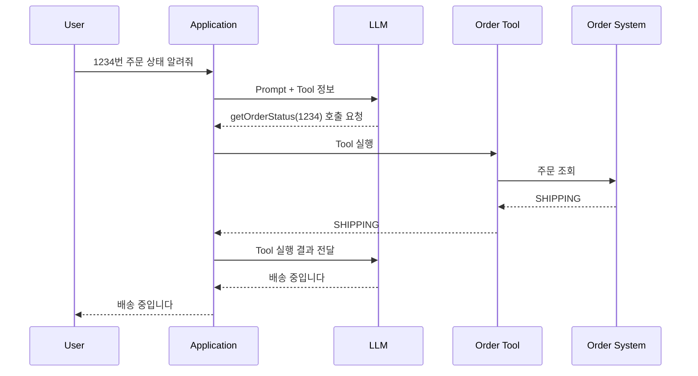
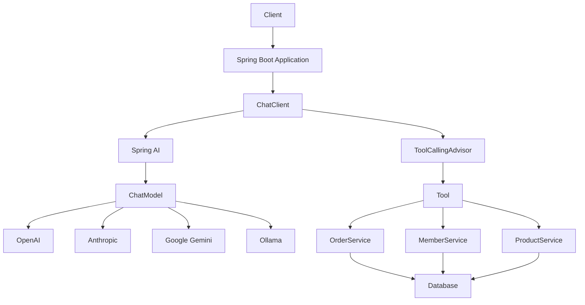

# 티뉴의 Spring AI란?
[https://youtu.be/9jrA-szasTI?si=BkyB_d3V2J15kFPD](https://youtu.be/9jrA-szasTI?si=BkyB_d3V2J15kFPD)

# 티뉴의 Spring AI란?
* toc
{:toc}

---

## Spring AI는 왜 필요할까? Spring 개발자가 LLM을 다루는 방법

ChatGPT나 Claude, Gemini 같은 생성형 AI를 사용하는 것은 이제 특별한 일이 아니다.

하지만 직접 사용하는 것과 **내가 만드는 백엔드 서비스에 AI 기능을 넣는 것**은 조금 다른 문제다.

예를 들어 Spring Boot로 고객 상담 서비스를 개발한다고 생각해보자.

처음에는 OpenAI API를 직접 호출하면 될 것 같다.

```text
사용자 질문

↓

Spring Boot

↓

OpenAI API

↓

응답
```

실제로 간단한 기능이라면 이것만으로도 충분하다.

하지만 서비스를 운영하다 보면 요구사항은 금방 늘어난다.

처음에는 OpenAI만 사용했다가 비용이나 품질 문제로 Claude를 함께 사용해야 할 수도 있다.

개발 환경에서는 로컬 Ollama를 사용하고 운영에서는 외부 모델을 사용하고 싶을 수도 있다.

단순 질의응답에서 시작했지만 나중에는 사내 데이터베이스를 조회해야 할 수도 있다.

사용자의 주문 내역을 확인하거나 외부 API를 호출해야 할 수도 있다.

RAG, Vector Database, Tool Calling, Streaming 같은 기능까지 필요해질 수도 있다.

이때부터 단순한 HTTP API 호출만으로는 구조가 점점 복잡해진다.

Spring AI는 바로 이런 문제를 Spring 개발자에게 익숙한 방식으로 다루기 위해 등장한 프로젝트다.

현재 Spring AI 공식 문서는 Chat Model뿐 아니라 Embedding, Image, Audio, Vector Store, Tool Calling, Structured Output, MCP 등 여러 생성형 AI 기능에 대한 공통 API를 제공하고 있다. 현재 안정 버전 문서 기준으로 OpenAI, Anthropic, Google, Amazon, Microsoft, Ollama 등 주요 Provider도 지원한다.

---

## Spring AI를 한 문장으로 표현하면

Spring AI를 이해할 때 가장 먼저 잡아야 하는 개념은 **추상화**다.

Spring을 사용하면서 이미 비슷한 경험을 많이 했다.

데이터베이스를 사용할 때 애플리케이션 코드가 JDBC Driver의 세부 구현을 매번 직접 다루지는 않는다.

Spring Data를 사용하면 Repository라는 추상화 위에서 데이터를 다룬다.

```text
Application

↓

Repository

↓

JPA

↓

Database
```

캐시 역시 마찬가지다.

```text
Application

↓

Spring Cache Abstraction

↓

Redis
Caffeine
기타 Cache 구현체
```

메시징 기술도 비슷한 방식으로 생각할 수 있다.

Spring AI가 하려는 일도 크게 다르지 않다.

```text
Application

↓

Spring AI

↓

OpenAI
Anthropic
Gemini
Ollama
...
```

애플리케이션이 특정 AI Provider의 API 구조에 지나치게 강하게 묶이지 않도록 중간에 공통된 프로그래밍 모델을 제공하는 것이다.

---

## AI API를 직접 호출하면 어떤 문제가 생길까?

OpenAI만 사용하는 서비스라면 다음처럼 직접 API Client를 만들어도 된다.

```java
public String ask(String message) {
    return openAiClient.chat(message);
}
```

그런데 어느 날 요구사항이 변경된다.

```text
OpenAI

↓

Anthropic Claude
```

두 회사가 제공하는 API는 완전히 동일하지 않다.

Request 구조도 다를 수 있다.

Response 형식도 다를 수 있다.

Model Option도 다르다.

Tool Calling 방식이나 Streaming 처리 역시 Provider별 차이가 존재한다.

결과적으로 애플리케이션 코드가 Provider SDK에 강하게 결합되어 있다면 교체 비용이 커진다.

```text
Business Logic

↓

OpenAI SDK

↓

OpenAI Request

↓

OpenAI Response
```

Provider를 변경하면 비즈니스 코드까지 수정해야 할 수 있다.

Spring AI는 여기에서 한 단계의 추상화를 추가한다.

```text
Business Logic

↓

Spring AI ChatModel

↓

Provider 구현체

↓

실제 LLM API
```

---

## 첫 번째 핵심 개념: ChatModel

Spring AI에서 가장 기본이 되는 추상화 중 하나가 `ChatModel`이다.

현재 Spring AI의 `ChatModel`은 Prompt를 받아 `ChatResponse`를 반환하는 공통 인터페이스를 제공한다. Provider가 달라지더라도 애플리케이션은 동일한 형태의 API를 사용할 수 있도록 설계되어 있다.

구조를 단순화하면 다음과 같다.

```java
public interface ChatModel {

    ChatResponse call(Prompt prompt);

}
```

핵심은 `call()` 내부에서 실제로 OpenAI를 호출하는지, Claude를 호출하는지가 아니다.

애플리케이션 입장에서는

```text
Prompt를 전달한다.

↓

ChatResponse를 받는다.
```

라는 행위가 중요하다.

구체적인 Provider 통신 방식은 구현체가 담당한다.

---

## 구현체가 달라도 사용하는 방법은 비슷하다

개념적으로 OpenAI를 사용하는 구현체가 있다고 하자.

```text
ChatModel

↑

OpenAiChatModel
```

Anthropic을 사용하면 다음과 같이 바뀔 수 있다.

```text
ChatModel

↑

AnthropicChatModel
```

Google Gemini라면 또 다른 구현체가 사용된다.

```text
ChatModel

↑

GoogleGenAiChatModel
```

하지만 애플리케이션은 가능한 한 `ChatModel`이라는 공통 추상화를 바라본다.

이 구조는 Spring을 사용해온 개발자에게 꽤 익숙하다.

```text
Interface

↓

Implementation
```

구현 세부사항을 비즈니스 코드에서 분리하는 전형적인 구조이기 때문이다.

---

## ChatModel을 사용하는 가장 단순한 코드

Spring AI를 이용하면 다음과 같은 형태로 모델을 사용할 수 있다.

```java
@Service
public class AiService {

    private final ChatModel chatModel;

    public AiService(ChatModel chatModel) {
        this.chatModel = chatModel;
    }

    public String ask(String question) {
        return chatModel.call(question);
    }
}
```

`AiService` 입장에서는 실제 어떤 Provider가 사용되는지가 핵심 관심사가 아니다.

중요한 것은

```text
질문을 전달한다.

↓

응답을 받는다.
```

는 것이다.

이런 구조라면 Provider에 대한 세부적인 책임을 애플리케이션 핵심 로직에서 어느 정도 떨어뜨릴 수 있다.

---

## 그렇다고 모델을 바꾸면 아무 코드도 수정하지 않아도 될까?

여기서는 조금 현실적으로 볼 필요가 있다.

추상화가 있다고 해서 모든 Provider가 완전히 동일해지는 것은 아니다.

각 모델은 서로 다른 기능을 제공할 수 있다.

예를 들어 어떤 모델은 이미지 입력을 지원하고,

어떤 모델은 특정 Tool Calling 기능을 제공하며,

지원하는 Token 수나 Structured Output 기능도 다를 수 있다.

Spring AI 공식 문서에서도 각 Chat Model 구현체별로 Multimodality, Tool Calling, Streaming, Observability 등의 지원 여부를 별도로 비교한다.

따라서

```text
Spring AI를 쓰면
모든 모델을 설정 하나로 완벽하게 교환할 수 있다.
```

라고 이해하면 과장이다.

조금 더 정확하게 표현하면 다음과 같다.

```text
공통적인 기능은
일관된 API로 사용할 수 있다.

하지만 Provider 고유 기능을 사용하면
Provider 의존성이 다시 생길 수 있다.
```

추상화는 차이를 없애는 것이 아니라 **공통된 부분을 하나의 인터페이스로 모으는 것**에 가깝다.

---

## ChatModel보다 ChatClient를 더 자주 사용하게 될 수도 있다

Spring AI에는 `ChatModel`보다 한 단계 높은 API인 `ChatClient`도 존재한다.

예를 들어 다음과 같이 사용할 수 있다.

```java
@Service
public class AiService {

    private final ChatClient chatClient;

    public AiService(ChatClient.Builder builder) {
        this.chatClient = builder.build();
    }

    public String ask(String question) {
        return chatClient.prompt()
                .user(question)
                .call()
                .content();
    }
}
```

코드만 보면 단순한 Builder API처럼 보인다.

하지만 `ChatClient`는 Prompt 구성이나 Advisor, Tool Calling 같은 여러 기능을 조합하기 위한 상위 인터페이스 역할을 한다.

특히 현재 Spring AI 2.0에서는 일반적인 Tool Calling 애플리케이션에 `ChatClient` 사용을 권장하며, `ChatModel`은 좀 더 낮은 수준의 제어가 필요한 경우 사용할 수 있도록 구분되어 있다.

---

## 두 번째 핵심 개념: Tool Calling

LLM에는 명확한 한계가 있다.

모델이 모든 현실 세계의 최신 정보를 알고 있는 것은 아니다.

예를 들어 사용자가 다음과 같이 질문했다고 하자.

```text
내 주문이 지금 어디까지 배송됐어?
```

LLM 자체는 사용자의 주문 데이터베이스에 접근할 수 없다.

다음 질문도 마찬가지다.

```text
오늘 서울 날씨 알려줘.
```

최신 날씨 정보를 얻으려면 외부 시스템에 접근해야 한다.

또는

```text
주문번호 1234번 취소해줘.
```

처럼 실제 시스템의 상태를 변경해야 할 수도 있다.

LLM이 이러한 작업을 수행할 수 있도록 애플리케이션의 기능을 연결하는 방식이 Tool Calling이다.

---

## Tool은 단순한 조회 기능만 의미하지 않는다

Tool이라고 하면 검색 API 정도를 떠올리기 쉽다.

하지만 범위는 훨씬 넓다.

예를 들어 다음과 같은 작업을 Tool로 제공할 수 있다.

```text
날씨 조회

주문 조회

고객 정보 조회

데이터베이스 검색

상품 재고 조회

메일 발송

예약 생성

주문 취소
```

크게 보면 두 종류로 나눌 수 있다.

하나는 정보를 얻는 작업이다.

```text
LLM

↓

배송 상태 조회 Tool

↓

주문 시스템

↓

배송 상태 반환
```

다른 하나는 실제 시스템에 변화를 만드는 작업이다.

```text
LLM

↓

예약 취소 Tool

↓

예약 시스템

↓

예약 상태 변경
```

두 번째 경우부터는 특히 보안과 권한 검증이 중요해진다.

---

## Tool Calling의 가장 중요한 오해

Tool Calling을 처음 접하면 다음과 같이 생각하기 쉽다.

```text
LLM이 직접
내 Database를 조회한다.
```

하지만 일반적인 Tool Calling의 구조는 그렇지 않다.

Spring AI 공식 문서에서도 모델은 Tool 실행을 **요청**할 뿐이며 실제 Tool을 실행하는 책임은 애플리케이션에 있다고 명확하게 설명한다. 모델이 애플리케이션 내부 API에 직접 접근하는 구조가 아니다.

실제 구조는 다음과 가깝다.

```text
사용자

↓

Application

↓

LLM

↓

"getOrderStatus를 호출하고 싶다"

↓

Application이 Tool 실행

↓

Order Service 호출

↓

결과를 다시 LLM에 전달

↓

LLM 최종 응답
```

이 차이는 굉장히 중요하다.

---

## Tool을 코드로 만들어보자

예를 들어 주문 상태를 조회하는 기능을 AI에게 제공한다고 하자.

Spring AI에서는 메서드를 Tool로 정의할 수 있다.

```java
@Component
public class OrderTools {

    private final OrderService orderService;

    public OrderTools(OrderService orderService) {
        this.orderService = orderService;
    }

    @Tool(description = "주문 번호를 이용해 현재 주문 상태를 조회한다.")
    public String getOrderStatus(Long orderId) {
        return orderService.getStatus(orderId);
    }
}
```

여기에서 중요한 부분은 description이다.

```java
@Tool(
    description = "주문 번호를 이용해 현재 주문 상태를 조회한다."
)
```

LLM은 Tool의 이름과 설명 등을 보고 어떤 상황에서 Tool을 사용할지 판단할 수 있다.

따라서 Tool 이름과 Description은 단순한 개발 문서가 아니다.

**모델이 어떤 도구를 선택할지 결정할 때 참고하는 정보**가 된다.

---

## Tool Calling은 어떻게 진행될까?

사용자가 다음과 같이 질문했다고 하자.

```text
1234번 주문 지금 어디까지 진행됐어?
```

LLM에는 다음 Tool이 제공되어 있다.

```text
getOrderStatus(orderId)
```

전체 흐름은 대략 다음과 같다.



중요한 것은 가운데 부분이다.

```text
LLM

↓

Tool 실행 요청


Application

↓

실제 Tool 실행
```

모델이 직접 Java Method를 실행하는 것이 아니다.

---

## Spring AI 2.0에서는 Tool Calling 흐름도 달라졌다

Spring AI는 계속 발전하고 있기 때문에 버전에 따라 내부 구조가 달라질 수 있다.

현재 Spring AI 2.0에서는 `ChatClient`가 일반적인 Tool Calling의 중심 역할을 하고, 자동 등록되는 `ToolCallingAdvisor`가 Tool Calling Loop를 관리한다.

모델이 Tool 사용을 요청하면 `ToolCallingManager`가 적절한 Tool을 찾아 실행하고, 결과를 다시 대화에 포함해 모델에 전달한다. 이 과정은 모델이 최종 응답을 반환할 때까지 반복될 수 있다.

개념적으로 보면 다음과 같다.

```text
ChatClient

↓

ToolCallingAdvisor

↓

LLM 호출

↓

Tool 필요?

YES

↓

ToolCallingManager

↓

Tool 실행

↓

Tool Result

↓

LLM 다시 호출
```

이 구조를 이해하면 AI Agent가 어떻게 외부 시스템과 상호작용하는지도 조금 더 쉽게 이해할 수 있다.

---

## Tool Calling은 결국 기존 Backend 코드와 연결된다

Spring 개발자 관점에서 흥미로운 부분은 Tool 내부가 특별한 AI 코드일 필요가 없다는 것이다.

다음 코드를 보자.

```java
@Tool(description = "회원의 현재 포인트를 조회한다.")
public Long getMemberPoint(Long memberId) {
    return memberService.getPoint(memberId);
}
```

내부에서는 기존 Service를 호출할 뿐이다.

```text
AI

↓

Tool

↓

Service

↓

Repository

↓

Database
```

즉 기존에 만들어놓은 Backend 기능을 AI에게 사용할 수 있는 Interface로 열어주는 구조라고 볼 수 있다.

그래서 Spring AI가 Spring 개발자에게 주는 장점 중 하나는 기존 애플리케이션 구조와 AI 기능을 비교적 자연스럽게 연결할 수 있다는 점이다.

---

## Tool이라고 해서 모든 Service를 열어주면 안 된다

Tool Calling을 이해하고 나면 이런 생각이 들 수 있다.

```text
기존 Service Method에
@Tool을 전부 붙이면 되는 것 아닌가?
```

하지만 실무에서는 위험한 접근이다.

예를 들어 다음 Tool을 생각해보자.

```java
@Tool(description = "주문을 취소한다.")
public void cancelOrder(Long orderId) {
    orderService.cancel(orderId);
}
```

여기에는 수많은 질문이 따라온다.

```text
현재 사용자가 이 주문의 소유자인가?

취소할 권한이 있는가?

이미 배송된 주문은 아닌가?

중복 호출되면 어떻게 되는가?

LLM이 잘못된 orderId를 전달하면 어떻게 되는가?

정말 사용자가 취소를 요청한 것인가?
```

즉 Tool Calling은 단순한 함수 호출 기능이 아니다.

외부 입력을 기반으로 실제 Backend 기능을 실행시키는 새로운 진입점이 된다.

---

## 특히 Write Tool은 더 조심해야 한다

조회 Tool은 상대적으로 위험이 작다.

```text
getOrderStatus

getProductStock

findMemberPoint
```

하지만 Write Tool은 시스템 상태를 바꾼다.

```text
cancelOrder

refundPayment

deleteMember

sendEmail

changePassword
```

이런 Tool에는 기존 API와 마찬가지로 인증, 인가, Validation, 멱등성, Audit Log 등을 고려해야 한다.

AI라고 해서 기존 Backend 원칙이 사라지는 것이 아니다.

오히려 한 단계 더 신중해야 한다.

---

## Tool Calling을 기존 Controller와 비교해보면 이해하기 쉽다

일반적인 REST API는 다음과 같다.

```text
Client

↓

Controller

↓

Service

↓

Repository
```

Tool Calling에서는 새로운 진입점이 하나 추가되는 셈이다.

```text
LLM

↓

Tool

↓

Service

↓

Repository
```

따라서 Tool을 설계할 때도 Controller를 설계하듯 책임을 구분하는 것이 좋다.

Tool에서 복잡한 비즈니스 로직을 모두 구현하기보다는 기존 Application Service를 호출한다.

```java
@Tool(description = "주문을 취소한다.")
public CancelOrderResult cancelOrder(Long orderId) {
    return orderApplicationService.cancel(orderId);
}
```

이렇게 하면 기존 비즈니스 규칙을 AI 경로와 일반 API 경로에서 함께 사용할 수 있다.

---

## Spring AI의 장점은 익숙함에 있다

Spring AI의 가장 큰 특징을 꼭 기능 개수로 설명할 필요는 없다.

Spring 개발자 입장에서 중요한 것은 **기존 Spring 애플리케이션에 AI 기능을 붙일 때 사고방식을 크게 바꾸지 않아도 된다는 점**이다.

우리는 이미 Spring에서 다음 패턴을 익숙하게 사용한다.

```text
Interface

Dependency Injection

Auto Configuration

Configuration Properties

Annotation

Observability
```

Spring AI 역시 이런 Spring 생태계의 방식과 연결되어 있다.

따라서 완전히 새로운 AI Framework의 규칙을 처음부터 익히는 것보다 기존 Spring Application 안에 AI 기능을 하나의 Infrastructure처럼 넣기가 상대적으로 자연스럽다.

---

## Spring AI는 단순 ChatGPT Wrapper가 아니다

Spring AI를 처음 보면 다음 정도로 생각할 수 있다.

```text
Spring에서
ChatGPT API 쉽게 호출하는 라이브러리
```

하지만 현재 Spring AI가 제공하는 범위는 더 넓다.

공식 문서에는 Chat Model 외에도 Embedding Model, Vector Store, Tool Calling, Structured Output, ETL, MCP, Advisors 등의 API가 포함되어 있다.

즉 구조적으로는 다음 방향을 바라보고 있다고 볼 수 있다.

```text
Spring Application

↓

Spring AI

├── Chat Model
├── Embedding
├── Vector Store
├── Tool Calling
├── Structured Output
├── MCP
└── Observability

↓

AI Provider / External System
```

---

## 그렇다면 Spring AI만 사용하면 될까?

그렇지는 않다.

AI Framework를 선택할 때도 다른 기술 선택과 마찬가지로 Trade-off가 있다.

대표적인 비교 대상 중 하나가 LangChain이다.

LangChain은 AI Application과 Agent 개발을 위한 생태계를 오래 구축해왔고, 공식 문서에서도 RAG Agent, SQL Agent, Semantic Search, Deep Agent 등 다양한 사례와 Provider Integration을 제공한다.

따라서

```text
Spring AI가 무조건 좋다.

LangChain이 무조건 좋다.
```

라는 식으로 접근하는 것은 큰 의미가 없다.

중요한 것은 프로젝트 성격이다.

---

## Spring AI와 LangChain을 어떻게 바라보면 좋을까?

두 기술을 단순히 기능 개수로 비교하기보다는 애플리케이션의 중심이 어디에 있는지를 보는 편이 좋다.

| 관점                 | Spring AI                | LangChain 계열                  |
| ------------------ | ------------------------ | ----------------------------- |
| 주요 개발 생태계          | Java / Spring            | Python, JavaScript 중심 생태계가 강함 |
| 기존 Spring 서비스 통합   | 자연스러움                    | 별도 서비스나 연동 구조를 고려할 수 있음       |
| Model 추상화          | 제공                       | 제공                            |
| Tool / Agent 기능    | 제공                       | 제공                            |
| 기존 Spring Bean 재사용 | 편리함                      | 구조에 따라 별도 연동 필요               |
| 선택 기준              | Spring Backend에 AI 기능 통합 | AI 중심 애플리케이션 및 폭넓은 AI 생태계 활용  |

어느 한쪽이 항상 더 낫다고 볼 수는 없다.

---

## “Spring AI는 느리고 LangChain은 빠르다”라고만 보면 부족하다

AI 생태계는 변화가 빠르다.

새 모델이 자주 등장하고 Provider API도 계속 바뀐다.

그래서 어떤 Framework든 새로운 기능을 추상화 계층에 반영하는 데는 시간이 필요하다.

예전에는 Spring AI의 Provider 지원이나 모델 지원 범위가 상대적으로 좁았지만 현재 공식 문서를 보면 OpenAI뿐 아니라 Anthropic, Google, Amazon Bedrock, Mistral, Ollama 등 여러 구현체를 제공하고 있다.

따라서 과거의

```text
Spring AI는 최신 모델 지원이 너무 느리다.
```

라는 평가를 그대로 현재 상황에 적용하는 것은 조심해야 한다.

대신 다음 질문이 더 유용하다.

```text
우리 서비스에서 필요한 Provider가 지원되는가?

필요한 Model 기능이 추상화되어 있는가?

Provider 전용 기능을 얼마나 많이 사용하는가?

Framework Upgrade 비용은 어느 정도인가?
```

---

## 추상화에는 항상 비용이 있다

Spring AI가 Provider 차이를 추상화해준다는 것은 장점이다.

하지만 추상화는 동시에 제약이 될 수도 있다.

예를 들어 어떤 Provider가 새로운 기능을 가장 먼저 출시했다고 하자.

```text
Provider 신기능

↓

Provider Native SDK에서는 사용 가능

↓

Spring AI 추상화에는 아직 없음
```

이 상황에서는 기다리거나 Provider 전용 API를 직접 사용해야 할 수도 있다.

즉 추상화의 Trade-off는 익숙하다.

```text
높은 추상화

장점
→ 코드 일관성
→ 교체 용이성
→ 구현 세부사항 감소

단점
→ 최신 Provider 기능 반영까지 시간 필요
→ Provider 특화 기능 표현에 한계 가능
```

JPA와 Native SQL의 관계에서도 비슷한 문제를 볼 수 있다.

JPA가 편리하다고 해서 모든 Query를 반드시 JPA만으로 작성하지는 않는다.

필요한 경우 Native Query를 사용한다.

Spring AI도 비슷하게 접근할 수 있다.

---

## 모든 Provider를 정말 교체할 필요가 있는지도 생각해야 한다

추상화를 이야기하면 흔히 다음 장점을 떠올린다.

```text
OpenAI를 Claude로
바로 교체할 수 있다.
```

물론 가능성을 열어놓는 것은 좋다.

하지만 실제 서비스에서는 Prompt도 모델 특성에 맞춰 최적화되는 경우가 많다.

Model마다 응답 품질도 다르다.

Tool Calling 능력도 다르다.

Structured Output 안정성도 다를 수 있다.

따라서 Provider 교체를 다음처럼 단순하게 생각하면 안 된다.

```text
application.yml 한 줄 변경

↓

모든 것이 동일하게 동작
```

보다 현실적인 과정은 다음에 가깝다.

```text
Provider 변경

↓

Model 변경

↓

Prompt 결과 검증

↓

Tool Calling 검증

↓

Structured Output 검증

↓

성능 측정

↓

비용 측정

↓

품질 재평가
```

추상화는 코드 변경 비용을 낮춰줄 수 있지만 **모델 행동의 차이까지 없애주지는 않는다.**

---

## AI에서는 테스트 방식도 조금 달라진다

일반적인 코드는 같은 입력에 같은 결과가 나오는 경우가 많다.

```text
1 + 1

→ 2
```

하지만 LLM은 같은 Prompt에도 결과가 달라질 수 있다.

따라서 AI 기능에서는 단순 Unit Test만으로 품질을 보장하기 어렵다.

예를 들어 고객 상담 AI가 있다고 하자.

검증해야 할 것은 단순히 API 호출 성공 여부가 아니다.

```text
정확한 답변을 했는가?

존재하지 않는 정보를 만들어내지 않았는가?

잘못된 Tool을 호출하지 않았는가?

민감한 데이터를 노출하지 않았는가?

응답 시간이 적절한가?

Token 비용이 적절한가?
```

결국 AI 기능에서는 **Evaluation**이라는 개념이 중요해진다.

---

## 운영 환경에서는 비용도 중요한 변수다

AI API는 일반적인 REST API와 다른 비용 구조를 가질 수 있다.

Model마다 가격이 다르고 입력과 출력 Token 양에 따라 비용이 달라질 수 있다.

따라서 다음과 같은 로직을 무심코 작성하면 문제가 될 수 있다.

```text
모든 요청

↓

가장 비싼 Model 호출
```

실제로는 요청의 성격에 따라 Model을 나눌 수도 있다.

```text
간단한 분류

→ 작은 Model


복잡한 추론

→ 고성능 Model
```

Spring AI가 모델 호출을 편리하게 만들어주더라도 어떤 모델을 어디에 사용할지는 애플리케이션 설계의 영역이다.

---

## Tool Calling에서는 보안이 더 중요하다

Tool Calling이 강력한 이유는 AI가 실제 시스템과 연결되기 때문이다.

하지만 같은 이유로 위험하다.

예를 들어 다음 Tool이 있다고 하자.

```java
@Tool(description = "회원의 계정을 삭제한다.")
public void deleteMember(Long memberId) {
    memberService.delete(memberId);
}
```

LLM이 잘못된 Parameter를 전달한다면 실제 데이터가 삭제될 수 있다.

그래서 Tool Calling을 적용할 때는 최소한 다음 관점이 필요하다.

| 관점             | 확인할 내용                 |
| -------------- | ---------------------- |
| Authentication | 현재 사용자가 누구인가           |
| Authorization  | 이 Tool을 사용할 권한이 있는가    |
| Validation     | 전달받은 Argument가 유효한가    |
| Idempotency    | 같은 Tool이 반복 실행되어도 안전한가 |
| Audit          | 누가 언제 어떤 Tool을 실행했는가   |
| Confirmation   | 중요한 작업은 사용자 재확인이 필요한가  |

Tool Calling은 AI 기능이면서 동시에 Backend API 설계 문제이기도 하다.

---

## Tool의 설명도 설계 대상이다

다음 두 Tool을 비교해보자.

```java
@Tool(description = "주문 조회")
```

그리고

```java
@Tool(
    description = """
        주문 ID를 이용해 현재 주문 상태를 조회한다.
        주문 변경이나 취소는 수행하지 않는다.
        """
)
```

두 번째가 모델에게 훨씬 많은 정보를 제공한다.

Tool 설명은 모델이 어떤 Tool을 선택할지 결정하는 데 영향을 줄 수 있기 때문에 API 이름을 대충 짓듯 작성해서는 안 된다.

좋은 Tool은 일반 Method와 마찬가지로 역할이 명확해야 한다.

---

## Tool의 크기도 작게 유지하는 편이 좋다

다음 Tool을 생각해보자.

```text
manageOrder()
```

이 Tool 하나가

```text
주문 조회

주문 생성

주문 취소

결제

환불

배송 변경
```

을 모두 담당한다면 모델이 정확히 사용하기 어렵고 Backend 책임도 복잡해진다.

반대로 역할을 분명하게 나누면 이해하기 쉽다.

```text
getOrderStatus

cancelOrder

requestRefund

changeShippingAddress
```

Tool 설계에서도 결국 우리가 기존 Backend에서 사용하던

```text
높은 응집도

명확한 책임

작은 인터페이스
```

같은 원칙이 그대로 적용된다.

---

## Spring AI를 어디에 적용하면 좋을까?

기존 Spring Boot 서비스가 있고 여기에 AI 기능을 추가해야 한다면 Spring AI는 꽤 자연스러운 선택지가 될 수 있다.

예를 들어 다음과 같은 서비스다.

```text
쇼핑몰 Backend

↓

기존 기능

회원
주문
결제
배송
상품

↓

AI 기능 추가

상품 추천 대화
주문 조회 Assistant
FAQ
검색
```

기존 Service를 그대로 활용하면서 AI 계층만 추가할 수 있다.

```text
ChatController

↓

AI Application Service

↓

Spring AI

↓

LLM

        ↓ Tool Calling

기존 OrderService
ProductService
MemberService
```

AI 때문에 기존 Backend Architecture 전체를 다시 만들 필요는 없다.

---

## 반대로 Spring AI가 항상 필요한 것은 아니다

AI 기능이 아주 작다면 Framework를 도입하지 않는 것이 더 단순할 수도 있다.

예를 들어 기능이 다음 하나뿐이라고 하자.

```text
문장을 전달한다.

↓

OpenAI API 한 번 호출한다.

↓

요약 결과를 반환한다.
```

Provider를 바꿀 계획도 없다.

RAG도 없다.

Tool Calling도 없다.

Vector Store도 없다.

이런 상황에서 Spring AI가 반드시 필요한 것은 아니다.

단순한 API Client 하나가 더 이해하기 쉬울 수도 있다.

기술을 선택할 때는 항상 같은 질문으로 돌아가야 한다.

```text
이 추상화가
현재 복잡성을 실제로 줄여주는가?
```

---

## Spring AI를 선택할 때는 이런 기준으로 보면 된다

Spring AI 자체가 좋은지 나쁜지를 판단하기보다 현재 시스템과 맞는지 보는 것이 좋다.

기존 Spring Boot 서비스에 AI를 붙이는 상황이라면 기존 Bean과 Service를 활용하기 쉽다는 장점이 있다.

여러 AI Provider를 사용할 가능성이 있다면 Model 추상화가 도움이 될 수 있다.

Tool Calling이나 Vector Store, Structured Output 등 여러 기능을 함께 사용해야 한다면 Framework의 공통 프로그래밍 모델이 편리해질 수 있다.

반대로 최신 Provider 전용 기능을 출시 직후부터 깊게 사용해야 한다면 Native SDK가 더 빠른 선택일 수 있다.

AI 자체가 제품의 대부분을 차지하고 Python 기반 AI 생태계를 적극적으로 활용해야 한다면 LangChain이나 다른 Framework까지 함께 비교하는 것이 자연스럽다.

---

## Spring AI의 핵심은 AI보다 Spring에 가깝다

Spring AI를 처음 보면 이름 때문에 AI 기술 자체를 구현하는 Framework처럼 느껴질 수 있다.

하지만 실제로 바라보면 핵심은 조금 다르다.

Spring AI가 LLM을 만드는 것은 아니다.

OpenAI나 Anthropic 같은 모델을 학습시키는 것도 아니다.

역할은 그 모델들을 **Spring Application에서 다루기 쉬운 형태로 연결하는 것**에 가깝다.

```text
AI Model

↓

Spring AI

↓

Spring Application
```

그래서 Spring AI를 이해할 때 Transformer나 Attention 같은 모델 내부 원리만 보는 것보다

```text
추상화

Dependency Injection

Adapter

Configuration

Tool Integration

Observability
```

같은 기존 Backend Engineering 개념을 함께 보는 것이 더 도움이 된다.

---

## 구조

Spring AI를 사용하는 애플리케이션의 전체 모습을 단순화하면 다음과 같이 생각할 수 있다.



AI Model과 기존 Backend가 서로 완전히 다른 세계에 있는 것이 아니다.

Spring AI가 그 사이를 연결해준다.

---

## 실무에서의 활용

예를 들어 쇼핑몰의 주문 상담 기능을 만든다고 하자.

사용자가 질문한다.

```text
내 1234번 주문 어디까지 왔어?
```

Controller는 질문을 AI Service에 전달한다.

```java
@RestController
@RequiredArgsConstructor
public class OrderAssistantController {

    private final OrderAssistantService assistantService;

    @PostMapping("/assistant")
    public String ask(
            @RequestBody AssistantRequest request
    ) {
        return assistantService.ask(request.message());
    }
}
```

AI Service에서는 ChatClient를 사용한다.

```java
@Service
public class OrderAssistantService {

    private final ChatClient chatClient;
    private final OrderTools orderTools;

    public OrderAssistantService(
            ChatClient.Builder builder,
            OrderTools orderTools
    ) {
        this.chatClient = builder.build();
        this.orderTools = orderTools;
    }

    public String ask(String question) {
        return chatClient.prompt()
                .user(question)
                .tools(orderTools)
                .call()
                .content();
    }
}
```

주문 조회 기능은 기존 Service를 재사용한다.

```java
@Component
@RequiredArgsConstructor
public class OrderTools {

    private final OrderService orderService;

    @Tool(
        description = "주문 ID를 이용해 현재 주문 배송 상태를 조회한다."
    )
    public String getOrderStatus(Long orderId) {
        return orderService.getStatus(orderId);
    }
}
```

전체 실행 흐름은 다음과 같다.

```text
사용자

"1234번 주문 어디까지 왔어?"

↓

ChatClient

↓

LLM

↓

getOrderStatus(1234) 필요 판단

↓

OrderTools

↓

OrderService

↓

Database

↓

SHIPPING

↓

LLM

↓

"현재 배송 중입니다."

↓

사용자
```

여기서 AI가 주문 시스템을 직접 제어하는 것이 아니다.

기존 Backend Application이 통제권을 가지고 있으며, LLM은 어떤 Tool을 사용할지를 요청하는 역할을 한다.

이 구조를 이해하는 것이 Tool Calling에서 가장 중요하다.

---

## Spring AI를 사용할 때 기억해야 할 핵심

Spring AI를 단순하게 설명하면 다음과 같다.

```text
AI Provider마다 다른 API

↓

Spring AI가 추상화

↓

Spring 개발자는
일관된 방식으로 사용
```

그 중심에는 `ChatModel` 같은 공통 인터페이스가 있다.

```text
Application

↓

ChatModel

↓

Provider Implementation
```

조금 더 높은 수준에서는 `ChatClient`를 이용해 Prompt와 Advisor, Tool Calling 등을 조합할 수 있다.

Tool Calling에서는 LLM이 실제 Tool을 직접 실행하는 것이 아니라

```text
LLM

↓

Tool 실행 요청

↓

Application

↓

Tool 실행
```

이라는 구조를 가진다.

따라서 AI 기능이라고 해도 기존 Backend Engineering 원칙은 그대로 중요하다.

```text
Transaction

Validation

Authentication

Authorization

Idempotency

Logging

Monitoring

Exception Handling
```

오히려 AI가 새로운 진입점이 되기 때문에 이 원칙들을 더 명확하게 적용해야 한다.

---

## 정리

Spring AI는 생성형 AI 모델 자체를 만드는 기술이 아니다.

OpenAI, Anthropic, Gemini 같은 AI Provider를 Spring Application에서 일관된 방식으로 사용할 수 있도록 여러 추상화를 제공하는 Framework다.

가장 기본적인 구조는 다음과 같다.

```text
Spring Application

↓

Spring AI

↓

AI Provider
```

`ChatModel`은 여러 Chat Model Provider와 통신하기 위한 공통 인터페이스 역할을 한다.

```text
ChatModel

├── OpenAI
├── Anthropic
├── Gemini
└── Ollama
```

덕분에 애플리케이션 코드가 Provider SDK에 직접 강하게 결합되는 것을 어느 정도 줄일 수 있다.

하지만 추상화가 모든 차이를 없애는 것은 아니다.

각 모델마다 기능과 성능, Prompt 특성, Tool Calling 지원 방식이 다를 수 있기 때문에 실제 Provider 교체에서는 반드시 품질과 기능을 다시 검증해야 한다.

Tool Calling은 LLM의 한계를 기존 Backend 기능과 연결하는 중요한 기능이다.

```text
사용자 요청

↓

LLM

↓

Tool 사용 필요 판단

↓

Application이 Tool 실행

↓

Database / External API

↓

결과

↓

LLM

↓

최종 응답
```

여기서 가장 중요한 점은 **LLM이 실제 시스템을 직접 실행하는 주체가 아니라는 것**이다.

통제권은 애플리케이션에 있다.

그리고 Tool 내부에서는 기존 Spring Service를 그대로 활용할 수 있다.

```text
Tool

↓

Application Service

↓

Domain

↓

Repository
```

그래서 Spring AI의 진짜 장점은 AI 기술을 새롭게 만드는 데 있기보다, 이미 잘 만들어진 Spring Backend와 AI 모델을 자연스럽게 연결하는 데 있다고 볼 수 있다.

다만 Framework를 사용하는 것 자체가 목적이 되어서는 안 된다.

AI API 호출 하나만 필요한 작은 기능이라면 Native SDK가 더 단순할 수 있다.

반대로 기존 Spring 서비스에 여러 Model, Tool Calling, Vector Store, Structured Output 같은 기능이 계속 추가될 가능성이 있다면 Spring AI의 추상화가 점점 더 의미를 갖는다.

결국 중요한 질문은

```text
Spring AI가 좋은가?
LangChain이 좋은가?
```

가 아니다.

더 좋은 질문은 다음과 같다.

```text
우리 서비스의 중심은 어디에 있는가?

기존 Spring Backend와 얼마나 깊게 연결해야 하는가?

Provider를 교체할 가능성이 있는가?

최신 Provider 전용 기능이 중요한가?

Tool을 통해 어떤 시스템까지 접근하게 할 것인가?

AI가 잘못 판단했을 때도
서비스가 안전하게 동작할 수 있는가?
```

AI Framework 선택 역시 다른 기술 선택과 다르지 않다.

기능의 개수보다 현재 시스템의 요구사항과 운영 비용, 팀이 감당할 수 있는 복잡도를 기준으로 판단해야 한다.

### 한 줄 요약

**Spring AI는 여러 AI Provider와 Tool Calling, Vector Store 같은 생성형 AI 기능을 Spring 방식으로 추상화해 기존 백엔드 시스템과 연결하도록 돕는 Framework이며, 핵심 가치는 AI 자체보다 Provider와 애플리케이션 사이의 복잡성을 줄이고 기존 Spring 아키텍처 안에서 AI 기능을 통제 가능하게 만드는 데 있다.**
