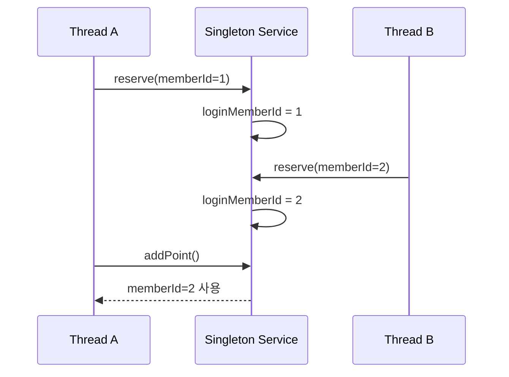
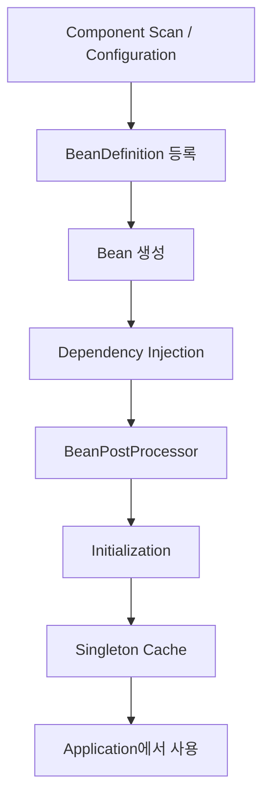
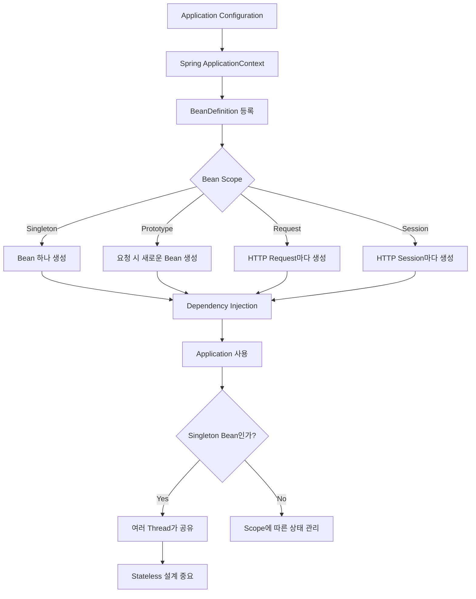

# 러키의 Spring Bean은 누가, 어떻게 관리할까?
[https://youtu.be/QMPrXjsRRhY?si=_mMmIoNcD6NZEDnD](https://youtu.be/QMPrXjsRRhY?si=_mMmIoNcD6NZEDnD)

# 러키의 Spring Bean은 누가, 어떻게 관리할까?
* toc
{:toc}

---

## Spring Bean은 누가 어떻게 관리할까? Bean Scope와 Singleton의 동작 원리

Spring Boot로 개발하다 보면 객체를 직접 생성하는 일이 생각보다 많지 않다.

Controller를 만들 때도

```java
@RestController
public class ReservationController {

    private final ReservationService reservationService;

    public ReservationController(
            ReservationService reservationService
    ) {
        this.reservationService = reservationService;
    }
}
```

`ReservationService`를 직접 생성하지 않는다.

```java
new ReservationService(...)
```

Service 역시 Repository를 직접 생성하지 않는다.

```java
@Service
public class ReservationService {

    private final ReservationRepository reservationRepository;

    public ReservationService(
            ReservationRepository reservationRepository
    ) {
        this.reservationRepository = reservationRepository;
    }
}
```

`@Service`, `@Repository`, `@Controller` 같은 애너테이션을 적절하게 붙이고 의존관계를 선언하면 Spring이 객체를 만들고 필요한 곳에 연결해준다.

평소에는 너무 자연스럽게 사용하는 기능이지만 조금만 생각해보면 꽤 흥미로운 질문이 생긴다.

```text
Spring은 왜 객체를 직접 관리할까?

생성한 객체는 어디에 보관할까?

요청이 들어올 때마다 새로 만드는 것일까?

왜 Spring Bean의 기본 Scope는 Singleton일까?

Singleton Bean을 여러 Thread가 동시에 사용해도 괜찮을까?
```

이 질문들의 중심에는 **Spring IoC Container와 Bean Scope**가 있다.

---

## Spring이 없다면 객체 생성도 개발자의 책임이다

먼저 Spring이 없는 애플리케이션을 생각해보자.

Controller가 Service를 사용하고, Service가 Repository를 사용하며, Repository가 `JdbcTemplate`을 사용한다고 가정한다.

의존관계는 다음과 같다.

```text
ReservationController

↓

ReservationService

↓

ReservationRepository

↓

JdbcTemplate

↓

DataSource
```

Spring이 없다면 누군가는 이 객체를 직접 생성해야 한다.

```java
DataSource dataSource =
        createDataSource();

JdbcTemplate jdbcTemplate =
        new JdbcTemplate(dataSource);

ReservationRepository repository =
        new ReservationRepository(jdbcTemplate);

ReservationService service =
        new ReservationService(repository);

ReservationController controller =
        new ReservationController(service);
```

동작 자체에는 문제가 없다.

오히려 객체가 몇 개 없다면 이해하기도 쉽다.

문제는 애플리케이션이 커지기 시작할 때다.

---

## 객체가 많아지면 생성보다 연결이 어려워진다

객체가 3개일 때는 직접 생성해도 크게 어렵지 않다.

하지만 애플리케이션에 수백 개의 객체가 존재한다고 생각해보자.

```text
Controller A
    ↓
Service A
    ↓
Repository A
    ↓
DataSource

Controller B
    ↓
Service B
    ↓
Client
    ↓
HttpClient

Service C
    ↓
Repository C
    ↓
EntityManager
```

개발자는 단순히 객체를 생성하는 것뿐 아니라 다음 관계를 모두 알아야 한다.

```text
누가 누구에게 의존하는가?

어떤 객체를 먼저 생성해야 하는가?

같은 객체를 재사용해야 하는가?

새로운 객체를 만들어야 하는가?

객체를 언제 초기화해야 하는가?

언제 정리해야 하는가?
```

생성자 하나가 바뀌어도 객체를 조립하는 코드가 함께 변경될 수 있다.

예를 들어 `ReservationService`에 새로운 의존성이 추가됐다고 하자.

```java
public ReservationService(
        ReservationRepository repository,
        NotificationClient notificationClient
) {
    this.repository = repository;
    this.notificationClient = notificationClient;
}
```

직접 객체를 조립하고 있었다면 생성하는 코드도 수정해야 한다.

```java
NotificationClient notificationClient =
        new NotificationClient(...);

ReservationService service =
        new ReservationService(
                repository,
                notificationClient
        );
```

객체 그래프가 커질수록 이런 조립 작업도 복잡해진다.

---

## 객체 생성과 연결을 다른 누군가에게 맡긴다면

여기서 사고를 조금 바꿔볼 수 있다.

개발자가

```text
객체 생성

의존관계 탐색

객체 연결

생명주기 관리
```

를 모두 직접 하지 않고,

```text
나는 어떤 객체가 필요한지만 선언한다.
```

고 하면 어떨까?

예를 들어 다음과 같이 작성한다.

```java
@Service
public class ReservationService {

    private final ReservationRepository repository;

    public ReservationService(
            ReservationRepository repository
    ) {
        this.repository = repository;
    }
}
```

개발자는

```text
ReservationService를 만들려면
ReservationRepository가 필요하다.
```

는 사실만 표현한다.

실제 Repository를 찾아 생성하고 전달하는 작업은 다른 주체가 담당한다.

그 역할을 하는 것이 **Spring Container**다.

---

## IoC란 무엇인가?

Spring을 이해할 때 자주 등장하는 용어가 IoC다.

IoC는 Inversion of Control, 즉 **제어의 역전**을 의미한다.

Spring을 사용하지 않는 코드에서는 객체 생성의 제어권이 애플리케이션 코드에 있다.

```text
Application Code

↓

new Repository()

↓

new Service(repository)

↓

new Controller(service)
```

개발자가 직접 결정한다.

Spring을 사용하면 흐름이 달라진다.

```text
Application

"ReservationService에는
ReservationRepository가 필요하다."

↓

Spring Container

객체 생성
의존성 탐색
의존성 연결
생명주기 관리
```

객체를 생성하고 조립하는 제어권이 애플리케이션 코드에서 Container로 이동한다.

그래서 제어의 역전이라고 부른다.

---

## Spring Bean이란 무엇인가?

Spring이 관리하는 객체를 **Bean**이라고 부른다.

일반 Java 객체와 Spring Bean이 클래스 자체부터 다른 것은 아니다.

```java
public class ReservationService {
}
```

그저 Java 객체다.

하지만 이 객체를 Spring IoC Container가 생성하고 조립하고 관리하기 시작하면 Spring Bean이 된다.

Spring 공식 문서에서도 Bean을 Spring IoC Container에 의해 인스턴스화되고 조립되며 관리되는 객체라고 설명한다.

즉 핵심은 클래스 모양이 아니라 **누가 객체의 생명주기를 관리하느냐**다.

---

## @Service를 붙였다고 바로 객체가 생기는 것은 아니다

다음 클래스가 있다고 하자.

```java
@Service
public class ReservationService {
}
```

`@Service` 자체가 직접

```java
new ReservationService();
```

를 실행하는 것은 아니다.

Spring이 Component Scan 등을 통해 클래스를 발견하고 Bean Definition이라는 메타데이터를 등록한 뒤 그 정보를 바탕으로 Bean을 생성한다.

개념적으로 보면 다음과 같다.

```text
@Service

↓

Component Scan

↓

Bean Definition 등록

↓

Bean 생성

↓

Spring Container에서 관리
```

Bean Definition에는 단순히 클래스 이름만 존재하는 것이 아니라 Scope, 생성자 인자, Lazy 여부, 초기화 및 종료 관련 정보 등 Bean 생성에 필요한 여러 메타데이터가 들어갈 수 있다.

---

## Spring Container는 무엇인가?

Spring에서 Bean을 관리하는 핵심 Container API를 이해할 때 두 가지 이름이 자주 등장한다.

```text
BeanFactory

ApplicationContext
```

둘을 완전히 별개의 Container라고 생각하기보다 관계를 보는 것이 중요하다.

```text
BeanFactory
    ↑
ApplicationContext
```

`ApplicationContext`는 `BeanFactory`를 확장한다.

---

## BeanFactory

`BeanFactory`는 Spring IoC Container의 핵심적인 기능을 정의한다.

대표적인 역할은 Bean을 생성하고 의존성을 연결하며 Bean을 조회하는 것이다.

개념적으로 다음과 같다.

```text
BeanFactory

├── Bean Definition 관리
├── Bean 생성
├── Dependency Injection
└── Bean 조회
```

우리가 흔히 사용하는

```java
applicationContext.getBean(
        ReservationService.class
);
```

같은 기능의 기반에도 BeanFactory의 역할이 있다.

---

## ApplicationContext

실제 Spring 애플리케이션에서는 보통 `BeanFactory`를 직접 사용하는 것보다 `ApplicationContext`를 사용한다.

ApplicationContext는 BeanFactory 기능을 포함하면서 추가적인 애플리케이션 기능을 제공한다.

대표적으로 이벤트 발행, 메시지 처리, Resource 접근과 여러 Container 확장 기능을 지원한다.

관계를 단순화하면 다음과 같다.

```text
ApplicationContext

├── BeanFactory 기능
│
├── Bean 생성 / DI
├── Bean Lifecycle
├── Event
├── Resource
├── MessageSource
└── 여러 Spring 확장 기능
```

그래서 일반적인 Spring Boot 애플리케이션에서 우리가 만나는 실질적인 Container는 대부분 ApplicationContext라고 생각해도 좋다.

---

## Spring Container가 대신 해주는 일

예를 들어 다음 객체 관계가 있다고 하자.

```text
ReservationController

↓

ReservationService

↓

ReservationRepository
```

개발자는 클래스만 작성한다.

```java
@RestController
public class ReservationController {

    private final ReservationService service;

    public ReservationController(
            ReservationService service
    ) {
        this.service = service;
    }
}
```

```java
@Service
public class ReservationService {

    private final ReservationRepository repository;

    public ReservationService(
            ReservationRepository repository
    ) {
        this.repository = repository;
    }
}
```

```java
@Repository
public class ReservationRepository {
}
```

Container는 객체 그래프를 구성한다.

```text
ReservationRepository 생성

↓

ReservationService 생성

repository 주입

↓

ReservationController 생성

service 주입
```

개발자는 직접 `new`를 연결하지 않는다.

---

## 의존성 주입과 IoC는 연결되어 있다

IoC와 DI는 비슷하게 사용되지만 관점을 나눠보면 이해하기 쉽다.

IoC는 더 넓은 개념이다.

```text
객체 생성과 관리의 제어권을
Framework가 가져간다.
```

DI는 그 과정에서 객체가 필요로 하는 의존성을 외부에서 전달하는 방법이다.

```text
ReservationService

"Repository 필요"

↓

Container

ReservationRepository 전달
```

즉 Spring Container가 객체 생성의 제어권을 가지고 있기 때문에 의존성 주입도 자연스럽게 수행할 수 있다.

---

## 그런데 Spring이 만든 Bean은 얼마나 오래 살아 있을까?

Spring이 Bean을 생성한다는 것까지 이해했다.

그다음 질문은 이것이다.

```text
한 번 생성해서 계속 사용할까?

필요할 때마다 새로 만들까?

HTTP 요청마다 새로 만들까?

사용자 Session마다 하나씩 만들까?
```

이 질문을 결정하는 개념이 **Bean Scope**다.

---

## Bean Scope란 무엇인가?

Bean Scope는 한 Bean Definition으로부터 만들어진 객체가 **어떤 범위에서 존재하고 재사용될지** 결정한다.

Spring이 제공하는 대표적인 Scope는 다음과 같다.

| Scope       | 생성 및 유지 범위                                 |
| ----------- | ------------------------------------------ |
| singleton   | Spring IoC Container에서 Bean Definition당 하나 |
| prototype   | Container에 Bean을 요청할 때 새로운 인스턴스            |
| request     | HTTP Request마다 하나                          |
| session     | HTTP Session마다 하나                          |
| application | ServletContext 단위                          |
| websocket   | WebSocket Session 단위                       |

일반적인 Spring Bean의 기본 Scope는 `singleton`이다.

별도로 지정하지 않으면 Singleton Bean이 된다.

```java
@Service
public class ReservationService {
}
```

이 클래스도 기본적으로 Singleton Scope다.

명시적으로 표현하면 다음과 비슷하다.

```java
@Service
@Scope("singleton")
public class ReservationService {
}
```

하지만 기본값이기 때문에 일반적으로 `@Scope("singleton")`은 작성하지 않는다.

---

## Singleton Scope란 무엇인가?

Spring Singleton Scope에서 하나의 Bean Definition에 대해 Container가 하나의 공유 인스턴스를 관리한다.

예를 들어 다음 Bean을 생각해보자.

```java
@Service
public class ReservationService {
}
```

Container가 만든 객체가 다음 하나라고 해보자.

```text
ReservationService Instance A
```

여러 곳에서 `ReservationService`를 요청한다.

```text
Controller A
        ↓

ReservationService A


Controller B
        ↓

ReservationService A


Controller C
        ↓

ReservationService A
```

같은 Container와 같은 Bean Definition에 대한 요청이라면 동일한 Bean이 주입된다.

Spring 공식 문서에서도 Singleton Scope를 **Spring IoC Container당, Bean Definition당 하나의 인스턴스**로 설명한다.

이 표현이 중요하다.

---

## Singleton은 애플리케이션 전체에 무조건 하나라는 뜻이 아니다

Singleton을 다음처럼 단순화하면 조금 부정확하다.

```text
이 클래스는 JVM에 무조건 하나만 존재한다.
```

Spring Singleton의 정확한 범위는 다음에 가깝다.

```text
Spring Container

+

Bean Definition

↓

하나의 Bean Instance
```

예를 들어 같은 클래스를 서로 다른 이름의 Bean으로 두 번 등록하면 같은 타입의 객체가 두 개 생길 수도 있다.

Spring Container 자체가 여러 개라면 각 Container가 별도의 Singleton Bean을 관리할 수도 있다.

그래서 Spring Singleton은 보통

```text
per-container
per-bean
```

이라고 설명한다.

---

## Prototype Scope란 무엇인가?

Prototype은 Singleton과 반대되는 특징을 이해하기 좋은 Scope다.

다음처럼 설정한다.

```java
@Component
@Scope("prototype")
public class ReservationCommand {
}
```

Container에 Bean을 요청한다.

```java
ReservationCommand first =
        applicationContext.getBean(
                ReservationCommand.class
        );

ReservationCommand second =
        applicationContext.getBean(
                ReservationCommand.class
        );
```

Prototype에서는 각각 새로운 객체가 만들어진다.

```text
first

→ Instance A


second

→ Instance B
```

따라서

```java
first == second
```

결과는 `false`가 된다.

Spring 공식 문서 역시 Prototype Scope는 해당 Bean이 요청될 때 새로운 인스턴스를 생성한다고 설명한다.

---

## Singleton과 Prototype을 비교하면

동작 차이를 단순하게 정리하면 다음과 같다.

| 구분              | Singleton    | Prototype          |
| --------------- | ------------ | ------------------ |
| 기본 Scope        | O            | X                  |
| 동일 Bean 요청      | 같은 객체        | 새로운 객체             |
| 일반적인 사용 방향      | Stateless 객체 | 독립 상태가 필요한 객체      |
| Container 관리 범위 | 전체 생명주기 관리   | 생성·설정 후 관리 범위가 제한됨 |

Spring 공식 문서에서는 일반적인 기준으로 Stateless Bean에는 Singleton을, Stateful Bean에는 Prototype을 고려할 수 있다고 설명한다.

하지만 여기서 중요한 것은 Prototype을 단순히

```text
Singleton보다 안전한 Scope
```

라고 생각하지 않는 것이다.

Scope를 선택하는 기준은 객체가 맡은 책임과 상태의 생명주기여야 한다.

---

## 왜 Spring의 기본 Scope는 Singleton일까?

Service를 생각해보자.

```java
@Service
public class ReservationService {

    private final ReservationRepository repository;

    public ReservationService(
            ReservationRepository repository
    ) {
        this.repository = repository;
    }
}
```

이 객체가 요청마다 달라져야 할 이유가 있을까?

일반적인 Service라면 없다.

요청 A가 사용하는 비즈니스 로직과 요청 B가 사용하는 비즈니스 로직 자체는 같다.

```text
Request A
        ↓

ReservationService


Request B
        ↓

ReservationService


Request C
        ↓

ReservationService
```

상태를 가지지 않는다면 하나의 객체를 여러 요청이 공유해도 된다.

굳이 다음처럼 요청마다 객체를 생성할 필요가 없다.

```text
Request A
→ ReservationService A

Request B
→ ReservationService B

Request C
→ ReservationService C
```

Singleton은 이런 Stateless Service와 잘 맞는다.

---

## 객체 재사용은 분명한 장점이 있다

Singleton은 한 번 생성한 객체를 재사용한다.

```text
Bean 생성

↓

재사용

↓

재사용

↓

재사용
```

반면 매번 새로운 객체를 만든다면

```text
객체 생성

↓

사용

↓

더 이상 참조하지 않음

↓

GC 대상
```

이라는 과정이 반복된다.

객체 생성과 Garbage Collection에는 비용이 존재하기 때문에 불필요하게 객체를 계속 만드는 것보다 재사용 가능한 Stateless 객체를 공유하는 것이 자원 효율 측면에서 유리할 수 있다.

하지만 여기서 하나는 정확히 구분할 필요가 있다.

```text
Spring이 Singleton을 기본으로 선택한 이유

=

오직 GC 성능 때문
```

이라고 단정할 필요는 없다.

더 중요한 설계상의 이유는 **일반적인 Service, Repository, Controller 같은 Spring Component가 요청별 상태를 저장할 필요가 없는 Stateless 객체인 경우가 많으며, 이런 객체는 하나를 만들어 공유하는 모델과 자연스럽게 맞는다는 것**이다.

성능과 객체 생성 비용 절감은 이 구조에서 얻는 장점 중 하나로 보는 편이 더 적절하다.

---

## Singleton이라고 객체 생성 비용을 항상 걱정할 필요가 없는 이유

현대 JVM에서는 짧은 객체의 생성 자체가 상당히 저렴한 경우가 많다.

따라서

```text
Prototype Bean을 하나 더 만들었다.

↓

GC가 급격히 증가한다.

↓

서비스 성능이 크게 떨어진다.
```

라는 식의 단순한 공식은 성립하지 않는다.

실제 비용은 객체 크기와 생성 빈도, 객체 그래프, GC 알고리즘, Heap 크기 등 여러 조건에 따라 달라진다.

따라서 Scope 선택을 단순 Benchmark 결과만으로 결정하기보다는 **객체의 상태와 생명주기**를 먼저 봐야 한다.

---

## Spring Singleton과 GoF Singleton은 다르다

이 부분은 매우 중요하다.

일반적으로 디자인 패턴에서 Singleton을 구현한다면 다음처럼 만들 수 있다.

```java
public class PaymentService {

    private static final PaymentService INSTANCE =
            new PaymentService();

    private PaymentService() {
    }

    public static PaymentService getInstance() {
        return INSTANCE;
    }
}
```

클래스 스스로 인스턴스를 하나만 만들도록 강제한다.

구조적으로 보면 다음과 같다.

```text
PaymentService

├── private constructor
├── static instance
└── getInstance()
```

Singleton 생성 책임이 클래스 안에 있다.

---

## Spring Singleton은 클래스가 Singleton일 필요가 없다

Spring에서는 평범한 클래스를 작성하면 된다.

```java
@Service
public class PaymentService {

    public PaymentService() {
    }
}
```

생성자를 `private`으로 막거나 `static INSTANCE`를 만들지 않는다.

대신 Spring Container가 객체를 하나 생성하고 관리한다.

```text
PaymentService

↓

Spring Container

↓

Instance A
```

여러 Bean이 필요로 하면 같은 Instance A를 전달한다.

Spring 공식 문서에서도 GoF Singleton은 일반적으로 ClassLoader 범위에서 하나의 인스턴스를 클래스 자체가 강제하는 방식인 반면, Spring Singleton은 Container와 Bean Definition 범위에서 Container가 관리한다는 차이를 명확히 설명한다.

---

## Spring Singleton이 테스트하기 편한 이유

직접 Singleton Pattern을 구현하면 객체 획득 방식이 고정될 수 있다.

```java
PaymentService.getInstance();
```

내부 의존성까지 전역 객체에 강하게 묶이면 테스트하기 어려워질 수 있다.

Spring에서는 Singleton 여부를 Container가 관리한다.

그래서 클래스 자체는 생성자 주입을 그대로 사용할 수 있다.

```java
@Service
public class ReservationService {

    private final ReservationRepository repository;

    public ReservationService(
            ReservationRepository repository
    ) {
        this.repository = repository;
    }
}
```

테스트에서는 Spring Container 없이도 직접 다른 구현체를 넣을 수 있다.

```java
ReservationRepository repository =
        new FakeReservationRepository();

ReservationService service =
        new ReservationService(repository);
```

Singleton을 관리하는 책임이 도메인이나 서비스 객체 내부에 박혀 있지 않기 때문에 객체 설계가 훨씬 유연해진다.

---

## Singleton의 진짜 주의사항은 공유 상태다

Singleton Bean의 핵심적인 문제는 객체가 하나라는 사실 자체가 아니다.

**하나의 객체를 여러 요청과 여러 Thread가 동시에 공유한다는 것**이다.

예를 들어 다음 Service를 만들어보자.

```java
@Service
public class ReservationService {

    private Long loginMemberId;

    public void reserve(Long memberId) {
        this.loginMemberId = memberId;

        // 예약 처리

        addPoint();
    }

    private void addPoint() {
        pointService.addPoint(loginMemberId);
    }
}
```

겉으로 보면 동작할 것 같다.

하지만 실제 웹 서버에서는 여러 요청이 동시에 들어올 수 있다.

---

## 두 요청이 동시에 들어오면 어떻게 될까?

초기 상태는 다음과 같다.

```text
ReservationService

loginMemberId = null
```

Request A가 들어온다.

```text
Thread A

memberId = 1
```

Service 필드가 변경된다.

```text
loginMemberId = 1
```

그런데 `addPoint()`가 실행되기 전에 Request B가 들어온다.

```text
Thread B

memberId = 2
```

같은 Singleton Bean을 사용한다.

그래서 필드를 변경한다.

```text
loginMemberId = 2
```

다시 Thread A가 실행된다.

Thread A의 요청에서는 1번 회원에게 포인트를 지급해야 한다.

그런데 현재 필드는

```text
loginMemberId = 2
```

다.

결국 잘못된 사용자에게 포인트를 지급할 수 있다.

---

## Singleton Bean에서 발생하는 Race Condition

전체 흐름을 보면 다음과 같다.



Thread마다 Service가 존재하는 것이 아니다.

```text
Thread A ─┐
          │
          ├── Singleton Service
          │
Thread B ─┘
```

따라서 변경 가능한 필드가 있다면 Thread 간에 같은 상태를 공유하게 된다.

---

## Singleton Bean은 Stateless하게 설계하자

일반적인 Service, Repository, Controller 같은 Singleton Bean은 요청마다 변하는 데이터를 인스턴스 필드에 저장하지 않는 것이 기본적인 설계 방향이다.

다음 코드는 위험하다.

```java
@Service
public class ReservationService {

    private Long loginMemberId;

    public void reserve(Long memberId) {
        loginMemberId = memberId;
    }
}
```

대신 필요한 상태를 Parameter로 전달한다.

```java
@Service
public class ReservationService {

    public void reserve(Long memberId) {
        addPoint(memberId);
    }

    private void addPoint(Long memberId) {
        // ...
    }
}
```

이제 요청마다 필요한 값은 Method 호출 흐름 안에서 이동한다.

```text
Thread A

memberId = 1


Thread B

memberId = 2
```

Singleton Bean 자체에는 요청별 상태가 남지 않는다.

---

## 그렇다고 Singleton Bean에는 필드가 하나도 없어야 할까?

그렇지는 않다.

다음 코드를 생각해보자.

```java
@Service
public class ReservationService {

    private final ReservationRepository repository;
    private final Clock clock;

    public ReservationService(
            ReservationRepository repository,
            Clock clock
    ) {
        this.repository = repository;
        this.clock = clock;
    }
}
```

이런 의존성 필드는 일반적이다.

중요한 차이는 **요청마다 값이 덮어쓰이는 상태인지**다.

다음은 위험하다.

```java
private Long currentMemberId;
private Reservation currentReservation;
private int temporaryCount;
```

다음처럼 한 번 설정되고 변경되지 않는 의존성은 일반적인 Singleton 구조에서 자연스럽다.

```java
private final ReservationRepository repository;
private final PaymentClient paymentClient;
```

하지만 `final`이라고 해서 객체 내부까지 자동으로 Thread-Safe해지는 것은 아니다.

참조하는 객체 자체가 Mutable하고 Thread-Safe하지 않다면 여전히 문제가 발생할 수 있다.

---

## 지역변수는 왜 상대적으로 안전할까?

다음 코드를 보자.

```java
public void reserve(Long memberId) {

    Reservation reservation =
            createReservation(memberId);

    repository.save(reservation);
}
```

`memberId`와 `reservation`은 Method 호출에 속한 값이다.

각 Thread는 자신의 호출 흐름을 가지고 있기 때문에 요청 A의 지역변수와 요청 B의 지역변수가 Service 인스턴스 필드처럼 하나의 저장 공간을 직접 공유하지 않는다.

개념적으로 보면 다음과 같다.

```text
Thread A Stack

memberId = 1
reservation = A


Thread B Stack

memberId = 2
reservation = B
```

그래서 요청별 데이터를 Singleton 필드에 보관하지 않고 Parameter와 지역변수로 처리하는 것이 안전한 기본 패턴이다.

다만 지역변수에 저장된 **참조가 공유 Mutable Object를 가리키고 있다면** 그 객체까지 자동으로 Thread-Safe해지는 것은 아니다.

Thread Safety는 단순히 “지역변수냐 필드냐” 하나만으로 결정되지는 않는다.

---

## Singleton Bean과 Thread Safety는 같은 개념이 아니다

Singleton이라는 말 때문에 다음과 같이 오해하기 쉽다.

```text
Spring이 Singleton으로 관리한다.

↓

Spring이 Thread Safety도 보장해준다.
```

그렇지 않다.

Spring은

```text
이 Bean을 하나만 만들어 공유한다.
```

는 것을 관리할 뿐이다.

그 Bean 안에 작성한 코드가 동시 접근에 안전한지는 개발자가 책임져야 한다.

```text
Spring Singleton

→ 객체 개수에 대한 Scope


Thread Safety

→ 동시에 접근했을 때 상태가 안전한지에 대한 문제
```

서로 다른 개념이다.

---

## Thread-Safe한 공유 상태가 필요한 경우도 있다

Singleton Bean이라고 해서 공유 상태를 절대로 만들 수 없는 것도 아니다.

예를 들어 Atomic 타입이나 동시성 Collection처럼 명시적으로 Thread-Safe하게 설계한 상태가 필요할 수도 있다.

```java
@Component
public class RequestCounter {

    private final AtomicLong count =
            new AtomicLong();

    public long increment() {
        return count.incrementAndGet();
    }
}
```

하지만 이런 상태를 추가할 때는 명확한 이유가 있어야 한다.

일반적인 비즈니스 Service에서 요청별 데이터까지 Bean Field에 저장하는 것과는 다른 문제다.

특히 서버가 여러 대라면 Singleton의 상태는 서버 한 대 안에서만 공유된다.

```text
Server A
RequestCounter = 100

Server B
RequestCounter = 87
```

따라서 분산 시스템 전체의 상태를 Singleton Bean에 보관하는 것 역시 적절하지 않은 경우가 많다.

---

## Prototype을 사용하면 상태 문제를 모두 해결할 수 있을까?

그렇다면 다음 생각을 할 수 있다.

```text
상태가 필요하다면
Service를 Prototype으로 만들면 되지 않을까?
```

기술적으로는 가능하지만 일반적인 웹 서비스의 Service 상태를 해결하는 방식으로 Prototype을 선택하는 것은 신중해야 한다.

```java
@Service
@Scope("prototype")
public class ReservationService {
}
```

이제 Bean을 Container에 요청할 때마다 새로운 인스턴스를 만들 수 있다.

하지만 요청별 상태라면 `request` Scope가 의미상 더 적절할 수도 있고, 대부분의 Service는 애초에 요청 상태를 Service 내부에 저장하지 않도록 설계하는 것이 더 단순하다.

Scope를 변경해서 잘못된 상태 설계를 가리는 것보다 먼저

```text
이 상태가 정말 Service의 Field여야 하는가?
```

를 질문하는 것이 좋다.

---

## Prototype Bean의 중요한 생명주기 특징

Prototype에는 알아두어야 할 특징이 하나 더 있다.

Spring은 Prototype Bean을 생성하고 의존성을 설정한 다음 클라이언트에게 전달한다.

하지만 이후의 전체 생명주기를 Singleton과 동일하게 끝까지 관리하지 않는다.

특히 Spring 공식 문서에서는 Prototype Bean에 대해 설정된 destruction lifecycle callback은 Container가 호출하지 않는다고 설명한다.

즉 개념적으로 다음과 같다.

```text
Prototype 요청

↓

Container가 생성

↓

Dependency Injection

↓

초기화

↓

사용자에게 전달

↓

이후 관리 책임은 제한적
```

Prototype Bean이 파일이나 Socket 같은 비싼 외부 Resource를 가지고 있다면 정리 방법까지 함께 고려해야 한다.

---

## Singleton 안에 Prototype을 주입하면 새로운 객체가 계속 생길까?

이 부분은 실무에서 자주 헷갈린다.

다음 구조를 생각해보자.

```java
@Component
@Scope("prototype")
public class PrototypeBean {
}
```

그리고 Singleton Bean이 Prototype Bean을 생성자 주입받는다.

```java
@Service
public class SingletonService {

    private final PrototypeBean prototypeBean;

    public SingletonService(
            PrototypeBean prototypeBean
    ) {
        this.prototypeBean = prototypeBean;
    }
}
```

많은 경우 다음처럼 생각할 수 있다.

```text
SingletonService에서
prototypeBean을 사용할 때마다

새로운 Prototype이 만들어지겠지?
```

하지만 생성자 주입은 SingletonService가 생성될 때 한 번 이루어진다.

```text
SingletonService 생성

↓

PrototypeBean A 생성

↓

PrototypeBean A 주입

↓

SingletonService가 계속
PrototypeBean A 사용
```

Spring 공식 문서에서도 Singleton Bean에 Prototype Bean을 일반적인 DI로 주입하면 Singleton 생성 시점에 Prototype 인스턴스가 한 번 만들어져 주입된다고 설명한다.

---

## 매번 새로운 Prototype이 필요하다면

런타임마다 새로운 Prototype 인스턴스가 필요하다면 일반적인 생성자 주입만으로는 원하는 동작이 나오지 않는다.

이럴 때는 `ObjectProvider` 같은 방법을 사용할 수 있다.

```java
@Service
public class SingletonService {

    private final ObjectProvider<PrototypeBean> provider;

    public SingletonService(
            ObjectProvider<PrototypeBean> provider
    ) {
        this.provider = provider;
    }

    public void execute() {
        PrototypeBean bean =
                provider.getObject();

        bean.execute();
    }
}
```

호출할 때마다 Container에 새로운 Prototype Bean을 요청할 수 있다.

```text
execute #1
→ Prototype A

execute #2
→ Prototype B

execute #3
→ Prototype C
```

Scope가 서로 다른 Bean을 연결할 때는 이런 생명주기 차이까지 고려해야 한다.

---

## Request Scope는 무엇이 다를까?

웹 애플리케이션에서는 Request Scope도 사용할 수 있다.

```java
@Component
@RequestScope
public class RequestContext {
}
```

HTTP 요청 하나마다 별도의 인스턴스가 만들어진다.

```text
Request A

↓

RequestContext A


Request B

↓

RequestContext B
```

Singleton과 비교하면 다음과 같다.

```text
Singleton

Request A ─┐
Request B ─┼── Bean A
Request C ─┘
```

```text
Request Scope

Request A → Bean A
Request B → Bean B
Request C → Bean C
```

Request별 상태가 정말 객체의 책임이라면 이러한 Scope를 고려할 수 있다.

Spring의 `request`, `session`, `application`, `websocket` Scope는 web-aware `ApplicationContext`에서 사용할 수 있다.

---

## Scope는 객체의 상태 생명주기와 맞아야 한다

Bean Scope를 외울 때 단순히

```text
Singleton
Prototype
Request
Session
Application
```

만 외우면 실제 설계에서 사용하기 어렵다.

더 중요한 질문은 이것이다.

```text
이 객체가 가지고 있는 상태는
언제 생성되어 언제까지 유지되어야 하는가?
```

애플리케이션 전체에서 공유해도 되는 Stateless Service라면 Singleton이 자연스럽다.

HTTP 요청 동안에만 유지되어야 하는 상태라면 Request Scope를 검토할 수 있다.

사용자 Session 동안 유지해야 한다면 Session Scope가 있을 수 있다.

호출할 때마다 독립 객체가 필요한 특별한 경우라면 Prototype을 고려할 수 있다.

즉 Scope는 단순 성능 설정이 아니라 **객체의 생명주기 설계**다.

---

## Singleton Bean 생성 과정을 조금 더 들어가보면

Spring이 Component Scan으로 Bean 후보를 발견하면 내부적으로 Bean Definition을 등록한다.

개념적으로 다음 정보들이 Container에 저장된다.

```text
Bean Name

Bean Class

Scope

Constructor Dependency

Lazy 여부

Initialization 정보

Destruction 정보
```

그다음 ApplicationContext 초기화 과정에서 일반적인 non-lazy Singleton Bean들이 생성된다.

의존관계를 찾아 연결하고 필요한 BeanPostProcessor 처리 등을 거쳐 사용할 수 있는 Bean으로 만든다.

단순화하면 다음과 같다.



실제 Spring Bean 생명주기는 더 복잡하지만 전체 구조를 이해하기에는 이 흐름이 유용하다.

---

## Singleton Bean은 어디에 저장될까?

개념적으로 Spring Container 내부에는 생성된 Singleton 객체를 보관하는 저장 공간이 있다고 생각할 수 있다.

```text
Spring Container

Singleton Cache

reservationController
→ Instance A

reservationService
→ Instance B

reservationRepository
→ Instance C
```

다시 같은 Bean을 요청한다.

```java
context.getBean(
        ReservationService.class
);
```

이미 생성된 Singleton이 있다면 Container는 새로운 Service를 만들지 않고 관리하고 있는 객체를 반환한다.

Spring 공식 문서 역시 Singleton Bean 인스턴스가 캐시에 저장되고 이후 해당 Bean에 대한 요청에서 같은 객체가 반환된다고 설명한다.

---

## @Configuration의 @Bean은 왜 여러 번 호출해도 Singleton일까?

조금 더 들어가면 흥미로운 동작도 있다.

다음 설정을 생각해보자.

```java
@Configuration
public class AppConfig {

    @Bean
    public ReservationRepository reservationRepository() {
        return new ReservationRepository();
    }

    @Bean
    public ReservationService reservationService() {
        return new ReservationService(
                reservationRepository()
        );
    }
}
```

Java 코드만 보면

```java
reservationRepository()
```

를 호출할 때마다

```java
new ReservationRepository()
```

가 실행될 것처럼 보인다.

하지만 일반적인 Full `@Configuration`에서는 Spring이 Configuration Class를 확장하고 Bean 메서드 호출을 가로채 Container가 관리하고 있는 Bean을 확인한다.

이미 Singleton Bean이 있다면 기존 객체를 반환한다.

그래서 일반적인 상황에서는

```text
reservationRepository()

↓

매번 new
```

가 아니라

```text
reservationRepository()

↓

Container 확인

↓

기존 Singleton 반환
```

으로 동작할 수 있다.

이 역시 Singleton 생명주기를 Container가 책임진다는 것을 보여주는 사례다.

---

## Spring Singleton의 Thread Safety는 어떻게 확보해야 할까?

일반적인 Singleton Service에서는 다음 원칙이 실용적이다.

의존성은 생성자를 통해 주입하고 가능한 한 변경되지 않도록 유지한다.

```java
private final ReservationRepository repository;
```

요청별 값은 Parameter로 전달한다.

```java
public void reserve(
        Long memberId,
        ReservationRequest request
) {
}
```

Method 내부에서만 필요한 상태는 지역변수로 사용한다.

```java
Reservation reservation =
        Reservation.create(
                memberId,
                request
        );
```

요청마다 변경되는 값을 Singleton Field에 저장하지 않는다.

```java
private Long currentMemberId;
```

이 기본 원칙만 지켜도 일반적인 Spring Service에서 발생할 수 있는 많은 공유 상태 문제를 피할 수 있다.

---

## 상태는 가능하면 상태를 책임져야 할 곳에 둔다

예를 들어 현재 로그인 사용자의 ID를 Service Bean에 저장하는 것은 이상하다.

```text
ReservationService

currentMemberId
```

로그인 사용자 정보는 요청 Context나 인증 Context에 가까운 정보다.

예약 상태는 Reservation Domain에 있어야 한다.

```text
Reservation

status
reservationDate
memberId
```

공유 캐시라면 Redis 같은 별도 저장소가 더 적합할 수 있다.

```text
Application

↓

Redis
```

즉 Singleton을 Stateless하게 만드는 것은 단순한 동시성 기법이 아니라 **상태를 올바른 책임을 가진 위치로 이동시키는 설계 문제**이기도 하다.

---

## Spring Bean을 이해하면 여러 Spring 기능이 연결된다

Bean과 Container 개념을 이해하면 다른 Spring 기술도 자연스럽게 연결된다.

예를 들어 `@Transactional`이 동작하려면 Service가 Spring Bean이어야 한다.

```text
Spring Bean

↓

Proxy 생성 가능

↓

Transaction Interceptor

↓

@Transactional 동작
```

`@Async`도 비슷하다.

```text
Spring Bean

↓

Proxy

↓

Async Interceptor
```

`@Cacheable`도 마찬가지다.

```text
Spring Bean

↓

Proxy

↓

Cache Interceptor
```

Spring이 객체의 생성과 참조를 관리하기 때문에 객체 사이에 Proxy를 끼우거나 BeanPostProcessor를 통해 기능을 추가할 수 있다.

그래서 Bean Container를 이해하는 것은 단순히 DI를 이해하는 것 이상으로 중요하다.

---

## 직접 new로 만든 객체에서는 왜 Spring 기능이 안 될까?

다음 클래스를 보자.

```java
@Service
public class PaymentService {

    @Transactional
    public void pay() {
    }
}
```

Spring이 생성한 Bean을 주입받아서 사용한다면 Transaction Proxy 등의 Spring 기능이 적용될 수 있다.

하지만 개발자가 직접 생성하면

```java
PaymentService service =
        new PaymentService();
```

이 객체는 Spring Container가 관리하는 Bean이 아니다.

Spring이 생성 과정에 참여하지 않았고 BeanPostProcessor나 Proxy 생성 과정도 거치지 않는다.

그래서 Spring Annotation 기반 기능을 이해할 때 항상

```text
이 객체는 Spring Bean인가?
```

를 확인하는 습관이 중요하다.

---

## 전체 구조

Spring Bean 관리 구조를 하나로 연결하면 다음과 같다.



Spring Container가 단순히 객체를 대신 `new` 해주는 도구가 아니라는 것을 알 수 있다.

객체의

```text
생성

연결

Scope

초기화

생명주기

확장 기능
```

을 관리하는 기반 Infrastructure다.

---

## 실무에서의 활용

일반적인 Backend Service를 생각해보자.

```java
@Service
@RequiredArgsConstructor
public class ReservationService {

    private final ReservationRepository reservationRepository;
    private final PaymentClient paymentClient;

    @Transactional
    public Long reserve(
            Long memberId,
            ReservationRequest request
    ) {
        Reservation reservation =
                Reservation.create(
                        memberId,
                        request
                );

        Reservation saved =
                reservationRepository.save(reservation);

        return saved.getId();
    }
}
```

`ReservationService`에는 요청별 상태가 없다.

필드에는 Service가 사용하는 의존성만 존재한다.

```text
ReservationRepository

PaymentClient
```

요청마다 달라지는 값은 Parameter와 지역변수로 관리한다.

```text
memberId

request

reservation
```

그러면 여러 Thread가 하나의 `ReservationService` 인스턴스를 공유하더라도 Service 자체의 요청별 상태가 서로 덮어써지는 문제를 피할 수 있다.

이것이 일반적인 Spring Service를 Singleton으로 사용하기 좋은 이유 중 하나다.

---

## Singleton이 적합한 대표적인 Bean

일반적인 Controller, Service, Repository는 요청별 상태를 자체 Field에 저장할 필요가 없는 경우가 많다.

```text
Controller

HTTP 요청을 Service에 전달


Service

비즈니스 Use Case 실행


Repository

Persistence 처리
```

이들은 대부분 동작을 제공하는 객체다.

즉

```text
상태를 가지고 대화하는 객체
```

라기보다

```text
행위를 제공하는 객체
```

에 가깝다.

그래서 하나의 객체를 공유하는 Singleton Scope와 잘 맞는다.

---

## Bean Scope를 선택할 때 중요한 질문

Scope를 선택할 때

```text
어떤 Scope가 더 빠른가?
```

만 묻는 것은 부족하다.

오히려 다음 질문이 먼저다.

```text
이 객체가 상태를 가지는가?

그 상태는 누구의 상태인가?

상태가 얼마나 오래 유지되어야 하는가?

여러 요청이 공유해도 되는가?

새로운 인스턴스가 정말 필요한가?
```

이 질문에 답하면 Scope도 자연스럽게 결정되는 경우가 많다.

---

## Prototype을 성능 비교 대상으로만 보면 안 되는 이유

Singleton과 Prototype을 Benchmark하면 일반적으로 Singleton이 객체 재사용 측면에서 유리하게 나타날 수 있다.

하지만 그것만으로 Prototype의 존재 이유를 평가할 수는 없다.

Prototype은

```text
Singleton보다 빠른가?

Singleton보다 느린가?
```

를 겨루기 위해 존재하는 Scope가 아니다.

핵심은 다음이다.

```text
호출할 때마다
독립적인 객체가 필요한가?
```

필요하다면 Prototype Scope가 의미를 가진다.

필요하지 않다면 Stateless Singleton이 훨씬 자연스러운 경우가 많다.

Scope 선택은 성능 최적화보다 **생명주기와 상태 모델링 문제**에 더 가깝다.

---

## 정리

Spring을 사용하지 않는다면 객체의 생성과 연결은 애플리케이션 개발자의 책임이 된다.

```text
new DataSource

↓

new JdbcTemplate

↓

new Repository

↓

new Service

↓

new Controller
```

애플리케이션이 커질수록 객체 생성 순서와 의존관계를 직접 관리하기 어려워진다.

Spring은 이 역할을 IoC Container가 대신 수행한다.

```text
Application

"무엇이 필요한지 정의"

↓

Spring Container

"어떻게 생성하고 연결할지 관리"
```

Spring Container의 핵심에는 `BeanFactory`가 있고, 실제 애플리케이션에서는 이를 확장해 이벤트, Resource, MessageSource 등 다양한 기능을 제공하는 `ApplicationContext`를 주로 사용한다.

Container가 관리하는 객체가 Spring Bean이다.

그리고 Bean이 어느 범위에서 만들어지고 유지될지를 결정하는 것이 Bean Scope다.

```text
singleton

prototype

request

session

application

websocket
```

기본값은 Singleton이다.

Singleton Scope에서는 같은 Spring Container의 같은 Bean Definition에 대해 하나의 인스턴스를 관리한다.

```text
Request A ─┐
Request B ─┼── Singleton Bean
Request C ─┘
```

반면 Prototype Scope에서는 Container에 Bean을 요청할 때 새로운 객체가 만들어진다.

```text
getBean()

→ Instance A


getBean()

→ Instance B
```

Spring의 Singleton은 GoF Singleton Pattern과도 다르다.

GoF Singleton은 클래스 자체가 하나의 객체만 존재하도록 강제한다.

```text
private constructor

static instance

getInstance()
```

Spring Singleton에서는 평범한 클래스를 작성하고 Container가 객체를 하나 생성해 관리한다.

```text
Plain Java Class

↓

Spring Container

↓

Singleton 관리
```

덕분에 객체 자체가 Singleton 관리 책임을 가지지 않아도 되고 DI와 테스트도 더 유연하게 구성할 수 있다.

하지만 Singleton Bean은 여러 요청과 여러 Thread가 하나의 객체를 공유한다.

그래서 요청마다 변경되는 값을 Field에 저장하면 문제가 발생할 수 있다.

```text
Thread A

loginMemberId = A

↓

Thread B

loginMemberId = B

↓

Thread A가 다시 접근

↓

B의 값 사용
```

따라서 일반적인 Singleton Service는 Stateless하게 설계하는 것이 중요하다.

```text
요청별 값

→ Parameter

→ Local Variable


공통 Dependency

→ final Field
```

다만 `final`이나 지역변수를 사용한다고 모든 Thread Safety 문제가 자동으로 해결되는 것은 아니다.

참조하는 객체 자체가 공유 Mutable State를 가지고 있다면 별도의 동시성 문제가 존재할 수 있다.

결국 Spring Bean을 이해할 때 핵심은 단순히

```text
@Service를 붙이면
Spring이 객체를 만들어준다.
```

에서 끝나지 않는다.

조금 더 깊게 보면 다음 흐름이 연결된다.

```text
Spring Container

↓

Bean Definition

↓

Bean 생성

↓

Dependency Injection

↓

Bean Scope

↓

Lifecycle 관리

↓

Singleton 공유

↓

Thread Safety
```

그리고 이 구조를 이해하면 `@Transactional`, `@Async`, `@Cacheable`처럼 Spring Bean을 기반으로 동작하는 다른 기능들도 훨씬 자연스럽게 이해할 수 있다.

Spring의 핵심적인 장점 중 하나는 단순히 객체를 자동 생성해주는 것이 아니다.

**객체 생성과 의존관계, Scope와 생명주기의 책임을 Container로 이동시켜 애플리케이션 객체가 자신의 역할에 더 집중할 수 있게 만드는 것**이다.

### 한 줄 요약

**Spring IoC Container는 Bean의 생성·의존성 주입·Scope·생명주기를 관리하며, 기본 Singleton Scope는 동일한 Bean을 여러 곳에서 재사용하게 하므로 일반적인 Service는 요청별 Mutable State를 필드에 보관하지 않는 Stateless 구조로 설계하는 것이 중요하다.**
