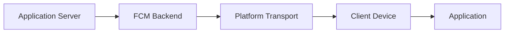
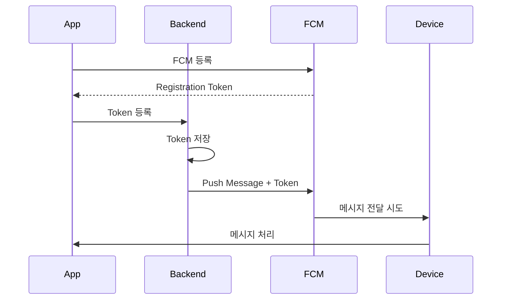
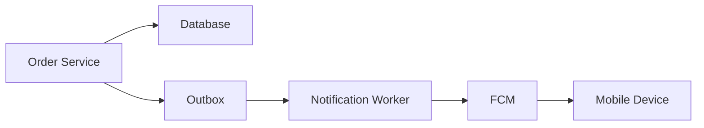
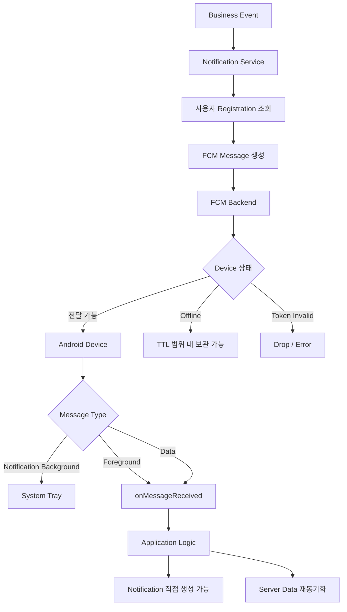

# 아오의 Firebase - Cloud Message
[https://youtu.be/xICeW-gigTc?si=YEEHsQ9qVSieOucD](https://youtu.be/xICeW-gigTc?si=YEEHsQ9qVSieOucD)

# 아오의 Firebase - Cloud Message
* toc
{:toc}

---

## FCM은 어떻게 푸시 알림을 전달할까? Firebase Cloud Messaging 동작 원리

모바일 서비스를 개발하다 보면 웹 서비스와는 조금 다른 요구사항을 만나게 된다.

대표적인 기능 중 하나가 **Push Notification**이다.

예를 들어 쇼핑 서비스라면 다음과 같은 상황에서 사용자에게 알려주고 싶을 수 있다.

```text
주문이 접수되었습니다.

배송이 시작되었습니다.

결제가 완료되었습니다.

새로운 채팅 메시지가 도착했습니다.

관심 상품의 가격이 내려갔습니다.
```

사용자가 현재 애플리케이션 화면을 보고 있지 않더라도 이런 이벤트를 전달하고 싶다.

이때 Android 애플리케이션에서 많이 사용하는 서비스 중 하나가 **Firebase Cloud Messaging**, FCM이다.

다만 FCM을 단순히

```text
서버에서 알림을 보내면
휴대폰에 팝업을 띄워주는 서비스
```

정도로 이해하면 실제 서비스를 구현할 때 여러 혼란을 만나게 된다.

FCM을 제대로 이해하려면 최소한 다음 흐름을 알고 있어야 한다.

```text
Backend Server

↓

FCM

↓

사용자의 App Instance

↓

Android OS / Application

↓

Notification 표시 또는 데이터 처리
```

그리고 그 사이에는 등록 토큰, 메시지 종류, 앱 상태, Android Notification Channel, 전송 우선순위, TTL 같은 여러 요소가 관여한다.

---

## FCM이란 무엇인가?

FCM은 Firebase Cloud Messaging의 약자다.

애플리케이션 서버에서 Android, iOS, Web 등의 클라이언트로 메시지를 전달할 수 있도록 Google이 제공하는 메시징 서비스다.

전체 구조를 단순화하면 다음과 같다.



서버가 사용자의 스마트폰에 직접 네트워크 연결을 맺고 메시지를 전송하는 것이 아니다.

서버는 FCM에

```text
이 App Instance에게
이 메시지를 전달해줘.
```

라고 요청한다.

FCM은 대상 플랫폼에 맞는 전송 계층을 거쳐 메시지를 전달한다. Android에서는 Google Play services가 있는 기기의 Android 전송 계층이 사용되고, Apple 플랫폼에서는 APNs가, Web에서는 Web Push 프로토콜이 이용된다.

---

## 왜 서버가 스마트폰에 직접 메시지를 보내지 않을까?

모바일 기기는 일반적인 서버처럼 항상 동일한 IP와 Port에서 연결을 기다리고 있지 않는다.

스마트폰은 Wi-Fi에서 LTE로 바뀔 수 있고,

네트워크가 끊길 수도 있고,

절전 모드에 들어갈 수도 있으며,

애플리케이션 프로세스가 실행 중이 아닐 수도 있다.

```text
Backend

X

Smartphone에 직접 지속적인 연결 유지
```

이 문제를 각 애플리케이션 개발사가 직접 해결하려고 하면 상당히 복잡하다.

그래서 FCM 같은 Push Messaging Infrastructure가 중간에서 메시지 전달을 담당한다.

```text
Backend

↓

FCM

↓

Device
```

백엔드 개발자는 주로

```text
누구에게

언제

어떤 메시지를

왜 보낼 것인가
```

에 집중하고, 실제 기기까지의 전달 경로는 FCM에 위임한다.

---

## FCM 메시지 전달 과정

주문 배송 알림을 예로 들어보자.

사용자의 주문 상태가 다음과 같이 변경되었다.

```text
READY

↓

SHIPPING
```

백엔드에서는 배송 시작 이벤트가 발생한다.

```text
Order Service

배송 시작
```

Notification Service가 메시지를 만든다.

```text
제목

배송이 시작되었습니다.


내용

주문번호 1234번 상품이 배송 중입니다.
```

그리고 대상 사용자의 FCM 등록 정보를 찾아 FCM으로 전송한다.



여기에서 중요한 것이 **Registration Token**이다.

---

## Registration Token은 무엇인가?

FCM이 메시지를 전달하려면 어디로 메시지를 보내야 하는지 알아야 한다.

그 역할을 하는 것이 등록 토큰이다.

개념적으로는 다음과 같다.

```text
FCM Registration Token

↓

특정 App Instance를 식별하기 위한 주소
```

애플리케이션이 FCM을 사용하도록 등록되면 SDK가 FCM과 통신해 등록 정보를 얻는다.

Android에서는 다음과 같이 현재 토큰을 가져올 수 있다.

```kotlin
FirebaseMessaging.getInstance().token
    .addOnCompleteListener { task ->
        if (!task.isSuccessful) {
            return@addOnCompleteListener
        }

        val token = task.result

        sendTokenToServer(token)
    }
```

애플리케이션은 이 값을 백엔드에 전달한다.

```text
Android App

↓

FCM Token

↓

Backend API

↓

Database 저장
```

이후 백엔드는 해당 등록 정보를 이용해 특정 App Instance에 메시지를 보낼 수 있다.

---

## FCM Token을 사용자 ID처럼 생각하면 안 된다

FCM Token을 처음 사용하면 다음처럼 저장하고 싶을 수 있다.

```text
member

id
name
fcm_token
```

하지만 실제 서비스에서는 조금 더 복잡하다.

한 사용자가 여러 기기를 사용할 수 있기 때문이다.

예를 들어 한 사용자가

```text
Galaxy S26

Galaxy Tab

업무용 스마트폰
```

세 곳에서 로그인했다고 하자.

같은 사용자라도 여러 App Instance가 존재할 수 있다.

따라서 관계는

```text
User

1

↓

N

FCM Registration
```

에 가깝다.

예를 들어 별도의 테이블로 관리할 수 있다.

```text
push_registration

id
member_id
token
platform
updated_at
enabled
```

즉 FCM Token은

```text
사용자 그 자체
```

가 아니라

```text
특정 App Instance의
Push 목적지
```

에 가깝게 바라보는 것이 좋다.

---

## Token은 영원히 유지되는 값도 아니다

등록 정보는 변경되거나 무효화될 수 있다.

앱 재설치나 데이터 초기화, 장기간 사용하지 않은 기기, 등록 상태 변경 등 다양한 이유를 고려해야 한다.

Firebase 역시 서버가 등록 정보의 최신 상태를 관리하고 오래되거나 더 이상 유효하지 않은 등록 정보를 제거하도록 권장한다. HTTP v1 API에서는 이미 무효화된 등록 대상으로 전송할 경우 `UNREGISTERED` 같은 응답을 받을 수 있다.

따라서 백엔드에서는 단순히 Token을 저장하고 끝내면 안 된다.

```text
Token 최초 등록

↓

최신 상태 갱신

↓

전송 실패 확인

↓

유효하지 않은 Token 제거
```

라는 생명주기를 함께 설계해야 한다.

---

## FCM 전송 성공은 사용자 수신 성공이 아니다

백엔드에서 다음과 같이 메시지를 보냈다고 해보자.

```java
String messageId =
        FirebaseMessaging.getInstance()
                .send(message);
```

정상적으로 Message ID가 반환되었다.

여기서 다음처럼 생각하기 쉽다.

```text
FCM 전송 성공

=

사용자 스마트폰에
알림 표시 완료
```

하지만 둘은 같은 의미가 아니다.

서버가 FCM에 메시지 요청을 성공적으로 전달했다는 것과, 실제 사용자의 기기에서 메시지가 처리되거나 알림을 봤다는 것은 서로 다른 단계다.

```text
Backend

↓

FCM 요청 성공


그 이후

↓

FCM 전달

↓

Device 도달

↓

OS 처리

↓

Notification 표시

↓

사용자 확인
```

이 전체 과정이 모두 성공했다고 의미하는 것은 아니다.

---

## FCM은 즉시 전달을 절대적으로 보장하지 않는다

일반적으로 FCM은 가능한 빨리 메시지를 전달하려고 한다.

하지만 상황에 따라 메시지가 지연되거나 전달되지 않을 수 있다.

대표적으로 다음과 같은 조건들이 영향을 줄 수 있다.

```text
기기가 Offline 상태

Doze Mode

배터리 최적화

FCM Throttling

TTL 만료

유효하지 않은 등록 정보

너무 많은 Pending Message

앱 Force Stop
```

Firebase 공식 문서에서도 기기가 사용할 수 없는 상황에서는 메시지를 저장했다가 가능한 시점에 전달할 수 있으며, TTL이 만료되면 더 이상 전달하지 않는다고 설명한다. Android와 Web의 TTL은 최대 28일까지 설정할 수 있고 기본값은 최대 4주다.

---

## FCM을 반드시 전달되어야 하는 메시지 저장소처럼 사용하면 안 된다

이 특성 때문에 다음과 같은 설계는 위험하다.

```text
결제 완료 정보

↓

FCM 한 번 전송

↓

끝
```

사용자가 Push를 받지 못했다면 결제가 완료됐다는 정보를 영원히 모르게 될 수도 있다.

중요한 비즈니스 정보라면 FCM 자체를 원본 데이터로 사용하면 안 된다.

예를 들어 알림 센터를 별도로 관리할 수 있다.

```text
결제 완료

↓

Notification DB 저장

↓

FCM Push

↓

앱 실행

↓

Notification API 조회
```

Push는 사용자에게

```text
새로운 정보가 있으니
확인해 주세요.
```

라고 알려주는 수단으로 사용하고,

실제 상태의 원본은 서버가 가지고 있는 것이 안전하다.

---

## 중요한 알림이라면 서버 데이터와 동기화할 수 있어야 한다

예를 들어 채팅 메시지를 생각해보자.

FCM Push 자체에 메시지 전체를 의존하면 전달 누락이 곧 데이터 누락이 된다.

조금 더 안전한 구조는 다음과 같다.

```text
Chat Message

↓

DB 저장

↓

Push 전송

↓

사용자 App

↓

Chat API 재조회

↓

최신 상태 동기화
```

즉 Push는

```text
데이터 그 자체
```

라기보다

```text
데이터가 변경되었다는 Signal
```

로 활용할 수도 있다.

---

## FCM에는 크게 두 가지 메시지 유형이 있다

FCM을 사용할 때 가장 중요한 개념 중 하나가 메시지 종류다.

대표적으로 다음 두 종류가 있다.

```text
Notification Message

Data Message
```

둘의 처리 방식이 다르다. Firebase 공식 문서도 Notification Message는 사용자에게 표시할 predefined notification payload를 가지며, Data Message는 애플리케이션이 직접 처리하는 사용자 정의 key-value payload라고 구분한다.

---

## Notification Message

Notification Message는 `notification` 영역에 사용자에게 표시할 정보를 넣는다.

개념적인 Payload는 다음과 같다.

```json
{
  "message": {
    "token": "FCM_TOKEN",
    "notification": {
      "title": "배송이 시작되었습니다.",
      "body": "주문 상품이 배송 중입니다."
    }
  }
}
```

핵심은

```text
title

body
```

처럼 Notification을 표시하기 위한 정보가 존재한다는 것이다.

다만 **Notification Message라고 해서 모든 앱 상태에서 FCM이 자동으로 팝업을 띄워주는 것은 아니다.**

이 부분은 매우 중요하다.

---

## Background에서는 Notification Message를 시스템이 표시할 수 있다

Android 애플리케이션이 Background에 있을 때 Notification Message가 도착하면 FCM SDK가 Notification을 시스템 트레이에 표시하는 흐름을 제공한다.

```text
Notification Message

↓

App Background

↓

FCM / Android 처리

↓

Notification Tray
```

따라서 애플리케이션 코드에서 직접 Notification을 만들지 않아도 사용자에게 표시되는 경우가 있다.

---

## Foreground에서는 동작이 다르다

앱이 현재 화면에 보이는 Foreground 상태라면 Notification Message도 `onMessageReceived()`로 전달된다.

이때 개발자가 어떻게 처리할지 결정해야 한다.

```text
Notification Message

↓

Foreground

↓

onMessageReceived()

↓

Application에서 처리 결정
```

예를 들어

```kotlin
override fun onMessageReceived(
    remoteMessage: RemoteMessage
) {
    super.onMessageReceived(remoteMessage)

    showNotification(remoteMessage)
}
```

처럼 직접 Notification을 만들 수 있다.

또는 현재 사용자가 이미 해당 채팅방을 보고 있다면 굳이 Popup을 보여주지 않을 수도 있다.

```text
현재 채팅방 화면을 보고 있음

↓

Popup 표시하지 않음

↓

화면에 메시지만 추가
```

즉 Foreground에서는 애플리케이션이 사용자 경험을 직접 결정할 수 있다.

---

## Data Message

Data Message에는 `notification`이 아니라 애플리케이션이 정의한 데이터를 넣는다.

```json
{
  "message": {
    "token": "FCM_TOKEN",
    "data": {
      "type": "ORDER_SHIPPED",
      "orderId": "1234"
    }
  }
}
```

이 메시지는

```text
알림 UI를 이렇게 보여줘.
```

라는 메시지가 아니라

```text
이 데이터를 애플리케이션에서 처리해.
```

에 가깝다.

Android에서는 `FirebaseMessagingService`의 `onMessageReceived()` 등을 통해 이를 처리한다.

---

## Notification과 Data를 함께 보낼 수도 있다

두 종류가 반드시 완전히 분리되어야 하는 것은 아니다.

Notification Payload와 Data Payload를 함께 넣을 수도 있다.

```json
{
  "message": {
    "token": "FCM_TOKEN",
    "notification": {
      "title": "배송 시작",
      "body": "상품이 배송 중입니다."
    },
    "data": {
      "orderId": "1234",
      "type": "ORDER_SHIPPED"
    }
  }
}
```

이렇게 하면 Notification 표시 정보와 애플리케이션에서 사용할 데이터를 함께 전달할 수 있다.

하지만 앱의 Foreground/Background 상태에 따라 처리 경로가 달라진다는 점을 알아야 한다.

---

## Notification + Data의 Background 동작

앱이 Background에 있을 때 Notification과 Data가 함께 들어오면 Notification은 시스템 트레이에 표시되고 Data Payload는 사용자가 Notification을 눌러 앱을 실행할 때 Launcher Activity의 Intent Extras를 통해 전달될 수 있다.

개념적으로 다음과 같다.

```text
Notification + Data

↓

Background

↓

Notification Tray 표시

↓

사용자 Notification 클릭

↓

Activity 실행

↓

Intent Extra로 Data 전달
```

따라서 Background에서도 무조건 `onMessageReceived()`가 실행될 것이라고 생각하면 안 된다.

---

## Notification과 Data 메시지 차이

Android 관점에서 단순화하면 다음과 같다.

| 앱 상태       | Notification          | Data                  | Notification + Data                             |
| ---------- | --------------------- | --------------------- | ----------------------------------------------- |
| Foreground | `onMessageReceived()` | `onMessageReceived()` | `onMessageReceived()`                           |
| Background | 시스템 Notification      | `onMessageReceived()` | Notification은 시스템 표시, Data는 Activity Intent에 전달 |

실제 처리에는 OS 버전과 백그라운드 실행 제한 등의 조건이 추가로 영향을 줄 수 있다.

---

## App 상태를 이해해야 하는 이유

모바일 애플리케이션은 대략적으로 다음 상태를 생각해볼 수 있다.

```text
Foreground

Background

Process가 실행되지 않는 상태
```

Foreground는 사용자가 현재 앱을 보고 있는 상태다.

```text
사용자 화면

↓

My Application
```

Background는 앱이 화면 전면에는 없지만 시스템에서 프로세스나 관련 구성요소가 존재할 수 있는 상태다.

```text
Home 화면

↓

Application은 Background
```

프로세스 자체가 없는 경우도 있다.

하지만 여기서 **최근 앱 화면에서 Swipe했다고 반드시 Android의 Force Stop과 같은 것은 아니다.**

이 둘은 구분해야 한다.

---

## Force Stop은 특별한 상태다

사용자가 설정에서 앱을 강제 종료한 경우 Android 시스템은 해당 애플리케이션을 명시적으로 중지된 상태로 취급한다.

FCM 전송 데이터에도 앱이 Force Stop되어 메시지가 Drop된 상태를 나타내는 항목이 존재한다.

따라서

```text
앱 Process가 현재 없다.

=

FCM을 절대로 받을 수 없다.
```

도 아니고,

```text
앱을 어떤 방식으로 종료해도
항상 FCM이 도착한다.
```

도 아니다.

Android의 앱 상태와 시스템 정책을 함께 봐야 한다.

---

## onMessageReceived()에서 오래 걸리는 작업을 하면 안 된다

Data Message를 받았다고 다음처럼 처리한다고 해보자.

```kotlin
override fun onMessageReceived(
    remoteMessage: RemoteMessage
) {
    downloadLargeFile()

    updateDatabase()

    callExternalApi()

    runHeavyTask()
}
```

안전하지 않은 구조다.

Firebase는 `onMessageReceived()`가 제공되는 처리 시간이 짧으며, 긴 작업은 Android의 Background Execution Limit 때문에 중단되거나 지연될 수 있다고 설명한다. 몇 초 이상 걸리는 처리가 필요하다면 적절한 생명주기를 가진 별도 작업으로 넘기는 것을 고려해야 한다.

예를 들어 WorkManager 같은 백그라운드 작업 수단을 사용할 수 있다.

```text
onMessageReceived()

↓

가벼운 Message Parsing

↓

WorkManager 등록

↓

Background Work
```

---

## FCM에서 말하는 Priority와 Notification Importance는 다르다

푸시 구현에서 특히 많이 혼동하는 개념이다.

다음 두 가지는 서로 다르다.

```text
FCM Message Priority

Notification Channel Importance
```

FCM Priority는 **메시지를 기기로 얼마나 긴급하게 전달할 것인가**에 가깝다.

Android에서는 일반적으로

```text
NORMAL

HIGH
```

같은 전송 Priority가 있다.

Normal Priority는 절전을 위해 기기가 잠든 상황에서 전달이 지연될 수 있고, High Priority는 시간에 민감한 메시지를 가능한 빨리 전달하려는 용도로 사용된다.

---

## Notification Channel Importance는 표시 방법에 가깝다

Notification Channel의 Importance는 Android가 사용자에게 Notification을 얼마나 눈에 띄게 보여줄지와 관련된다.

예를 들어 Android 8.0 이상에서는 다음과 같은 값을 사용할 수 있다.

```text
IMPORTANCE_HIGH

IMPORTANCE_DEFAULT

IMPORTANCE_LOW

IMPORTANCE_MIN
```

Android 공식 문서 기준으로 `IMPORTANCE_HIGH`는 소리와 Heads-up Notification을 제공할 수 있고, `IMPORTANCE_DEFAULT`는 소리를 내지만 Heads-up은 제공하지 않는 일반적인 수준이다.

즉 둘을 구분해야 한다.

```text
FCM Priority

→ 얼마나 빨리 전달할 것인가?


Channel Importance

→ 도착한 알림을
얼마나 방해적으로 보여줄 것인가?
```

---

## Heads-up Notification이란 무엇인가?

Heads-up Notification은 화면 상단 등에 잠시 떠오르는 형태의 알림을 말한다.

```text
┌──────────────────────────┐
│ 새로운 메시지가 왔습니다 │
│ 지금 확인해 보세요       │
└──────────────────────────┘
```

화면을 보고 있는 사용자의 시선을 즉시 끌 수 있다.

그래서 중요한 메시지에는 효과적이다.

하지만 모든 알림을 Heads-up으로 만들면 사용자가 금방 피로해질 수 있다.

---

## 모든 알림을 IMPORTANCE_HIGH로 만들면 안 되는 이유

예를 들어 쇼핑 서비스에서 다음 알림이 있다고 하자.

```text
배송 시작

결제 실패

새로운 채팅

이벤트 광고

추천 상품

마케팅 정보
```

모든 알림을 Heads-up으로 표시한다.

```text
팝업

팝업

팝업

팝업

팝업
```

사용자는 결국

```text
이 앱 알림 너무 많다.
```

라고 느낄 수 있다.

그리고 가장 좋지 않은 결과가 생긴다.

```text
Notification 설정

↓

전체 알림 끄기
```

정말 중요한 알림조차 전달할 방법을 잃는다.

---

## 알림은 중요도에 따라 나누는 것이 좋다

예를 들어 다음과 같은 전략을 사용할 수 있다.

| 알림 종류      | 예시            | 중요도            |
| ---------- | ------------- | -------------- |
| 즉각 대응 필요   | 결제 실패, 긴급 메시지 | HIGH 고려        |
| 일반 서비스 이벤트 | 배송 시작, 주문 완료  | DEFAULT        |
| 낮은 긴급성     | 추천 정보         | LOW 고려         |
| 마케팅        | 이벤트·광고        | 별도 채널 및 사용자 선택 |

핵심은 기술적으로 띄울 수 있다고 모두 강하게 띄우지 않는 것이다.

Notification은 시스템 기능인 동시에 **사용자 경험을 설계하는 기능**이다.

---

## Android Notification Channel

Android 8.0 이상에서는 Notification Channel이라는 개념이 중요하다.

예를 들어 애플리케이션이 다음 채널을 만들 수 있다.

```text
CHAT

ORDER

MARKETING
```

각 Channel마다 다른 Importance를 설정한다.

```text
CHAT

IMPORTANCE_HIGH


ORDER

IMPORTANCE_DEFAULT


MARKETING

IMPORTANCE_LOW
```

사용자는 시스템 설정에서 각각의 Channel을 개별적으로 끄거나 동작을 변경할 수 있다.

---

## Channel Importance는 만든 뒤 앱이 마음대로 바꾸기 어렵다

Notification Channel을 처음 생성할 때 Importance를 설정한다.

```kotlin
val channel = NotificationChannel(
    CHANNEL_ID,
    "주문 알림",
    NotificationManager.IMPORTANCE_DEFAULT
)
```

중요한 특징이 있다.

한 번 Channel을 생성한 이후에는 애플리케이션이 해당 Channel의 Importance를 마음대로 높이거나 낮추는 방식으로 변경할 수 없다.

사용자가 Notification 설정에 대한 최종적인 통제권을 가진다.

따라서 Channel을 처음 설계할 때부터

```text
채팅 알림

주문 알림

프로모션 알림
```

처럼 목적에 맞게 분리하는 것이 중요하다.

---

## Android 13부터는 알림 권한도 필요하다

FCM 설정이 모두 정상이라고 해서 사용자가 무조건 Notification을 볼 수 있는 것도 아니다.

Android 13(API 33) 이상에서는 `POST_NOTIFICATIONS` Runtime Permission이 추가됐다. 사용자가 권한을 허용하지 않으면 일반적인 Notification을 표시할 수 없다.

Manifest에는 다음 Permission이 사용된다.

```xml
<uses-permission
    android:name="android.permission.POST_NOTIFICATIONS" />
```

그리고 런타임에도 사용자에게 권한을 요청해야 한다.

따라서 푸시 알림 흐름에는 이제 다음 단계도 들어간다.

```text
FCM Message 도착

↓

Notification Permission 존재?

↓

Notification Channel 활성화?

↓

Channel Importance는?

↓

Notification 표시
```

서버에서 정상 전송했다고 하더라도 사용자가 알림 권한을 껐다면 화면에는 나타나지 않을 수 있다.

---

## Permission 요청 시점도 UX다

앱을 처음 실행하자마자 아무런 설명 없이

```text
알림을 허용하시겠습니까?
```

를 보여주면 사용자가 거부할 가능성이 높다.

Android에서도 사용자가 앱과 기능을 이해한 뒤 적절한 맥락에서 Notification Permission을 요청하는 방식을 권장한다.

예를 들어 주문 완료 후 다음과 같이 안내할 수 있다.

```text
배송 상태를 바로 알려드릴까요?

[알림 받기]
```

사용자가 기능의 가치를 이해한 순간에 Permission을 요청하면 훨씬 자연스럽다.

---

## 메시지 전달이 늦어질 수 있는 이유

FCM Message는 항상 같은 시간에 도착하지 않는다.

대표적으로 Doze Mode가 있다.

사용자가 오랫동안 기기를 사용하지 않으면 Android가 배터리를 절약하기 위해 Background 작업과 Network 접근을 제한할 수 있다.

Normal Priority 메시지라면 이런 상황에서 지연될 수 있다. 시간에 민감한 메시지는 High Priority를 사용할 수 있지만, 모든 메시지를 High로 보내는 전략도 적절하지 않다.

---

## High Priority도 남용하면 안 된다

예를 들어 다음 이벤트를 모두 High Priority로 보낸다고 생각해보자.

```text
이벤트 광고

추천 상품

친구 추천

주간 리포트

쿠폰 만료
```

High Priority는 배터리와 시스템 자원에 영향을 줄 수 있기 때문에 시간에 민감한 사용자 경험에 맞게 사용해야 한다.

FCM도 지나치게 많은 메시지나 전송 패턴에 대해 Throttling을 적용할 수 있다.

따라서

```text
중요한 알림

=

High Priority
```

라고 단순하게 결정할 것이 아니라,

```text
몇 분 늦으면
사용자 경험이 깨지는가?
```

를 기준으로 판단하는 것이 좋다.

---

## TTL이란 무엇인가?

TTL은 Time To Live다.

FCM이 메시지를 얼마나 오래 보관하면서 전달을 시도할 것인지를 지정한다.

예를 들어 기기가 Offline이라고 하자.

```text
Backend

↓

FCM

↓

Device Offline
```

FCM은 상황에 따라 메시지를 보관한다.

기기가 다시 연결되면 전달을 시도할 수 있다.

하지만 TTL을 넘었다면 더 이상 전달할 필요가 없다고 판단할 수 있다.

---

## 모든 Push가 오래 살아 있어야 하는 것은 아니다

예를 들어 화상 통화 요청을 생각해보자.

```text
12:00

전화가 왔습니다.
```

30분 뒤 이 메시지가 도착해도 아무 의미가 없다.

이런 메시지는 짧은 TTL이 적절할 수 있다.

반대로 단순한 콘텐츠 업데이트 알림이라면 조금 늦어도 문제가 없을 수 있다.

```text
새로운 콘텐츠가 등록되었습니다.
```

즉 TTL 역시 메시지의 비즈니스 의미에 맞춰 설정해야 한다.

---

## Collapsible Message

FCM에는 오래된 메시지를 새로운 메시지로 대체할 수 있는 Collapsible Message 개념도 있다.

예를 들어 스포츠 점수를 계속 전달한다고 해보자.

```text
1 : 0

↓

1 : 1

↓

2 : 1

↓

3 : 1
```

기기가 Offline이었다고 해서 복구된 순간 네 개를 모두 전달해야 할까?

최신 점수 하나만 의미 있을 수 있다.

```text
3 : 1
```

이럴 때 이전 메시지를 새로운 메시지로 대체하는 Collapsible 전략이 유용하다.

FCM은 Collapsible Message를 지원하며 Android에서는 `collapse_key`를 이용할 수 있다. 다만 FCM은 메시지 전달 순서도 보장하지 않기 때문에 순서 자체가 중요한 데이터는 서버 상태를 다시 조회하는 방식이 더 안전하다.

---

## 채팅 메시지는 어떻게 해야 할까?

채팅은 조금 다르다.

다음 메시지가 모두 중요하다.

```text
A: 안녕하세요.

B: 반갑습니다.

A: 내일 시간 되세요?
```

마지막 메시지만 전달해서는 안 된다.

따라서 이런 경우에는 Push Message 자체를 유일한 채팅 저장소로 사용하는 것이 아니라 서버에서 모든 메시지를 저장한다.

```text
Chat Server

↓

Message DB
```

FCM은

```text
새 메시지가 도착했다.
```

라고 알려주는 역할을 한다.

앱은 서버와 동기화한다.

```text
Push

↓

Chat API

↓

누락 메시지 동기화
```

이 구조라면 FCM 메시지 하나가 누락되어도 채팅 데이터 자체가 유실되지는 않는다.

---

## 백엔드에서는 FCM을 어떻게 호출할까?

서버에서는 Firebase Admin SDK 또는 FCM HTTP v1 API를 이용할 수 있다.

Java Backend에서 Admin SDK를 사용한다고 가정하면 개념적으로 다음과 같은 코드를 작성할 수 있다.

```java
public void send(
        String token,
        String title,
        String body
) throws FirebaseMessagingException {

    Message message = Message.builder()
            .setToken(token)
            .setNotification(
                    Notification.builder()
                            .setTitle(title)
                            .setBody(body)
                            .build()
            )
            .build();

    FirebaseMessaging.getInstance()
            .send(message);
}
```

서버의 책임은 크게 다음과 같다.

```text
알림 발생 조건 결정

↓

수신 대상 결정

↓

Registration 정보 조회

↓

Payload 생성

↓

FCM 전송

↓

전송 결과 처리
```

이 정도만 구현해도 기본적인 Push 기능은 만들 수 있다.

하지만 운영 단계에서는 여기서 끝나지 않는다.

---

## FCM 전송을 DB 트랜잭션 안에서 바로 호출해도 될까?

예를 들어 주문 Transaction을 생각해보자.

```java
@Transactional
public void ship(Long orderId) {

    Order order = orderRepository.findById(orderId)
            .orElseThrow();

    order.ship();

    fcmClient.send(
            order.getMemberId(),
            "배송이 시작되었습니다."
    );
}
```

겉으로 보면 자연스럽다.

하지만 FCM은 외부 시스템이다.

다음 상황이 발생할 수 있다.

```text
DB UPDATE

↓

FCM 전송 성공

↓

DB Commit 실패
```

사용자는

```text
배송이 시작되었습니다.
```

라는 알림을 받았는데 실제 Database는 Rollback될 수 있다.

반대 상황도 가능하다.

```text
DB Commit 성공

↓

FCM 전송 실패
```

실제 배송 상태는 변경됐는데 알림은 가지 않는다.

---

## 중요한 Push라면 비동기 이벤트 구조를 고려할 수 있다

보다 안정적으로 설계하려면 비즈니스 상태 변경과 Push 발송을 분리할 수 있다.

예를 들어 다음과 같다.

```text
Order Transaction

↓

Order 상태 변경

↓

Outbox Event 저장

↓

Commit


별도 Worker

↓

Outbox 조회

↓

FCM 전송

↓

성공 처리
```

이 구조에서는 알림 전송 실패를 재시도할 수 있다.



모든 푸시에 Outbox가 필요한 것은 아니지만

```text
결제

배송

보안

중요한 업무 알림
```

처럼 누락을 추적해야 하는 메시지라면 고려할 가치가 있다.

---

## 전송 실패 시 Token도 관리해야 한다

FCM에서 등록 대상이 더 이상 유효하지 않다는 응답이 내려왔다고 하자.

계속 같은 대상으로 전송하면 의미 없는 요청만 반복된다.

```text
Invalid Token

↓

FCM 전송

↓

실패

↓

다시 전송

↓

또 실패
```

따라서 전송 결과에 따라 등록 정보를 비활성화하거나 제거해야 한다.

```text
FCM Response

↓

UNREGISTERED

↓

Registration 제거
```

Firebase 역시 유효하지 않거나 오래된 등록 정보를 서버에서 정리할 것을 권장한다.

---

## 사용자가 로그아웃하면 Token을 어떻게 해야 할까?

한 기기에서 A 사용자가 로그인했다고 하자.

```text
Device X

↓

User A

↓

Token T
```

서버에 다음 관계를 저장한다.

```text
User A

→ Token T
```

그런데 A가 로그아웃하고 B가 로그인한다.

Token 자체가 그대로일 수도 있다.

서버에서 이전 관계를 정리하지 않으면

```text
User A에게 보낸 Push

↓

Device X

↓

현재 로그인 사용자는 User B
```

라는 위험한 상황을 만들 수 있다.

따라서 Push Token 관리는 인증 Session 관리와도 연결된다.

```text
Login

↓

Token 등록 / 연결


Logout

↓

User-Token 연결 해제
```

특히 개인정보가 포함된 Push라면 더욱 중요하다.

---

## Push Payload에는 민감한 정보를 최소화하자

Lock Screen에는 Notification 내용이 그대로 노출될 수도 있다.

예를 들어 다음 메시지는 위험할 수 있다.

```text
홍길동님의 카드 결제가
3,240,000원 승인되었습니다.

카드번호 1234-5678-...
```

Push Payload에 지나치게 많은 개인정보를 넣기보다 다음처럼 최소한의 정보만 전달하는 것이 더 안전할 수 있다.

```text
새로운 결제 내역이 있습니다.
```

그리고 사용자가 앱을 열었을 때 인증된 API를 통해 실제 데이터를 조회한다.

```text
Push

↓

Application 실행

↓

Authentication

↓

Payment API 조회
```

---

## FCM Delivery Metrics는 어디까지 믿을 수 있을까?

FCM은 전송 상태를 분석하기 위한 Delivery Metrics를 제공한다.

예를 들어

```text
지연된 메시지 비율

Throttling

너무 많은 Pending Message로 인한 Drop

비활성 Device

Force Stop 상태
```

등을 분석할 수 있다.

하지만 이 정보를

```text
사용자 A가
정확히 10:02:03에
알림을 읽었다.
```

는 개별 비즈니스 ACK처럼 생각해서는 안 된다.

정확한 업무 수준의 수신 확인이 필요하다면 애플리케이션 자체에서 ACK 프로토콜을 설계해야 한다.

---

## 정말 수신 여부를 알아야 한다면

예를 들어 매우 중요한 업무 알림이라고 하자.

Push만 보내고 끝내면 안 된다.

앱에서 메시지를 확인한 후 Backend에 ACK를 보낼 수 있다.

```text
Backend

↓

Push

↓

Application

↓

Message 처리

↓

POST /notifications/{id}/ack
```

그러면 서버에서는 상태를 관리할 수 있다.

```text
SENT

↓

DELIVERED_BY_APP

↓

READ
```

물론 여기서도

```text
Push 전달

앱 수신

사용자 읽음
```

은 서로 다른 개념이다.

---

## Notification 시스템을 설계할 때 상태를 구분하자

예를 들어 다음 상태 모델을 둘 수 있다.

```text
CREATED

↓

SEND_REQUESTED

↓

FCM_ACCEPTED

↓

APP_ACKNOWLEDGED

↓

READ
```

모든 서비스가 이렇게까지 복잡할 필요는 없다.

하지만 중요한 것은

```text
FCM Send 성공

=

사용자가 읽음
```

으로 합쳐버리지 않는 것이다.

---

## 전체 구조

FCM을 이용한 Push Notification 구조를 하나로 연결하면 다음과 같다.



이 구조를 보면 FCM은 단순한 Notification UI API가 아니라 **서버와 클라이언트 사이의 비동기 메시징 인프라**에 더 가깝다는 것을 알 수 있다.

---

## 실무에서의 활용

실제 서비스를 만든다면 먼저 Token Lifecycle을 설계하는 것이 좋다.

```text
앱 설치 / 실행

↓

Registration 정보 확보

↓

Backend 등록

↓

로그인 사용자와 연결

↓

Token 갱신

↓

로그아웃 시 연결 해제

↓

Invalid Token 제거
```

그다음 Notification 종류를 나눈다.

```text
채팅

주문

배송

결제

마케팅
```

그리고 종류마다 다음 정책을 결정한다.

```text
Notification Message인가?

Data Message인가?

Channel은 무엇인가?

Importance는 어느 정도인가?

FCM Priority는?

TTL은 얼마인가?

누락됐을 때 재동기화할 방법이 있는가?

전송 실패 시 재시도해야 하는가?
```

여기까지 정해야 Push Notification을 하나의 운영 가능한 기능으로 볼 수 있다.

---

## 좋은 Push Notification 시스템을 위한 판단 기준

Push 기능을 구현할 때 가장 먼저 **Push가 원본 데이터인지 단순 알림 신호인지** 결정해야 한다. 일반적인 비즈니스 서비스에서는 서버의 Database가 원본이고 FCM은 변경을 알리는 Signal로 사용하는 방식이 안전하다.

그다음 **사용자와 Token을 1:1로 가정하지 않아야 한다.** 사용자는 여러 기기를 사용할 수 있고, Token은 변경되거나 무효화될 수 있으므로 별도의 등록 생명주기가 필요하다.

메시지를 만들 때는 **Notification과 Data 중 어느 형태가 적합한지**, 그리고 Foreground와 Background에서 각각 어떤 UX를 제공할지를 결정해야 한다.

Android에서는 **전송 Priority와 Notification Channel Importance를 구분해야 한다.** 하나는 메시지를 얼마나 긴급하게 전달할지의 문제이고, 다른 하나는 사용자에게 얼마나 방해적으로 보여줄지의 문제다.

마지막으로 중요한 알림이라면 **FCM 자체의 전달 보장에 의존하지 않고 DB 저장, 재시도, 동기화 API, Outbox 같은 보완 구조를 검토해야 한다.**

---

## 정리

FCM은 애플리케이션 서버가 사용자의 기기로 메시지를 전달할 수 있도록 도와주는 메시징 서비스다.

전체 흐름은 다음과 같다.

```text
Backend

↓

FCM

↓

Platform Transport

↓

Device

↓

Application / Notification
```

메시지를 특정 App Instance에 전달하기 위해 등록 정보가 필요하다.

```text
Application

↓

FCM Registration

↓

Backend 저장
```

하지만 등록 정보는 사용자 그 자체가 아니다.

```text
User

1

↓

N

App Registration
```

한 명의 사용자가 여러 기기를 사용할 수 있고 등록 정보는 변경되거나 무효화될 수 있기 때문에 생명주기 관리가 필요하다.

FCM Message에는 대표적으로 Notification Message와 Data Message가 있다.

```text
Notification Message

→ 사용자에게 보여줄 Notification 정보 중심


Data Message

→ Application이 처리할 데이터 중심
```

Android에서는 앱 상태에 따라 처리 방식도 달라진다.

특히 Notification Message라고 해서 Foreground에서도 자동으로 Heads-up Notification이 표시되는 것은 아니다. Foreground에서는 `onMessageReceived()`로 전달되며 애플리케이션이 어떻게 처리할지 결정한다. 반면 Background의 Notification Message는 시스템 트레이에 표시되는 흐름을 제공한다.

또한 서버가 FCM으로 메시지를 성공적으로 보냈다고 해서 실제 사용자가 Notification을 받았거나 읽었다는 의미는 아니다.

```text
FCM 요청 성공

≠

Device 도착 보장

≠

Notification 표시 보장

≠

사용자 확인 보장
```

기기 Offline, Doze Mode, Throttling, TTL 만료, 잘못된 등록 정보, Force Stop 등 여러 조건이 실제 전달에 영향을 줄 수 있다.

따라서 중요한 비즈니스 데이터는 FCM 자체에 의존하지 않는 것이 좋다.

```text
Business Data

↓

Database

↓

Push는 알림 Signal
```

필요하다면 앱이 서버를 다시 조회해 최신 상태를 동기화한다.

그리고 사용자 경험 측면에서는 모든 알림을 강하게 보여주는 것이 좋은 전략이 아니다.

```text
FCM Priority

→ 전달 긴급성


Notification Channel Importance

→ 표시 방해 수준
```

을 구분하고,

```text
채팅

주문

배송

마케팅
```

같은 알림 성격에 따라 Channel과 Importance를 나누는 것이 좋다.

Android 13 이상에서는 사용자의 Notification Runtime Permission도 필요하기 때문에, 이제 서버에서 메시지를 보내는 것만으로 Push 기능이 완성되는 것도 아니다.

결국 FCM을 이용한 Push Notification은 단순히

```text
서버에서 Push 한번 보내기
```

가 아니다.

실제 서비스에서는

```text
Registration 관리

메시지 종류 선택

Foreground / Background 처리

Notification Channel 설계

Priority와 TTL 설정

Invalid Token 정리

재시도

DB 동기화

사용자 알림 설정

모니터링
```

까지 함께 설계해야 한다.

FCM을 제대로 이해하는 핵심은 **FCM을 알림창을 띄우는 도구로 보는 것이 아니라, 신뢰성이 제한된 모바일 환경에서 서버와 App Instance 사이에 메시지를 전달해주는 비동기 메시징 인프라로 바라보는 것**이다.

### 한 줄 요약

**FCM은 백엔드와 모바일 애플리케이션 사이의 Push 메시지 전달을 담당하지만 실제 기기 도착이나 사용자 확인까지 보장하는 시스템은 아니므로, Registration 생명주기와 Notification/Data 메시지의 처리 차이, 앱 상태, Priority·Channel Importance·TTL을 이해하고 중요한 데이터는 서버를 원본으로 두는 구조로 설계해야 한다.**
