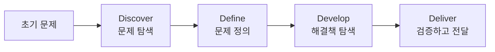
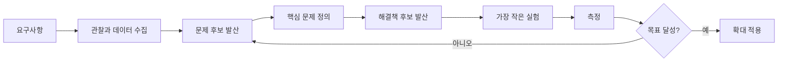
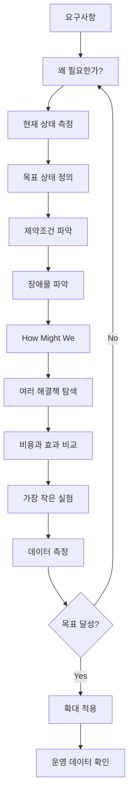

# 벤지의 코드를 짜기 전에 해야 할 일
[https://youtu.be/o9xdxwsc_XU?si=fAQEwaGXCyjUZvj0](https://youtu.be/o9xdxwsc_XU?si=fAQEwaGXCyjUZvj0)

# 벤지의 코드를 짜기 전에 해야 할 일
* toc
{:toc}

---

## 요구사항을 바로 구현하지 마라: 문제를 정의하는 개발자의 사고법

개발을 하다 보면 이런 요청을 자주 받는다.

```text
목록 화면에 무한 스크롤을 넣어주세요.
```

개발자라면 머릿속에서 바로 구현 방법이 떠오른다.

```text
Intersection Observer를 사용하면 되겠다.

다음 페이지를 가져오는 API가 필요하겠다.

Cursor Pagination을 붙여야겠다.

중복 요청도 막아야겠다.
```

기술적으로는 자연스러운 사고다.

개발자는 무언가를 만드는 사람이기 때문에 요구사항을 받으면 곧바로

```text
어떻게 만들까?
```

를 생각한다.

그런데 여기에서 한 가지 질문이 빠졌다.

```text
왜 무한 스크롤이 필요한가?
```

사용자가 다음 페이지 버튼을 찾기 어려운 것일까?

목록의 데이터가 너무 많아서 탐색하기 어려운 것일까?

원하는 데이터를 찾기 어려워서 그런 것일까?

아니면 단순히 다른 서비스들이 무한 스크롤을 사용하고 있어서 추가하려는 것일까?

이 질문에 따라 해결책은 완전히 달라질 수 있다.

진짜 문제가

```text
원하는 상품을 찾기 어렵다.
```

라면 무한 스크롤보다 검색 기능이 더 나은 해결책일 수 있다.

진짜 문제가

```text
페이지 이동이 번거롭다.
```

라면 무한 스크롤이 적절할 수도 있다.

문제를 확인하지 않고 곧바로 구현하면 **잘못된 문제를 아주 훌륭하게 해결하는 상황**이 만들어질 수 있다.

---

## 요구사항과 문제는 같은 것이 아니다

개발하면서 가장 먼저 구분해야 하는 것이 있다.

```text
문제

≠

요구사항

≠

해결책
```

예를 들어 다음 요청이 들어왔다.

```text
Redis Cache를 넣어주세요.
```

이 문장은 문제처럼 보이지만 실제로는 이미 하나의 해결책이다.

먼저 물어야 한다.

```text
왜 Redis가 필요한가?
```

답이 다음과 같을 수도 있다.

```text
API가 느립니다.
```

하지만 이것 역시 아직 충분한 문제 정의가 아니다.

더 구체적으로 들어가야 한다.

```text
어떤 API가 느린가?

현재 응답 시간은 얼마인가?

목표 응답 시간은 얼마인가?

DB Query가 느린가?

외부 API가 느린가?

데이터 변환이 느린가?

동시 요청 때문에 느린가?
```

분석해보니 실제 원인이 Index가 없는 Query였다면 Redis를 추가하는 것은 불필요한 복잡성만 늘릴 수도 있다.

```text
요구사항

Redis를 넣자.

↓

문제 확인

상품 검색 API P95가 2.8초다.

↓

원인 확인

검색 조건에 적절한 Index가 없다.

↓

해결

Index 추가

↓

P95 180ms
```

같은 문제라도 해결 방법은 전혀 달라질 수 있다.

---

## 개발자가 가장 경계해야 할 것은 잘못된 문제를 잘 푸는 것이다

기술적으로 완벽한 시스템을 만들 수도 있다.

```text
Clean Architecture

Redis Cluster

Kafka

CQRS

Event Sourcing

Kubernetes
```

코드 품질도 좋다.

테스트도 많다.

장애 대응도 잘 되어 있다.

그런데 정작 사용자가 필요로 하지 않는 기능이라면 어떻게 될까?

기술적인 완성도와 제품의 가치는 반드시 같은 방향으로 움직이지 않는다.

```text
좋은 코드

×

잘못된 문제

=

가치가 낮은 결과
```

반대로 아주 작은 수정이 실제 문제를 해결할 수도 있다.

```text
복잡한 기능 개발

X

버튼 이름 변경

O
```

그래서 구현 능력이 좋아질수록 오히려 다음 질문이 중요해진다.

```text
이 기능을 잘 만들 수 있는가?
```

보다

```text
이 기능을 만드는 것이 맞는가?
```

를 먼저 물어야 한다.

---

## 문제 해결에서 발산과 수렴이 필요한 이유

문제를 받으면 사람은 자연스럽게 가장 먼저 떠오른 해결책으로 이동한다.

예를 들어

```text
API가 느리다.

↓

Cache를 넣자.
```

또는

```text
동시성 문제가 있다.

↓

분산 락을 사용하자.
```

와 같은 식이다.

하지만 복잡한 문제일수록 첫 번째로 떠오른 해결책이 최선이라는 보장은 없다.

따라서 문제 해결에서는 두 종류의 사고를 번갈아 사용하는 것이 도움이 된다.

### 발산적 사고

가능성을 넓히는 단계다.

```text
왜 느릴까?

DB일 수도 있다.

Network일 수도 있다.

외부 API일 수도 있다.

Lock일 수도 있다.

GC일 수도 있다.

잘못된 Pagination일 수도 있다.
```

아직 답을 고르지 않는다.

가능성을 충분히 펼친다.

### 수렴적 사고

펼쳐놓은 가능성에서 가장 중요한 것을 선택한다.

```text
APM 분석

↓

DB Query가 전체 시간의 82%

↓

Execution Plan 확인

↓

Full Table Scan 발생

↓

문제 원인 확정
```

즉

```text
발산

가능성을 넓힌다.

↓

수렴

근거를 통해 좁힌다.
```

를 반복하는 것이다.

---

## 더블 다이아몬드

이런 사고 방식을 이해하는 데 유용한 모델이 **Double Diamond**다.

Design Council이 정리한 Double Diamond는 다음 네 단계로 구성된다.

```text
Discover

↓

Define

↓

Develop

↓

Deliver
```

두 개의 다이아몬드는 각각 발산과 수렴을 표현한다.



첫 번째 다이아몬드는 **문제 공간**이다.

```text
우리가 실제로 해결해야 하는 문제가 무엇인가?
```

를 찾는다.

두 번째 다이아몬드는 **해결 공간**이다.

```text
그 문제를 해결하는 가장 적절한 방법은 무엇인가?
```

를 탐색한다.

Design Council도 Discover에서는 문제를 가정하기보다 실제 사용자와 상황을 이해하고, Define에서 발견한 내용을 바탕으로 문제를 명확하게 좁히며, Develop에서는 여러 해결책을 만들고, Deliver에서는 작은 규모로 테스트하면서 작동하지 않는 해결책을 버리고 개선하는 과정으로 설명한다.

---

## 개발자가 가장 자주 건너뛰는 단계

개발 과정에서는 종종 다음처럼 흘러간다.

```text
요구사항

↓

구현

↓

테스트

↓

배포
```

더블 다이아몬드 관점에서 보면 중간 단계가 사라졌다.

```text
문제 탐색

문제 정의
```

가 없다.

예를 들어 요청이

```text
무한 스크롤을 추가해주세요.
```

라면 바로 두 번째 다이아몬드로 이동한 것이다.

이미 해결책이 정해져 있다.

하지만 제대로 시작하려면 먼저 첫 번째 다이아몬드로 돌아가야 한다.

```text
왜 무한 스크롤이 필요한가?

↓

사용자가 무엇을 어려워하는가?

↓

현재 어떤 행동을 하고 있는가?

↓

우리가 해결하려는 문제는 무엇인가?
```

---

## 첫 번째 다이아몬드: 문제를 제대로 정의하기

개발 실무에서는 첫 번째 다이아몬드를 다음 네 가지 질문으로 구체화해볼 수 있다.

```text
1. 현재 상태는 무엇인가?

2. 목표 상태는 무엇인가?

3. 제약조건과 장애물은 무엇인가?

4. 어떻게 하면 목표에 도달할 수 있을까?
```

이 질문들을 차례대로 답하면 모호한 요구사항을 훨씬 명확한 문제로 바꿀 수 있다.

---

## 1. 현재 상태를 정의한다

다음과 같은 표현은 문제처럼 들린다.

```text
검색이 느리다.
```

하지만 측정할 수 없다.

어느 정도 느린지 알 수 없기 때문이다.

조금 더 구체적으로 바꿔보자.

```text
상품 검색 API의 P95 응답 시간이
현재 2.8초다.
```

이제 문제를 측정할 수 있다.

또 다른 예를 보자.

```text
사용자가 결제를 자주 실패한다.
```

보다는

```text
결제 화면에 진입한 사용자 중
12%가 결제 완료 전에 이탈한다.
```

가 더 좋은 현재 상태다.

현재 상태를 숫자로 표현해야 하는 이유는 단순하다.

```text
측정할 수 없다.

↓

개선 여부도 알 수 없다.
```

---

## 현재 상태는 관찰 가능한 사실이어야 한다

다음 두 문장을 비교해보자.

```text
사용자가 불편해한다.
```

그리고

```text
시간 설정 세션의 38%에서
오전/오후 영역을 위아래로 Swipe했고,

반응이 없자 평균 3회 반복했다.
```

두 번째가 훨씬 유용하다.

첫 번째는 해석이다.

두 번째는 관찰 가능한 행동이다.

문제 정의 단계에서는 가능한 한

```text
느낌

추측

의견
```

보다

```text
로그

사용자 행동

지표

에러율

Latency

Session Replay

문의 데이터
```

를 사용하는 것이 좋다.

---

## 2. 목표 상태를 정의한다

현재 상태가

```text
P95 응답 시간 2.8초
```

라면

```text
API를 빠르게 만든다.
```

는 좋은 목표가 아니다.

어디까지 개선해야 하는지 알 수 없기 때문이다.

대신

```text
P95 응답 시간을
500ms 이하로 낮춘다.
```

처럼 정의할 수 있다.

UI 문제도 마찬가지다.

현재

```text
38%의 세션에서
잘못된 Swipe 발생
```

이라면 목표를

```text
잘못된 Swipe가 발생하는 세션을
5% 이하로 낮춘다.
```

라고 설정할 수 있다.

그러면 개발이 끝났을 때 질문할 수 있다.

```text
성공했는가?
```

그리고 숫자로 대답할 수 있다.

---

## 좋은 목표에는 완료 조건이 있다

다음 목표는 모호하다.

```text
사용성을 개선한다.

성능을 높인다.

안정성을 강화한다.
```

반면 다음 목표는 검증할 수 있다.

```text
결제 성공률

96.2%
→ 99.5%
```

```text
상품 API P95

1.8초
→ 300ms 이하
```

```text
배치 실패율

3%
→ 0.1% 이하
```

목표가 숫자로 정의되어 있으면 개발자뿐 아니라 기획자, 디자이너, 운영자도 같은 기준으로 결과를 평가할 수 있다.

---

## 3. 제약조건과 장애물을 구분한다

문제를 해결할 때 모든 어려움이 같은 성격을 가지고 있지는 않다.

크게 두 가지로 나누어볼 수 있다.

```text
제약조건

VS

장애물
```

제약조건은 현재 프로젝트에서 받아들여야 하는 조건이다.

예를 들면 다음과 같다.

```text
이번 주 안에 배포해야 한다.

DBMS를 변경할 수 없다.

기존 Public API Spec을 유지해야 한다.

팀원이 3명뿐이다.

예산을 늘릴 수 없다.
```

반면 장애물은 노력하면 제거하거나 줄일 수 있다.

```text
Index가 없다.

Query가 비효율적이다.

UX 신호가 부족하다.

테스트 자동화가 없다.

모니터링이 부족하다.
```

둘을 구분해야 하는 이유가 있다.

바꿀 수 없는 조건과 계속 싸우면 정작 해결할 수 있는 문제에 사용할 자원을 낭비하게 된다.

---

## 예를 들어 성능 문제가 있다고 하자

현재 상황은 다음과 같다.

```text
상품 검색 P95

2.8초
```

목표는 다음이다.

```text
500ms 이하
```

그리고 조건을 정리한다.

### 제약조건

```text
MySQL을 계속 사용해야 한다.

이번 Sprint 안에 완료해야 한다.

API Response Spec을 변경할 수 없다.
```

### 장애물

```text
검색 Column에 Index가 없다.

필요 없는 Column까지 조회한다.

N+1 Query가 발생한다.
```

이제 훨씬 현실적인 문제 해결이 가능하다.

---

## 4. 해결책이 아니라 방향을 묻는다

여기에서 매우 중요한 질문이 있다.

```text
How Might We?
```

한국어로 표현하면

```text
어떻게 하면 우리가
이 문제를 해결할 수 있을까?
```

정도로 생각할 수 있다.

중요한 것은 질문 안에 해결책을 넣지 않는 것이다.

다음 질문은 이미 답이 정해져 있다.

```text
어떻게 하면 Redis를 이용해서
API를 빠르게 만들 수 있을까?
```

Redis를 사용할 것이라는 결론이 이미 들어가 있다.

대신 다음과 같이 묻는다.

```text
어떻게 하면 상품 검색의
P95 응답 시간을 500ms 이하로 만들 수 있을까?
```

그러면 해결책이 열린다.

```text
Index 추가

Query 개선

Projection

Cache

Pagination 변경

Read Replica

데이터 모델 변경
```

가능성을 비교할 수 있다.

---

## 좋은 질문은 해결 공간을 열어둔다

예를 들어 사용자가 오전/오후 선택 영역에서 계속 Swipe를 시도한다고 하자.

바로 다음처럼 결정할 수도 있다.

```text
오전/오후 영역도
Swipe 가능하게 만들자.
```

그럴듯하다.

하지만 이미 해결책이 들어 있다.

대신 다음처럼 질문한다.

```text
어떻게 하면 사용자가 헷갈리지 않고
한 번의 조작으로 오전/오후를 변경할 수 있을까?
```

그러면 여러 가능성이 열린다.

```text
Swipe를 지원한다.

탭 UI를 더 명확하게 만든다.

전체 Time Picker를 하나의 Wheel로 통일한다.

AM/PM을 제거하고 24시간 형식을 사용한다.

아무것도 변경하지 않는다.
```

마지막 선택지도 중요하다.

문제를 발견했다고 항상 코드를 변경해야 하는 것은 아니다.

---

## 문제 정의를 한 문장으로 만들기

좋은 문제 정의는 다음 구조로 만들어볼 수 있다.

```text
현재

[측정 가능한 현재 상태]이고,

목표는

[측정 가능한 목표 상태]이며,

[제약조건] 안에서

[해결해야 할 장애물]을 해결해야 한다.
```

예를 들어 다음과 같다.

```text
현재 상품 검색 API의 P95 응답 시간은 2.8초다.

목표는 기존 API Spec과 MySQL을 유지하면서
P95를 500ms 이하로 낮추는 것이다.

현재 주요 장애물은 Full Table Scan과
불필요한 연관 데이터 조회다.
```

여기까지 왔다면 상당히 좋은 문제 정의가 만들어진 것이다.

아직 Redis도 없고 Kafka도 없고 새로운 Architecture도 없다.

**기술 선택은 아직 하지 않았다.**

---

## 두 번째 다이아몬드: 해결책을 탐색한다

문제를 명확하게 정의했다면 이제 해결책을 생각한다.

여기에서도 먼저 발산한다.

예를 들어 API Latency를 개선한다면 다음과 같은 후보가 나올 수 있다.

```text
Index

Query Rewrite

DTO Projection

Cache

Pagination

Denormalization

Read Replica
```

바로 하나를 선택하지 않는다.

각 해결책의 비용과 효과를 비교한다.

| 해결책          | 예상 효과 |   복잡도 |              위험 |
| ------------ | ----: | ----: | --------------: |
| Index 추가     |    높음 |    낮음 |              낮음 |
| Query 개선     |    높음 |    중간 |              낮음 |
| Redis Cache  |    높음 |    높음 |       Cache 정합성 |
| Read Replica |    중간 |    높음 | Replication Lag |
| 데이터 모델 변경    |    높음 | 매우 높음 |       Migration |

이제 수렴한다.

```text
효과 대비 비용이 가장 좋은 것은 무엇인가?
```

를 판단한다.

---

## 수렴의 핵심은 검증이다

좋아 보이는 해결책을 골랐다고 바로 전체 사용자에게 배포할 필요는 없다.

먼저 가장 작은 비용으로 가정을 검증할 수 있다.

UI라면

```text
Figma Prototype
```

으로 검증할 수 있다.

Backend라면

```text
Benchmark

Load Test

Execution Plan

Prototype

Shadow Traffic
```

을 사용할 수도 있다.

제품 기능이라면 Feature Flag를 이용해 일부 사용자에게만 노출할 수도 있다.

```text
전체 사용자

100%

X


실험 사용자

10%

O
```

그리고 결과를 본다.

```text
기존

잘못된 Swipe
38%


변경 후

잘못된 Swipe
4.2%
```

목표가 5% 이하였다면 가설을 지지하는 결과를 얻었다고 볼 수 있다.

---

## 처음부터 완성품을 만들지 않는 것이 중요하다

새로운 해결책을 검증한다고 다음처럼 시작할 필요는 없다.

```text
Backend 완성

Frontend 완성

Admin 완성

모니터링 완성

전체 배포
```

그 전에 가장 위험한 가정을 찾아야 한다.

```text
우리가 지금 믿고 있는 것 중
틀렸을 때 가장 큰 손실을 만드는 가정은 무엇인가?
```

그리고 그것만 먼저 검증한다.

초기 Airbnb의 사례도 이런 관점에서 볼 수 있다. 공동창업자들은 샌프란시스코의 디자인 행사로 호텔이 부족했던 시기에 자신의 집에 에어베드 세 개를 마련했고 실제 세 명의 첫 손님을 맞았다. 거대한 숙박 플랫폼을 먼저 만든 것이 아니라 낯선 사람의 공간을 다른 사람이 이용하려는 수요 자체가 존재하는지를 작은 규모에서 확인한 셈이다.

개발에서도 같은 원칙을 적용할 수 있다.

```text
완성하고 검증

X


작게 검증하고 완성

O
```

---

## 검증 가능한 가설을 만들어보자

다음 요구사항이 들어왔다고 하자.

```text
검색 결과에 무한 스크롤을 넣자.
```

먼저 가설로 바꿔본다.

```text
사용자가 원하는 상품을 찾지 못하는 이유는
Pagination 이동의 불편함 때문일 것이다.
```

이제 검증할 수 있다.

하지만 사용자 행동을 살펴보니 다음 결과가 나온다.

```text
Pagination 이탈률

3%


검색 후 결과 없음

31%
```

문제의 중심은 Pagination이 아닐 가능성이 높다.

새로운 문제 정의가 만들어진다.

```text
사용자가 원하는 상품을 찾지 못하는 주된 원인은
페이지 이동보다 검색 정확도에 있다.
```

해결책도 바뀐다.

```text
무한 스크롤

↓

검색어 자동완성

검색 조건 개선

필터 개선
```

이것이 문제 정의의 가치다.

---

## 요구사항을 받으면 다섯 번 질문해보자

항상 거창한 Workshop을 해야 하는 것은 아니다.

실무에서는 다음 다섯 질문만으로도 많은 문제를 걸러낼 수 있다.

```text
왜 필요한가?

현재 어떤 문제가 있는가?

얼마나 자주 발생하는가?

어디까지 개선되면 성공인가?

다른 해결 방법은 없는가?
```

예를 들어

```text
Kafka를 도입하고 싶습니다.
```

라는 요구사항이 왔다.

질문한다.

```text
왜 필요한가?
```

답한다.

```text
비동기로 처리하고 싶습니다.
```

다시 묻는다.

```text
왜 비동기가 필요한가?
```

```text
외부 알림 API가 느려서
회원가입 응답이 늦습니다.
```

다시 확인한다.

```text
현재 얼마나 느린가?
```

```text
P95가 1.4초이고
그중 알림 API가 평균 900ms입니다.
```

이제 문제는 Kafka가 아니다.

```text
회원가입 Transaction과
느린 외부 알림 전송이 결합되어 있다.
```

가 실제 문제다.

해결책은 Kafka일 수도 있지만 다른 방법도 있다.

```text
Transactional Event

Task Executor

Message Queue

Outbox

알림 자체 제거
```

이제 기술 선택을 제대로 비교할 수 있다.

---

## 문제 정의는 기술 선택의 품질도 높인다

기술 선택에서 가장 위험한 질문은 다음과 같다.

```text
Redis가 좋을까?

Kafka가 좋을까?

gRPC가 좋을까?
```

Context가 없다.

좋은 질문은 다르다.

```text
현재 초당 3,000건의 동일 상품 조회가 발생하고 있고

DB CPU 사용률이 85%까지 상승한다.

상품 정보는 최대 30초 정도 오래되어도 괜찮다.

어떻게 하면 DB 부하를 낮출 수 있을까?
```

이제 Redis가 왜 필요한지 설명할 수 있다.

```text
문제

DB Read 부하


특성

읽기 비율 높음
동일 데이터 반복 조회
짧은 Stale 허용


해결 후보

Cache


선택

Redis
```

기술 이름이 먼저가 아니라 문제 특성이 먼저다.

---

## 개발자가 문제를 정의할 때 유용한 데이터

문제 정의는 느낌보다 증거에 가까워질수록 좋다.

Backend에서는 다음 데이터를 활용할 수 있다.

```text
APM

Application Log

Metrics

Tracing

Slow Query Log

Execution Plan

CPU

Memory

GC

DB Connection Pool

Error Rate

P95 / P99 Latency
```

Frontend나 제품 영역에서는 다음 데이터도 활용할 수 있다.

```text
Session Replay

Funnel

Click Event

Conversion Rate

사용자 문의

이탈률

A/B Test
```

좋은 문제 정의는 결국

```text
관찰

↓

데이터

↓

가설

↓

검증
```

의 흐름을 가진다.

---

## 문제 정의 없이 최적화를 시작하면 위험하다

예를 들어 API가 느리다는 이유로 Cache를 추가했다고 하자.

```text
Application

↓

Redis

↓

Database
```

그런데 실제 병목이 외부 API였다.

```text
Application

↓

Redis

↓

Database


Application

↓

External API
          ↑
      진짜 병목
```

Redis를 완벽하게 구축해도 응답 시간은 거의 줄지 않는다.

게다가 새로운 문제만 생긴다.

```text
Cache Invalidation

TTL

Cache Stampede

Serialization

Monitoring

Redis 장애 대응
```

**잘못된 문제를 해결하면 좋은 기술도 기술 부채가 될 수 있다.**

---

## 문제와 해결책을 문서에서도 분리하자

기술 문서를 작성할 때도 다음처럼 시작하는 경우가 많다.

```text
Redis 도입

Kafka 도입

gRPC 도입
```

조금 더 좋은 구조는 다음과 같다.

```text
Problem

현재 어떤 문제가 있는가?


Evidence

어떤 데이터가 이를 증명하는가?


Goal

어떤 상태가 되면 성공인가?


Constraints

무엇을 변경할 수 없는가?


Options

어떤 해결책들이 있는가?


Decision

무엇을 선택했는가?


Validation

실제로 문제가 해결됐는가?
```

이 구조를 사용하면 시간이 지난 뒤에도

```text
왜 이 기술을 선택했지?
```

라는 질문에 답할 수 있다.

---

## 개발자를 위한 Double Diamond

개발 업무에 맞게 조금 단순화하면 다음 구조로 사용할 수 있다.



핵심은 이 과정이 완벽하게 직선으로 진행되지 않는다는 점이다.

Double Diamond 역시 반복을 전제로 하는 모델이다. 해결책을 테스트하다가 새로운 사실을 발견하면 다시 문제 정의로 돌아갈 수도 있다.

---

## 개발할 때 바로 사용할 수 있는 문제 정의 템플릿

요구사항을 받았을 때 다음 형식으로 간단하게 정리해볼 수 있다.

```text
현재 상태

- 지금 어떤 일이 발생하고 있는가?
- 수치로 표현하면 어느 정도인가?


목표 상태

- 어디까지 개선되면 성공인가?
- 어떤 지표로 확인할 것인가?


제약조건

- 변경할 수 없는 것은 무엇인가?
- 시간, 비용, 기술적 제약은 무엇인가?


장애물

- 해결 가능한 원인은 무엇인가?


How Might We

- 해결책을 정하지 않은 상태에서
  어떤 질문으로 문제를 표현할 수 있는가?


해결 후보

- 가능한 방법은 무엇인가?


검증 방법

- 가장 작은 비용으로
  가설을 어떻게 확인할 것인가?
```

---

## 예제: 주문 API가 느리다

### 현재 상태

```text
주문 상세 API

Average
420ms

P95
1.8s

P99
3.1s
```

### 목표 상태

```text
P95

500ms 이하
```

### 제약조건

```text
DB는 MySQL 유지

Response Spec 변경 불가

2주 안에 개선
```

### 장애물

```text
OrderItem N+1

배송 정보 외부 API 동기 호출

불필요한 Entity 전체 조회
```

### 방향을 여는 질문

```text
어떻게 하면 기존 API 계약을 유지하면서
주문 상세 조회 P95를 500ms 이하로 줄일 수 있을까?
```

### 해결 후보

```text
Fetch Join

DTO Projection

Batch Size

외부 배송 정보 Cache

배송 API 병렬 처리

Response 구조 변경 없이 일부 데이터 비동기 갱신
```

### 검증

```text
Load Test

Query Count 비교

P95 / P99 비교

DB CPU 비교

External API Latency 분석
```

이제 기술 선택에 근거가 생긴다.

---

## 문제를 정의하면 하지 않아도 되는 일도 발견한다

문제 해결에서 가장 가치 있는 결과가 항상

```text
새로운 기능 개발
```

인 것은 아니다.

분석 결과 다음 결론이 나올 수도 있다.

```text
아무것도 만들 필요가 없다.
```

예를 들어 사용자의 0.02%에서만 발생하는 불편이고 해결하려면 핵심 Architecture를 크게 변경해야 한다면 지금 해결하지 않는 것이 더 합리적일 수도 있다.

```text
문제 존재

≠

반드시 지금 해결
```

우선순위 역시 문제 해결의 일부다.

---

## 좋은 개발자는 문제를 거절하는 사람이 아니다

여기서 한 가지 오해도 피해야 한다.

```text
왜 필요한가요?
```

를 묻는 것은 기획자의 요구를 반박하기 위한 것이 아니다.

목적은

```text
그거 필요 없는데요.
```

라고 말하는 것이 아니다.

오히려 같은 목적을 공유하기 위해 묻는 것이다.

```text
어떤 문제를 해결하려는 것인지 이해하면
더 좋은 방법을 함께 찾을 수 있습니다.
```

개발자가 문제 정의에 참여한다는 것은 역할을 넘어서는 것이 아니라 기술적인 제약과 가능성을 문제 해결 과정에 제공하는 것이다.

---

## AI 시대에는 이 능력이 더 중요해진다

생성형 AI는 구현 비용을 크게 낮추고 있다.

예전에는 개발자가 직접 작성해야 했던

```text
CRUD

Test Code

DTO

SQL

API Client

Configuration

Refactoring
```

같은 작업을 AI가 상당 부분 빠르게 만들어줄 수 있다.

그렇다고 개발자의 역할이 사라지는 것은 아니다.

오히려 구현 비용이 낮아질수록 다음 질문의 가치가 커진다.

```text
무엇을 만들어야 하는가?

왜 만들어야 하는가?

어떤 제약을 지켜야 하는가?

어떤 결과를 성공이라고 볼 것인가?

AI가 만든 결과가 실제 문제를 해결했는가?
```

AI에게 잘못 정의한 문제를 전달하면 잘못된 방향의 코드를 훨씬 빠르게 만들어낼 수도 있다.

```text
잘못된 문제

×

AI의 빠른 구현

=

잘못된 결과를 더 빨리 완성
```

그래서 AI 시대에는 구현 능력과 함께 **문제 정의 능력과 검증 능력**의 중요성이 더 커진다.

---

## AI에게도 해결책보다 문제를 전달하자

예를 들어 다음 Prompt를 생각해보자.

```text
Redis를 사용해서
상품 조회 API를 최적화해줘.
```

AI는 Redis 기반 코드를 만들어줄 것이다.

하지만 더 좋은 질문은 다음과 같다.

```text
상품 조회 API의 P95가 1.5초다.

전체 시간 중 DB Query가 1.2초를 차지하고 있고
같은 상품을 반복 조회하는 비율은 약 70%다.

상품 정보는 최대 30초 정도 오래되어도 괜찮다.

DB 부하와 응답 시간을 줄일 수 있는
대안을 비교하고 가장 적절한 방법을 제안해줘.
```

이제 AI 역시

```text
Cache

Index

Query 개선

Projection

Read Replica
```

등을 비교할 수 있다.

AI를 잘 사용하는 것과 문제를 잘 정의하는 것은 결국 연결되어 있다.

---

## 구현 속도보다 더 중요한 것

개발자가 빠르게 구현하는 능력은 여전히 중요하다.

하지만 다음 두 개발자를 비교해보자.

### 개발자 A

```text
요구사항

↓

바로 구현

↓

빠르게 완료
```

### 개발자 B

```text
요구사항

↓

왜 필요한지 확인

↓

현재 상태 측정

↓

목표 정의

↓

해결 후보 비교

↓

작게 검증

↓

구현
```

단순한 작업이라면 A가 더 빠를 수도 있다.

하지만 복잡하고 비용이 큰 문제일수록 B가 불필요한 개발을 줄일 가능성이 높다.

실제 개발 속도를

```text
코드를 작성하는 속도
```

만으로 정의하면 안 되는 이유다.

진짜 중요한 속도는

```text
문제를 해결하기까지 걸리는 시간
```

이다.

---

## 좋은 문제 해결 과정

전체 흐름을 하나로 정리하면 다음과 같다.



이 과정의 핵심은 코드를 늦게 작성하자는 것이 아니다.

**잘못된 코드를 작성하는 시간을 줄이자**는 것이다.

---

## 실무에서의 활용

다음번에 팀에서 이런 이야기가 나왔다고 해보자.

```text
Kafka 넣죠.

Redis 넣죠.

검색 엔진 붙이죠.

무한 스크롤로 바꾸죠.

마이크로서비스로 분리하죠.
```

곧바로 기술적인 장단점부터 이야기하지 말고 한 단계 앞으로 돌아가보자.

```text
어떤 문제를 해결하려는 건가요?
```

그다음 현재 상태를 확인한다.

```text
지금 실제로 어떤 문제가 발생하고 있나요?
```

수치로 만든다.

```text
얼마나 자주 발생하나요?

Latency는 얼마인가요?

실패율은 얼마인가요?

사용자 이탈률은 얼마인가요?
```

목표를 정한다.

```text
어느 정도 개선되면
성공했다고 판단할 수 있나요?
```

그 뒤에야 기술을 이야기한다.

```text
그 목표를 달성할 수 있는 방법에는
어떤 것들이 있을까요?
```

이 순서 하나만 바꾸어도 기술 선택의 질은 크게 달라질 수 있다.

---

## 개발자가 기억하면 좋은 10가지 기준

### 1. 요구사항을 문제라고 생각하지 않는다

```text
Redis를 넣어주세요.
```

는 문제보다 해결책에 가깝다.

### 2. 첫 번째 해결책에 바로 뛰어들지 않는다

먼저 다른 가능성이 있는지 확인한다.

### 3. 현재 상태를 측정한다

```text
느리다.
```

보다

```text
P95가 2.8초다.
```

가 좋다.

### 4. 목표 상태도 측정 가능하게 만든다

```text
빠르게 한다.
```

보다

```text
P95 500ms 이하
```

가 좋다.

### 5. 제약조건과 장애물을 구분한다

바꿀 수 없는 것과 해결할 수 있는 것을 분리한다.

### 6. 질문 안에 해결책을 넣지 않는다

```text
어떻게 Redis를 적용할까?
```

보다

```text
어떻게 DB 부하를 50% 줄일까?
```

가 좋다.

### 7. 여러 해결책을 비교한다

하나의 문제에 하나의 해결책만 존재한다고 생각하지 않는다.

### 8. 가장 위험한 가정을 먼저 검증한다

완성품을 만들기 전에 작은 실험으로 틀릴 가능성을 확인한다.

### 9. 배포가 끝이 아니다

목표로 정한 지표가 실제로 개선됐는지 확인한다.

### 10. 아무것도 만들지 않는 것도 해결책이다

개발 비용보다 문제의 영향이 작다면 해결하지 않는 선택도 가능하다.

---

## 정리

개발자는 요구사항을 받으면 자연스럽게

```text
어떻게 구현할까?
```

부터 생각한다.

하지만 그 전에 한 가지 질문이 필요하다.

```text
왜 이걸 만들어야 할까?
```

요구사항과 실제 문제는 같지 않을 수 있기 때문이다.

```text
무한 스크롤을 추가해주세요.

↓

왜?

↓

사용자가 원하는 데이터를 찾기 어렵습니다.

↓

그렇다면 정말
무한 스크롤이 최선인가?
```

이 질문 하나가 완전히 다른 해결책으로 이어질 수 있다.

이런 문제 해결 과정을 체계적으로 생각하는 데 더블 다이아몬드를 활용할 수 있다.

```text
Discover

문제를 넓게 탐색한다.

↓

Define

진짜 해결할 문제를 정의한다.

↓

Develop

여러 해결책을 탐색한다.

↓

Deliver

작게 검증하고 적용한다.
```

더블 다이아몬드는 Design Council이 정리한 디자인·혁신 과정으로, 두 개의 다이아몬드는 각각 가능성을 넓히는 발산과 중요한 방향으로 좁히는 수렴을 나타낸다.

개발 실무에서는 첫 번째 다이아몬드를 다음 네 질문으로 바꿔볼 수 있다.

```text
현재 상태는 무엇인가?

목표 상태는 무엇인가?

제약조건과 장애물은 무엇인가?

어떻게 하면 목표 상태에 도달할 수 있을까?
```

그리고 두 번째 다이아몬드에서는 해결책을 여러 개 만들고 가장 작은 비용으로 가정을 검증한다.

```text
해결책 후보

↓

작은 Prototype

↓

일부 사용자 적용

↓

측정

↓

학습

↓

확대 또는 폐기
```

이 과정에서 가장 중요한 것은 개발을 늦추는 것이 아니다.

```text
코딩 전에 오래 고민한다.
```

가 목적이 아니라

```text
잘못된 방향으로
빠르게 개발하는 일을 줄인다.
```

가 목적이다.

특히 AI가 구현 비용을 계속 낮추는 환경에서는 이 차이가 더 중요해진다.

AI는 주어진 요구사항의 구현을 빠르게 도와줄 수 있다.

하지만 우리가 잘못 정의한 문제까지 자동으로 올바른 문제로 바꿔준다고 기대해서는 안 된다.

그래서 개발자에게 필요한 능력도

```text
어떻게 빠르게 만들 것인가?
```

에서 끝나지 않는다.

```text
무엇을 만들 것인가?

왜 만들어야 하는가?

어떤 결과가 성공인가?

가장 작은 비용으로 어떻게 검증할 것인가?
```

까지 확장된다.

Peter Drucker 역시 “해서는 안 될 일을 매우 효율적으로 수행하는 것만큼 쓸모없는 일도 드물다”는 취지의 말을 남겼다. Drucker Institute에도 해당 문장이 그의 인용문으로 정리되어 있다.

소프트웨어 개발에도 그대로 적용할 수 있다.

좋은 개발자는 단순히 코드를 빠르게 만드는 사람이 아니다.

**코드를 작성하기 전에 문제를 의심하고, 데이터를 통해 문제를 정의하고, 여러 해결책 중 가장 적절한 것을 선택한 뒤 실제로 문제가 해결되었는지까지 확인하는 사람**에 더 가깝다.

### 한 줄 요약

**요구사항을 곧바로 구현하기보다 현재 상태·목표·제약조건·장애물을 먼저 정의하고, 여러 해결책을 작은 실험으로 검증하는 습관이 잘못된 문제를 완벽하게 해결하는 일을 막아주며, 구현 비용이 낮아지는 AI 시대일수록 개발자의 문제 정의 능력은 더욱 중요해진다.**
