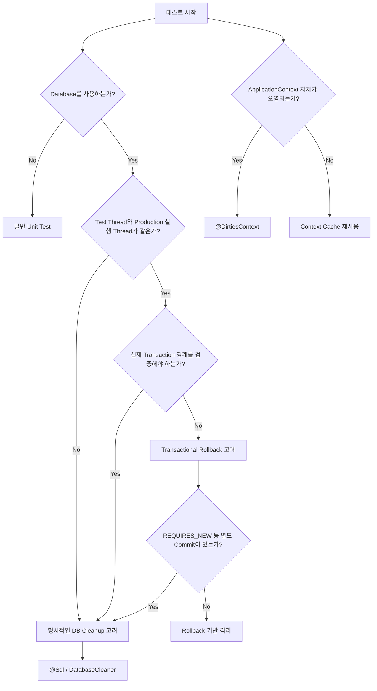

# 라텔의 Spring Boot 테스트 격리
[https://youtu.be/nER0Z_99OmQ?si=yVZ0iWjgZjL7Aixz](https://youtu.be/nER0Z_99OmQ?si=yVZ0iWjgZjL7Aixz)

# 라텔의 Spring Boot 테스트 격리
* toc
{:toc}

---

## Spring Boot 통합 테스트는 어떻게 격리해야 할까?

테스트 코드를 작성하다 보면 가끔 이상한 상황을 만난다.

분명 코드를 수정하지 않았는데 어떤 때는 테스트가 성공하고, 어떤 때는 실패한다.

```text
실행 #1

PASS


실행 #2

FAIL


실행 #3

PASS
```

더 이상한 경우도 있다.

테스트 하나만 실행하면 성공한다.

```text
ReservationRepositoryTest

PASS
```

그런데 전체 테스트를 실행하면 실패한다.

```text
전체 테스트 실행

FAIL
```

테스트 실행 순서를 바꾸면 다시 성공하기도 한다.

이런 테스트는 개발자에게 잘못된 신호를 준다.

테스트가 실패했을 때 우리는 보통

```text
프로덕션 코드에 문제가 있는가?

요구사항을 잘못 구현했는가?

설정이 잘못되었는가?
```

를 의심한다.

그런데 테스트 자체가 실행 순서나 이전 상태에 따라 성공과 실패를 반복한다면 실패 결과를 신뢰하기 어렵다.

이런 문제를 이해하려면 먼저 **비결정적 테스트와 테스트 격리**를 이해해야 한다.

---

## 비결정적 테스트란 무엇인가?

결정적인 테스트는 같은 조건에서 실행하면 항상 같은 결과를 만들어야 한다.

```text
같은 코드

+

같은 입력

+

같은 환경

↓

항상 같은 테스트 결과
```

반대로 같은 코드인데 실행 시점이나 실행 순서 등에 따라 결과가 달라진다면 비결정적인 테스트가 된다.

대표적인 원인은 여러 가지가 있다.

```text
현재 시간

Random 값

외부 API

Thread Scheduling

비동기 처리

Network

공유 파일

Database 상태

다른 테스트의 실행 결과
```

예를 들어 다음 코드가 있다고 하자.

```java
public Coupon issueCoupon() {
    LocalDate today = LocalDate.now();

    return new Coupon(today.plusDays(7));
}
```

테스트에서도 현재 시간을 사용한다.

```java
@Test
void couponExpiresAfterSevenDays() {
    Coupon coupon = couponService.issueCoupon();

    assertThat(coupon.getExpireDate())
            .isEqualTo(LocalDate.now().plusDays(7));
}
```

테스트와 실제 코드에서 시간이 바뀌는 경계에 걸리면 예상하지 못한 실패가 발생할 수 있다.

그래서 시간처럼 통제해야 하는 값은 `Clock` 등을 주입해 제어할 수 있다.

하지만 이번 글에서 집중할 문제는 **Database 상태 공유로 발생하는 비결정성**이다.

---

## 테스트 격리란 무엇인가?

두 개의 테스트가 있다고 하자.

첫 번째 테스트는 데이터를 저장한다.

```java
@Test
void saveReservation() {
    reservationRepository.save(
            new Reservation("Yun")
    );

    assertThat(
            reservationRepository.count()
    ).isEqualTo(1);
}
```

두 번째 테스트는 데이터가 없는 상황을 기대한다.

```java
@Test
void reservationDoesNotExist() {
    assertThat(
            reservationRepository.count()
    ).isZero();
}
```

두 번째 테스트부터 실행하면 성공한다.

```text
Database

EMPTY

↓

reservationDoesNotExist()

PASS
```

하지만 저장 테스트부터 실행한다.

```text
saveReservation()

↓

Database

Reservation 1개 저장


reservationDoesNotExist()

↓

FAIL
```

두 번째 테스트가 첫 번째 테스트의 결과에 의존하게 되었다.

문제의 핵심은 테스트가 같은 Database 상태를 공유했다는 것이다.

---

## 테스트 격리의 핵심

테스트 격리는 단순하게 표현하면 다음과 같다.

```text
Test A의 실행 결과

↓

Test B에 영향을 주지 않는다.
```

각 테스트가 자신만의 초기 상태에서 실행되어야 한다.

```text
Test A

초기 상태
→ 실행
→ 결과


Test B

초기 상태
→ 실행
→ 결과
```

즉 테스트 격리의 목적은

```text
공유 상태 제거

↓

테스트 독립성 확보

↓

실행 순서 의존 제거

↓

결정적인 테스트
```

라고 볼 수 있다.

Spring Boot 통합 테스트에서는 이 공유 상태가 Database인 경우가 많다.

---

## 왜 Database 테스트에서 격리가 특히 중요할까?

일반적인 단위 테스트는 객체를 매번 새롭게 만들기 쉽다.

```java
@BeforeEach
void setUp() {
    repository =
            new FakeReservationRepository();
}
```

하지만 통합 테스트에서는 실제 Database를 사용한다.

```text
Test 1 ─┐
        │
Test 2 ─┼── Test Database
        │
Test 3 ─┘
```

각 테스트가 INSERT, UPDATE, DELETE를 수행하면 Database 상태가 계속 변경된다.

따라서 테스트 사이에 데이터를 초기화할 방법이 필요하다.

Spring 환경에서 대표적으로 생각해볼 수 있는 방법은 다음과 같다.

```text
1. @Transactional을 통한 Rollback

2. SQL을 이용한 Database 초기화

3. DatabaseCleaner를 이용한 자동 초기화

4. @DirtiesContext를 통한 Context 재생성
```

하지만 네 가지는 동작 원리와 목적이 서로 다르다.

---

## 첫 번째 방법: @Transactional과 Rollback

가장 간단한 방법은 테스트에 `@Transactional`을 붙이는 것이다.

```java
@SpringBootTest
@Transactional
class ReservationServiceTest {

    @Test
    void saveReservation() {
        // ...
    }
}
```

Spring TestContext Framework에서 테스트에 `@Transactional`을 선언하면 테스트는 **test-managed transaction** 안에서 실행되고, 기본적으로 테스트가 끝날 때 Rollback된다. 이를 관리하는 핵심 구성요소가 `TransactionalTestExecutionListener`다.

흐름을 단순화하면 다음과 같다.

```text
Test 시작

↓

Test Transaction 시작

↓

INSERT

↓

SELECT

↓

Assertion

↓

Test 종료

↓

ROLLBACK
```

따라서 다음 테스트가 시작할 때 Database에는 이전 테스트가 저장한 데이터가 남지 않는다.

---

## 테스트의 @Transactional은 프로덕션 @Transactional과 실행 구조가 조금 다르다

여기서 중요한 부분이 있다.

Service에서 사용하는

```java
@Transactional
public void reserve() {
}
```

와 테스트 클래스의

```java
@Transactional
class ReservationServiceTest {
}
```

을 완전히 동일한 메커니즘이라고 생각하면 안 된다.

프로덕션의 일반적인 `@Transactional`은 Spring의 Transaction Interceptor와 Proxy 구조를 통해 실행된다.

반면 Spring TestContext에서 테스트 트랜잭션은 `TransactionalTestExecutionListener`가 테스트 실행 전후의 트랜잭션을 관리한다.

개념적으로는 다음과 같다.

```text
TransactionalTestExecutionListener

↓

Test Transaction 시작

↓

@Test 실행

↓

Test Transaction Rollback
```

즉 테스트 객체 자체를 일반적인 Service Bean처럼 Transaction Proxy로 감싸서 실행한다고 이해하는 것은 정확하지 않다.

---

## 테스트 트랜잭션 안에서 Service 트랜잭션은 어떻게 될까?

테스트가 이미 Transaction을 가지고 있다고 하자.

```text
Test Transaction
```

그리고 다음 Service를 호출한다.

```java
@Transactional
public void reserve() {
    reservationRepository.save(...);
}
```

기본 전파 속성은 `REQUIRED`다.

이미 Transaction이 있으므로 Service Transaction은 기존 테스트 Transaction에 참여한다.

```text
Test Transaction

┌─────────────────────────────┐

    Service
    @Transactional(REQUIRED)

    ↓

    기존 Transaction 참여

└─────────────────────────────┘
```

테스트가 끝난다.

```text
ROLLBACK
```

Service에서 저장한 데이터도 함께 Rollback된다.

그래서 일반적인 Repository나 Service 통합 테스트에서 `@Transactional`이 매우 편리하다.

---

## @Transactional 방식의 장점

첫 번째 장점은 간단하다.

```java
@Transactional
```

만 붙여도 된다.

두 번째로 빠르다.

테스트마다 Table 전체를 삭제하고 데이터를 다시 만드는 것보다 Transaction을 Rollback하는 방식이 훨씬 저렴한 경우가 많다.

세 번째로 테스트 코드에서 Database Cleanup 코드가 보이지 않는다.

```java
@Test
void reservationTest() {
    // 테스트에 필요한 내용만 보인다.
}
```

그래서 Repository 테스트나 JPA Slice Test에서 특히 편리하다.

Spring Boot의 `@DataJpaTest` 역시 기본적으로 Transactional하게 실행되고 각 테스트 종료 후 Rollback된다.

---

## 하지만 @Transactional이 항상 테스트 격리를 보장하는 것은 아니다

`@Transactional`이 편리하다고 모든 통합 테스트에 사용할 수 있는 것은 아니다.

가장 중요한 이유는 **테스트가 만든 Transaction과 실제 프로덕션 코드가 실행되는 Transaction 경계가 항상 같지는 않기 때문**이다.

대표적으로 다음 상황을 봐야 한다.

```text
REQUIRES_NEW

실제 HTTP Server 테스트

다른 Thread에서 실행되는 코드

비동기 처리
```

---

## REQUIRES_NEW에서는 문제가 달라진다

다음 Service가 있다고 하자.

```java
@Transactional(propagation = Propagation.REQUIRES_NEW)
public void saveAuditLog() {
    auditRepository.save(...);
}
```

테스트는 이미 Transaction을 가지고 있다.

```text
Test Transaction

T1
```

`REQUIRES_NEW` 메서드를 호출하면 기존 Transaction에 참여하지 않는다.

기존 Transaction을 잠시 중단하고 새로운 Transaction을 시작한다.

```text
Test Transaction T1

        일시 중단

            ↓

Production Transaction T2

            ↓

          COMMIT

            ↓

Test Transaction T1 재개
```

테스트가 끝난다.

```text
T1

ROLLBACK
```

하지만 T2는 이미 Commit되었다.

따라서 T1을 Rollback해도 T2에서 저장한 데이터까지 되돌릴 수 없다.

Spring 공식 문서도 Test-managed Transaction과 Spring-managed Transaction을 구분해야 하며, 애플리케이션 Transaction에서 `REQUIRED`나 `SUPPORTS` 이외의 전파 속성을 사용할 때 주의해야 한다고 설명한다.

---

## 트랜잭션 테스트가 실제 프로덕션 동작을 가릴 수도 있다

또 하나의 문제는 테스트가 프로덕션 코드 바깥에 Transaction을 만들어버린다는 것이다.

실제 애플리케이션에서는 다음 흐름일 수 있다.

```text
Controller

↓

Service Transaction 시작

↓

Repository

↓

Commit

↓

Lazy Loading 불가능
```

그런데 테스트는 다음처럼 실행될 수 있다.

```text
Test Transaction 시작

↓

Service

↓

Repository

↓

Service 종료

↓

Test Transaction은 아직 살아 있음
```

Service Transaction이 끝난 뒤에도 테스트 Transaction 때문에 Persistence Context가 계속 열려 있다면 실제 운영에서는 실패할 코드가 테스트에서는 성공하는 상황도 조심해야 한다.

예를 들어 Transaction 밖에서 Lazy Loading을 하는 버그가 테스트 Transaction 때문에 드러나지 않을 수 있다.

그래서 Transaction 자체의 경계를 검증해야 하는 테스트라면 테스트에 무조건 `@Transactional`을 붙이는 것이 오히려 테스트의 현실성을 떨어뜨릴 수 있다.

---

## 실제 서버를 띄우는 테스트에서는 Rollback이 적용되지 않을 수 있다

다음 테스트를 생각해보자.

```java
@SpringBootTest(
    webEnvironment = SpringBootTest.WebEnvironment.RANDOM_PORT
)
@Transactional
class ReservationApiTest {
}
```

HTTP Client를 통해 실제 서버로 요청을 보낸다.

```text
Test Thread

↓

HTTP Request

↓

Embedded Server

↓

Server Thread

↓

Controller

↓

Service
```

여기에서 중요한 것은 Test Thread와 Server Thread가 다르다는 것이다.

Spring의 Transaction Context는 기본적으로 Thread에 연결되어 관리된다.

따라서

```text
Test Thread의 Transaction

≠

Server Thread의 Transaction
```

이다.

Spring Boot 공식 문서도 `RANDOM_PORT`나 `DEFINED_PORT`를 사용하는 실제 Servlet 환경에서는 HTTP Client와 Server가 서로 다른 Thread에서 실행되므로 서버에서 시작된 Transaction은 테스트 Transaction의 Rollback 대상이 아니라고 명시한다.

---

## RestAssured 테스트에서 자주 만나는 문제

예를 들어 다음과 같이 테스트한다고 하자.

```java
@Transactional
@Test
void createReservation() {
    given()
        .contentType(ContentType.JSON)
        .body(request)
    .when()
        .post("/reservations")
    .then()
        .statusCode(201);
}
```

Test Thread에는 Transaction이 있다.

하지만 실제 서버 요청은 다른 Thread에서 처리한다.

```text
Test Thread

@Transactional

↓

HTTP Request


Server Thread

Controller

↓

Service Transaction

↓

COMMIT
```

테스트 종료 후

```text
Test Transaction

ROLLBACK
```

을 하더라도 Server Thread에서 이미 Commit된 데이터는 그대로 남는다.

따라서 실제 HTTP 요청 기반 인수 테스트에서는 별도의 Database 초기화 전략이 필요한 경우가 많다.

---

## Thread가 달라지는 테스트라면 항상 조심하자

이 문제는 HTTP Server 테스트에만 있는 것은 아니다.

Spring 공식 문서는 테스트 Framework가 Preemptive Timeout을 구현하기 위해 테스트 코드를 다른 Thread에서 실행하는 경우에도 Test-managed Transaction이 적용되지 않을 수 있다고 경고한다. 대표적으로 JUnit Jupiter의 `assertTimeoutPreemptively()` 같은 기능이 있다.

핵심은 다음과 같다.

```text
Spring Test Transaction

↓

현재 Thread에 연결


실제 코드

↓

다른 Thread 실행


결과

↓

같은 Test Transaction에 포함되지 않을 수 있음
```

따라서

```text
@Transactional을 붙였다.

=

어디에서 실행되는 코드든
무조건 Rollback된다.
```

라고 생각하면 안 된다.

---

## 두 번째 방법: SQL로 Database를 직접 초기화한다

Transaction Rollback을 신뢰하기 어려운 테스트라면 더 단순한 방법이 있다.

테스트가 끝났거나 시작하기 전에 데이터를 직접 삭제한다.

예를 들어 다음과 같다.

```sql
TRUNCATE TABLE reservation;
TRUNCATE TABLE member;
TRUNCATE TABLE reservation_time;
```

`TRUNCATE`는 Table 구조는 유지하고 Row 데이터를 비우는 목적으로 사용할 수 있다.

이제 테스트마다 Database를 다음 상태로 만들 수 있다.

```text
Test 시작

↓

Database Cleaner

↓

EMPTY

↓

Test 실행
```

실제 애플리케이션에서 Transaction이 Commit되어도 다음 테스트 전에 데이터를 제거하므로 테스트가 독립적으로 실행된다.

---

## @BeforeEach에서 직접 초기화할 수 있다

가장 단순한 방법은 `JdbcTemplate`을 이용하는 것이다.

```java
@BeforeEach
void setUp() {
    jdbcTemplate.execute(
            "TRUNCATE TABLE reservation"
    );

    jdbcTemplate.execute(
            "TRUNCATE TABLE member"
    );
}
```

직관적이다.

하지만 Table이 많아지면 금방 문제가 생긴다.

```java
jdbcTemplate.execute("TRUNCATE TABLE member");
jdbcTemplate.execute("TRUNCATE TABLE reservation");
jdbcTemplate.execute("TRUNCATE TABLE payment");
jdbcTemplate.execute("TRUNCATE TABLE coupon");
jdbcTemplate.execute("TRUNCATE TABLE point");
jdbcTemplate.execute("TRUNCATE TABLE notification");
```

새로운 Table이 생길 때마다 Cleanup 코드도 변경해야 한다.

---

## 테스트 준비 코드와 Database Cleanup 코드가 섞인다

`@BeforeEach`에는 테스트에 정말 필요한 Fixture 준비 코드가 있을 수도 있다.

```java
@BeforeEach
void setUp() {
    cleanDatabase();

    member = createMember();
    product = createProduct();
}
```

Cleanup 로직이 복잡해지면 중요한 준비 과정이 가려질 수 있다.

```text
setUp()

├── DB 초기화 코드 30줄
├── Foreign Key 처리
├── Sequence 초기화
│
└── 실제 Fixture 준비
```

그래서 Database 초기화 책임을 별도로 분리하는 것이 좋다.

---

## @Sql을 이용할 수도 있다

Spring TestContext Framework는 SQL Script를 테스트 전후에 실행할 수 있는 `@Sql`을 제공한다.

예를 들어 다음 SQL 파일을 만든다.

```sql
SET FOREIGN_KEY_CHECKS = 0;

TRUNCATE TABLE reservation;
TRUNCATE TABLE member;
TRUNCATE TABLE reservation_time;

SET FOREIGN_KEY_CHECKS = 1;
```

그리고 테스트에 적용한다.

```java
@Sql(
    scripts = "/sql/cleanup.sql",
    executionPhase = Sql.ExecutionPhase.BEFORE_TEST_METHOD
)
@SpringBootTest
class ReservationApiTest {
}
```

테스트 흐름은 다음과 같다.

```text
Spring Test

↓

cleanup.sql 실행

↓

Test Method 실행
```

SQL Cleanup 코드가 테스트 클래스에서 사라지기 때문에 테스트 코드가 더 읽기 쉬워진다.

---

## @Sql의 장점

SQL 자체를 별도 파일에 관리할 수 있다.

```text
src/test/resources

└── sql
    ├── cleanup.sql
    ├── member-fixture.sql
    └── reservation-fixture.sql
```

테스트에서는 어떤 Script를 사용하는지만 표현한다.

```java
@Sql("/sql/cleanup.sql")
```

초기 데이터 생성에도 활용할 수 있다.

```java
@Sql({
    "/sql/cleanup.sql",
    "/sql/member-fixture.sql"
})
@Test
void findMember() {
}
```

즉 Cleanup뿐 아니라 테스트 Fixture 관리에도 사용할 수 있다.

---

## 하지만 @Sql 역시 유지보수 비용이 있다

Schema가 변경되었다고 하자.

새로운 Table이 추가되었다.

```text
notification
```

그러면 Cleanup SQL도 변경해야 한다.

```sql
TRUNCATE TABLE notification;
```

Table 이름이 변경되어도 수정해야 한다.

```text
reservation

↓

reservations
```

SQL Script는 Application Schema와 직접 결합되어 있기 때문이다.

또 테스트 코드만 보면

```java
@Sql("/sql/cleanup.sql")
```

이 정확히 어떤 일을 하는지 확인하려면 파일을 열어봐야 한다.

---

## DatabaseCleaner로 초기화 로직을 자동화할 수 있다

Table이 많아지면 Database Metadata를 이용해 Table 목록을 자동으로 가져오는 방법을 사용할 수 있다.

개념적으로 다음 구조다.

```text
DatabaseCleaner

↓

Database Metadata 조회

↓

Table 목록 추출

↓

Foreign Key 제약 처리

↓

각 Table TRUNCATE

↓

Sequence / Identity 초기화
```

사용하는 코드는 간단해진다.

```java
@BeforeEach
void setUp() {
    databaseCleaner.clear();
}
```

테스트 입장에서는 의도가 명확하다.

```text
databaseCleaner.clear()

↓

Database를 깨끗한 상태로 만든다.
```

---

## DatabaseCleaner 예제

구현 방식은 DBMS마다 달라질 수 있지만 구조는 대략 다음과 같다.

```java
@Component
public class DatabaseCleaner {

    private final JdbcTemplate jdbcTemplate;

    public DatabaseCleaner(
            JdbcTemplate jdbcTemplate
    ) {
        this.jdbcTemplate = jdbcTemplate;
    }

    public void clear() {
        jdbcTemplate.execute(
                "SET FOREIGN_KEY_CHECKS = 0"
        );

        // Metadata를 이용해 Table 목록 조회
        // 각 Table TRUNCATE

        jdbcTemplate.execute(
                "SET FOREIGN_KEY_CHECKS = 1"
        );
    }
}
```

실제 구현에서는 사용하는 DBMS에 따라 Foreign Key 처리, Schema 이름, Sequence 초기화 방법 등을 달리해야 한다.

따라서 DatabaseCleaner 자체를 모든 DB에서 동일하게 사용할 수 있다고 생각하면 안 된다.

---

## TRUNCATE에도 주의할 점이 있다

`TRUNCATE`는 단순한 `DELETE FROM`과 완전히 동일하지 않다.

DBMS에 따라 DDL에 가까운 동작을 하거나 Transaction 처리 방식이 다를 수 있다.

Foreign Key가 연결되어 있다면 바로 실행할 수 없는 경우도 있다.

또 Auto Increment 값을 초기화하는 동작 역시 DBMS마다 다를 수 있다.

따라서 Cleaner는 다음 요소를 고려해야 한다.

```text
DBMS 종류

Foreign Key

Sequence / Identity

Schema

Table 제외 목록

Migration Metadata Table
```

예를 들어 Flyway나 Liquibase가 관리하는 Table까지 지워서는 안 된다.

```text
flyway_schema_history

↓

Cleanup 제외
```

---

## 테스트마다 Before에서 지울까, After에서 지울까?

두 방식 모두 가능하지만 개인적으로는 테스트 시작 전에 깨끗한 상태를 만드는 방식이 이해하기 쉽다.

```text
BEFORE

Database Cleanup

↓

Test 실행
```

이 구조에서는 각 테스트가

```text
내가 어떤 이전 테스트 다음에 실행됐는지
상관없이

항상 깨끗한 Database에서 시작한다.
```

는 전제를 가질 수 있다.

반면 테스트 종료 후에만 정리하면 이전 테스트가 비정상적으로 종료되었거나 Cleanup이 수행되지 않은 경우 다음 테스트에 영향을 줄 수 있다.

핵심은 각 테스트의 **Precondition을 테스트 시작 시점에 보장하는 것**이다.

---

## @Transactional과 DatabaseCleaner를 동시에 사용할 때도 조심해야 한다

다음 구조를 생각해보자.

```java
@Transactional
class ReservationTest {

    @BeforeEach
    void setUp() {
        databaseCleaner.clear();
    }
}
```

Spring의 Transactional Test에서는 일반적인 `@BeforeEach`와 `@AfterEach`도 Test-managed Transaction 내부에서 실행된다.

따라서 Cleanup SQL과 Transaction의 관계를 의도적으로 설계해야 한다.

특히 `TRUNCATE`의 Transaction 의미는 DBMS마다 다를 수 있기 때문에 애매하게 섞는 것은 피하는 편이 좋다.

DatabaseCleaner 방식으로 격리한다면 아예 테스트 자체의 Rollback에 의존하지 않는 구조가 더 이해하기 쉬운 경우가 많다.

---

## 세 번째 방법: @DirtiesContext

Spring Test에서는 `@DirtiesContext`라는 Annotation도 제공한다.

```java
@DirtiesContext
@SpringBootTest
class ReservationServiceTest {
}
```

이름 그대로

```text
현재 ApplicationContext가 오염되었다.
```

고 Spring Test Framework에 알려주는 기능이다.

Spring은 Test ApplicationContext를 매번 새롭게 만들지 않는다.

동일한 설정을 사용하는 테스트라면 생성된 `ApplicationContext`를 Cache해서 재사용한다.

---

## 왜 ApplicationContext를 재사용할까?

Spring Boot ApplicationContext를 생성하는 작업은 비싸다.

```text
Configuration 읽기

↓

Component Scan

↓

Bean Definition 생성

↓

Bean 생성

↓

Dependency Injection

↓

JPA 초기화

↓

DataSource 생성

↓

각종 Auto Configuration
```

이 과정을 테스트마다 다시 수행하면 테스트 Suite가 매우 느려진다.

그래서 Spring TestContext Framework는 동일한 설정의 Context를 Cache한다. 현재 공식 문서에 따르면 Context Cache는 기본 최대 32개이며 동일한 설정을 가진 테스트 사이에서 재사용된다.

```text
Test A

↓

ApplicationContext A 생성


Test B

같은 설정

↓

ApplicationContext A 재사용
```

---

## @DirtiesContext는 Context Cache를 버린다

테스트가 Spring Bean의 상태를 변경했다고 생각해보자.

```java
@Component
public class FeatureFlag {

    private boolean enabled;

    public void enable() {
        enabled = true;
    }
}
```

Test A에서 값을 변경한다.

```text
enabled

false → true
```

다음 테스트에서도 같은 ApplicationContext를 재사용하면

```text
enabled = true
```

가 남을 수 있다.

이런 경우 `@DirtiesContext`를 사용할 수 있다.

```java
@DirtiesContext
@Test
void changeFeatureFlag() {
}
```

Spring은 해당 Context를 Cache에서 제거하고 닫는다.

다음에 같은 Context가 필요하면 새로 생성한다.

---

## @DirtiesContext의 진짜 목적

핵심은 이것이다.

```text
@DirtiesContext

=

Database Cleaner
```

가 아니다.

정확한 목적은

```text
Spring ApplicationContext 상태가 변경되었으니

현재 Context를 재사용하지 말자.
```

에 가깝다.

Spring 공식 문서 역시 Singleton Bean의 상태 변경처럼 ApplicationContext가 변경되거나 오염된 경우를 대표적인 사용 사례로 설명한다.

---

## 그런데 왜 @DirtiesContext로 DB가 초기화되는 것처럼 보일까?

H2 같은 In-memory Database를 ApplicationContext가 생성하는 상황을 생각해보자.

```text
ApplicationContext

↓

DataSource

↓

In-memory DB
```

`@DirtiesContext`로 Context를 닫는다.

```text
ApplicationContext Close

↓

DataSource Close

↓

In-memory DB Lifecycle 종료
```

그리고 새로운 Context를 만든다.

```text
New ApplicationContext

↓

New DataSource

↓

New In-memory Database
```

결과적으로 Database가 깨끗해진 것처럼 보일 수 있다.

하지만 이것은 **Context 재생성 과정에서 In-memory DB까지 함께 다시 만들어진 결과**일 뿐이다.

---

## 외부 Database라면 이야기가 달라진다

다음 구조라면 어떨까?

```text
ApplicationContext

↓

DataSource

↓

localhost MySQL
```

Context를 버린다.

```text
ApplicationContext 삭제

↓

DataSource Connection Pool 종료
```

하지만 MySQL Server 자체의 데이터는 그대로다.

```text
MySQL

Reservation 데이터 그대로 존재
```

새로운 Context가 같은 MySQL에 다시 연결한다.

```text
New ApplicationContext

↓

New DataSource

↓

기존 MySQL Data
```

따라서 `@DirtiesContext`를 Database Cleanup 도구로 사용하는 설계는 Database 실행 방식에 따라 우연히 작동하는 것일 수 있다.

---

## @DirtiesContext가 느린 이유

`@DirtiesContext`는 Context를 Cache에서 제거한다.

그러면 다시 만들어야 한다.

```text
ApplicationContext Close

↓

Context Cache 제거

↓

다음 테스트

↓

ApplicationContext 다시 생성

↓

Bean 전체 초기화
```

Spring Boot 애플리케이션에서는 이 비용이 상당할 수 있다.

테스트가 100개 있다고 하자.

Context를 공유하면

```text
ApplicationContext 시작

1회
```

로 끝날 수도 있다.

반면 테스트마다 Context를 새롭게 만들면

```text
ApplicationContext 초기화

×

100
```

이 될 수 있다.

그래서 `@DirtiesContext`를 습관적으로 사용하면 전체 Test Suite가 급격히 느려질 수 있다.

---

## @DirtiesContext를 사용하기 적절한 경우

다음처럼 실제 Spring Context 상태가 변경된 경우에는 목적에 맞는다.

```text
Singleton Bean 상태 변경

Bean Definition 영향

Context의 공유 상태 변경

다음 테스트가 기존 Context를 재사용하면 문제가 되는 경우
```

이럴 때는

```java
@DirtiesContext
```

의 의미가 명확하다.

반대로 목적이

```text
Database Row를 삭제하고 싶다.
```

뿐이라면 Database를 직접 초기화하는 것이 책임상 더 자연스럽다.

---

## 세 가지 방법을 비교하면

| 방법                        | 장점                | 단점                       | 적합한 경우                   |
| ------------------------- | ----------------- | ------------------------ | ------------------------ |
| `@Transactional` Rollback | 빠르고 간단함           | Transaction 경계를 왜곡할 수 있음 | Repository/JPA 통합 테스트    |
| `@Sql`                    | 명시적이고 단순함         | Schema 변경 시 SQL 유지보수     | 작은 Schema, Fixture 관리    |
| DatabaseCleaner           | Schema 변경 대응이 편리함 | DBMS별 구현 필요              | 실제 HTTP 통합/인수 테스트        |
| `@DirtiesContext`         | Context 자체 초기화    | 매우 비쌀 수 있음               | Bean/Context가 실제로 오염된 경우 |

중요한 것은 하나를 모든 테스트에 적용하는 것이 아니다.

**테스트가 무엇을 검증하는가에 따라 격리 전략도 달라져야 한다.**

---

## Repository 테스트라면

예를 들어 Repository 기능만 검증한다고 하자.

```java
@DataJpaTest
class ReservationRepositoryTest {

    @Autowired
    ReservationRepository repository;

    @Test
    void findReservation() {
        // ...
    }
}
```

이 경우 Spring Boot의 `@DataJpaTest`는 기본적으로 Transactional하게 실행되고 테스트 이후 Rollback한다.

Repository Query를 검증하는 목적이라면 매우 적절한 방식이다.

```text
Test Transaction

↓

Repository 실행

↓

Assertion

↓

Rollback
```

빠르고 단순하다.

---

## Service 테스트에서는 트랜잭션 경계를 생각하자

Service 테스트도 단순 Business Logic 검증이라면 Rollback 방식이 편리할 수 있다.

하지만 테스트 목적이 다음과 같다면 달라진다.

```text
Transaction Propagation 검증

Commit 후 Event 검증

@TransactionalEventListener AFTER_COMMIT

REQUIRES_NEW

Lazy Loading 경계

Transaction 종료 후 동작
```

테스트 바깥에 큰 Transaction을 만들어버리면 프로덕션과 실행 조건이 달라질 수 있다.

따라서 이런 테스트에서는 테스트의 `@Transactional`을 제거하고 실제 Transaction 경계를 그대로 실행한 뒤 DatabaseCleaner 등으로 상태를 초기화하는 것이 더 적절할 수 있다.

---

## 실제 HTTP API 테스트라면

다음 구조라고 하자.

```text
RestAssured

↓

Embedded Tomcat

↓

Controller

↓

Service

↓

Database
```

Client와 Server가 서로 다른 Thread에서 실행된다.

따라서 Test Thread에서 만든 Transaction Rollback에 서버 Transaction을 기대하면 안 된다.

이런 테스트에서는

```text
DatabaseCleaner

↓

HTTP Request

↓

Assertion

↓

다음 테스트 전에 Cleaner
```

처럼 실제 Database 상태를 초기화하는 방식이 훨씬 명확하다.

---

## 테스트 격리와 Fixture는 다른 문제다

Database를 깨끗하게 만드는 것과 필요한 테스트 데이터를 준비하는 것은 역할이 다르다.

### 격리

```text
이전 테스트의 상태를 제거한다.
```

### Fixture

```text
현재 테스트가 필요한 상태를 만든다.
```

예를 들면 다음과 같다.

```java
@BeforeEach
void setUp() {
    databaseCleaner.clear();

    member = memberRepository.save(
            MemberFixture.member()
    );
}
```

둘을 분리하면 테스트 구조를 이해하기 쉽다.

```text
Cleanup

↓

Given

↓

When

↓

Then
```

---

## Database를 매번 비우는 것만이 격리는 아니다

테스트 격리의 본질은 `TRUNCATE`가 아니다.

목적은 다음이다.

```text
테스트가 서로 영향을 주지 않는다.
```

따라서 상황에 따라 다른 전략도 가능하다.

예를 들어 테스트마다 독립된 Database나 Schema를 제공할 수도 있고, 고유 식별자를 사용해 서로의 데이터를 침범하지 않도록 설계할 수도 있다.

중요한 것은 특정 기술이 아니라 **공유 Mutable State를 통제하는 것**이다.

---

## 테스트가 느려진다고 무조건 Transaction Rollback으로 바꾸면 안 된다

DatabaseCleaner가 느리다고 다음처럼 결정할 수 있다.

```text
TRUNCATE가 느리다.

↓

전부 @Transactional로 변경
```

하지만 실행 속도만 보고 판단하면 테스트가 검증하려는 실제 Transaction Boundary를 잃어버릴 수 있다.

반대로

```text
Rollback은 위험하다.

↓

모든 테스트에서 TRUNCATE
```

도 좋은 결론은 아니다.

Repository Test까지 매번 모든 Table을 지운다면 불필요한 비용이 발생한다.

따라서 테스트 수준에 따라 전략을 나누는 것이 좋다.

---

## 테스트 종류에 따라 전략을 나눠보자

실무에서는 다음과 같은 기준이 현실적이다.

```text
Unit Test

↓

Database 없음


Repository Slice Test

↓

@Transactional Rollback


Service Integration Test

↓

목적에 따라 Rollback 또는 Cleaner


HTTP Integration / Acceptance Test

↓

DatabaseCleaner 또는 명시적 DB 초기화


Context 자체가 변경되는 Test

↓

@DirtiesContext
```

하나의 격리 방식이 모든 테스트를 해결할 필요는 없다.

---

## 테스트 격리는 실행 순서에 의존하지 않아야 한다

다음 Annotation으로 테스트 순서를 지정할 수도 있다.

```java
@TestMethodOrder(
        MethodOrderer.OrderAnnotation.class
)
```

그리고

```java
@Order(1)
void save() {
}
```

```java
@Order(2)
void find() {
}
```

처럼 만들 수 있다.

하지만 이것은 격리가 아니다.

```text
Test A가 성공해야

Test B가 성공한다.
```

라는 의존성을 명시했을 뿐이다.

일반적인 독립 테스트라면

```text
A → B

B → A

Random
```

어떤 순서로 실행되어도 결과가 같아야 한다.

---

## Parallel Test를 생각하면 격리의 중요성이 더 커진다

테스트 Suite가 커지면 실행 시간을 줄이기 위해 Parallel Test를 고려할 수 있다.

그런데 테스트들이 같은 Database 데이터를 공유한다면 문제가 더 쉽게 드러난다.

```text
Thread A

TRUNCATE

↓

INSERT Member A


Thread B

TRUNCATE

↓

Thread A 데이터까지 삭제
```

따라서 병렬 테스트를 수행하려면 단순히 매 테스트마다 같은 Database를 `TRUNCATE`하는 전략도 적합하지 않을 수 있다.

이 경우에는

```text
Database 분리

Schema 분리

Container 분리

Test Data Namespace 분리
```

같은 더 강한 격리가 필요할 수 있다.

즉 테스트 격리는 Test Suite 규모가 커질수록 단순 Cleanup 문제를 넘어 테스트 Architecture 문제가 된다.

---

## 테스트 격리 전략을 선택할 때 확인할 질문

다음 질문을 순서대로 확인하면 선택하기 쉬워진다.

### 테스트와 프로덕션 코드가 같은 Thread에서 실행되는가?

같다면 Test Transaction Rollback을 활용할 가능성이 높다.

다른 Thread라면 Rollback만 믿어서는 안 된다.

### 실제 Transaction Boundary를 검증해야 하는가?

그렇다면 테스트 바깥의 Transaction이 실제 동작을 가릴 수 있다.

### REQUIRES_NEW 같은 별도 Transaction이 존재하는가?

별도로 Commit된 Transaction은 외부 테스트 Rollback으로 되돌릴 수 없다.

### Schema 변경이 자주 발생하는가?

그렇다면 수동 `cleanup.sql` 유지보수가 부담될 수 있다.

### 실제 ApplicationContext 상태가 변경되는가?

그때는 `@DirtiesContext`가 적절할 수 있다.

### 테스트 실행 속도가 중요한가?

가장 강력한 초기화가 항상 가장 효율적인 것은 아니다.

---

## 실무에서 추천할 수 있는 기본 방향

Repository 테스트는 가능하면 Spring이 제공하는 Rollback을 적극적으로 활용할 수 있다.

```text
@DataJpaTest

+

기본 Transaction Rollback
```

실제 HTTP 요청을 보내는 통합 테스트에서는 DatabaseCleaner 같은 명시적인 초기화 전략이 이해하기 쉽다.

```text
@SpringBootTest(RANDOM_PORT)

+

DatabaseCleaner
```

Context 상태를 직접 변경하는 매우 특수한 테스트에서만 `@DirtiesContext`를 사용한다.

```text
Bean State 변경

↓

@DirtiesContext
```

이렇게 테스트 종류에 따라 격리 도구를 나누면 성능과 정확성을 모두 챙기기 쉽다.

---

## 구조

전체 흐름을 정리하면 다음과 같다.



이 구조에서 가장 중요한 것은

```text
무조건 @Transactional

무조건 TRUNCATE

무조건 @DirtiesContext
```

같은 하나의 규칙이 없다는 점이다.

---

## 실무에서의 활용

예를 들어 Repository 테스트는 다음과 같이 단순하게 사용할 수 있다.

```java
@DataJpaTest
class MemberRepositoryTest {

    @Autowired
    private MemberRepository memberRepository;

    @Test
    void findMember() {
        Member member =
                memberRepository.save(
                        new Member("yun")
                );

        Member result =
                memberRepository.findById(
                        member.getId()
                ).orElseThrow();

        assertThat(result.getName())
                .isEqualTo("yun");
    }
}
```

테스트가 끝나면 기본 Rollback이 수행되므로 다음 테스트에 데이터가 남지 않는다.

반면 실제 HTTP 테스트는 다음처럼 접근할 수 있다.

```java
@SpringBootTest(
    webEnvironment =
        SpringBootTest.WebEnvironment.RANDOM_PORT
)
class ReservationAcceptanceTest {

    @Autowired
    private DatabaseCleaner databaseCleaner;

    @BeforeEach
    void setUp() {
        databaseCleaner.clear();
    }

    @Test
    void createReservation() {
        // 실제 HTTP 요청
    }
}
```

여기에서는 Test Transaction Rollback에 의존하지 않는다.

실제 Controller와 Service의 Transaction이 Commit되어도 다음 테스트 전에 Database 자체를 초기화한다.

두 테스트가 서로 다른 전략을 사용하는 이유는 간단하다.

**검증하려는 범위가 다르기 때문이다.**

---

## 정리

좋은 테스트는 실패했을 때 의미 있는 정보를 제공해야 한다.

그런데 같은 코드가

```text
어떤 때는 성공

어떤 때는 실패
```

한다면 테스트 결과를 신뢰하기 어렵다.

이런 비결정성의 대표적인 원인 중 하나가 **테스트 사이의 공유 상태**다.

Spring Boot 통합 테스트에서는 Database가 대표적인 공유 상태가 된다.

```text
Test A

Database 변경

↓

Test B

변경된 상태 사용

↓

실행 순서에 따라 결과 변화
```

테스트 격리는 이 연결을 끊는 것이다.

```text
Test A

독립 상태


Test B

독립 상태
```

가장 간단한 방법은 테스트의 `@Transactional`을 이용하는 것이다.

Spring TestContext의 `TransactionalTestExecutionListener`가 Test-managed Transaction을 열고 테스트 종료 시 기본적으로 Rollback한다.

```text
BEGIN

↓

Test

↓

ROLLBACK
```

빠르고 편리하기 때문에 Repository나 일반적인 JPA Integration Test에서는 좋은 선택이 될 수 있다.

하지만 Transaction Rollback은 만능이 아니다.

```text
REQUIRES_NEW

실제 HTTP Server

별도 Thread

비동기 코드
```

처럼 Test Transaction과 다른 Transaction에서 실행되는 작업은 외부 Rollback으로 되돌릴 수 없다.

특히 `@SpringBootTest`에서 `RANDOM_PORT` 또는 `DEFINED_PORT`를 사용하는 실제 서버 테스트에서는 Client와 Server가 별도 Thread에서 동작하므로 서버 Transaction이 테스트 Transaction의 Rollback 대상이 되지 않는다.

이런 경우에는 Database 자체를 직접 초기화할 수 있다.

```text
@Sql

또는

DatabaseCleaner
```

`@Sql`은 Spring Test가 제공하는 기능으로 테스트 전후에 원하는 SQL Script를 실행할 수 있다.

Schema가 커지고 변경이 많다면 Metadata에서 Table 목록을 읽어 자동으로 초기화하는 DatabaseCleaner를 만들 수도 있다.

반면 `@DirtiesContext`는 Database Cleanup 기능이 아니다.

Spring TestContext Framework는 성능을 위해 `ApplicationContext`를 Cache하고 재사용하는데, `@DirtiesContext`는 현재 Context가 오염되었다고 표시해 Cache에서 제거하고 닫도록 하는 기능이다.

따라서

```text
DB 데이터를 초기화하고 싶다.

↓

@DirtiesContext
```

보다

```text
Spring Bean 또는 Context 상태가
실제로 오염되었다.

↓

@DirtiesContext
```

가 본래 목적에 가깝다.

결국 테스트 격리 방법을 선택할 때 중요한 것은 어떤 Annotation이 가장 편한지를 보는 것이 아니다.

```text
테스트가 어떤 범위를 검증하는가?

실제 Transaction Boundary가 중요한가?

코드가 다른 Thread에서 실행되는가?

독립적으로 Commit되는 Transaction이 존재하는가?

Database Schema는 얼마나 자주 변하는가?

ApplicationContext 자체가 변경되는가?
```

를 먼저 봐야 한다.

실무에서는 다음처럼 나누어 생각하면 이해하기 쉽다.

```text
Repository Test

→ Transaction Rollback


Transaction Boundary를 검증하는 Integration Test

→ Rollback 사용 여부 신중하게 결정


실제 HTTP Acceptance Test

→ DatabaseCleaner / 명시적인 DB 초기화


Context 자체를 변경하는 Test

→ @DirtiesContext
```

테스트 격리의 목적은 Database를 무조건 비우는 것도, 모든 테스트를 Transaction으로 감싸는 것도 아니다.

**각 테스트가 다른 테스트의 실행 결과에 영향을 받지 않고, 어떤 순서로 실행되더라도 같은 결과를 만들어 신뢰할 수 있는 테스트 Suite를 만드는 것**이 핵심이다.

### 한 줄 요약

**Spring Boot 테스트 격리는 공유 Database 상태를 통제해 테스트 간 의존성을 제거하는 것이 핵심이며, 빠르고 편리한 Transaction Rollback은 같은 Transaction 경계에서 실행되는 테스트에 적합하고, 실제 HTTP 호출·`REQUIRES_NEW`·다른 Thread가 개입하는 테스트에서는 `@Sql`이나 DatabaseCleaner 같은 명시적인 초기화 전략을 사용하며, `@DirtiesContext`는 DB 초기화가 아니라 실제 ApplicationContext가 오염되었을 때 사용하는 것이 적절하다.**
