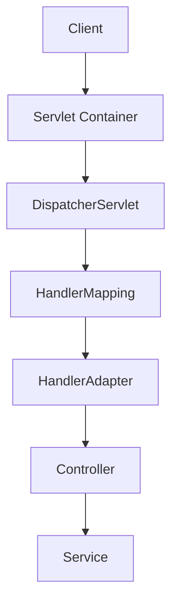
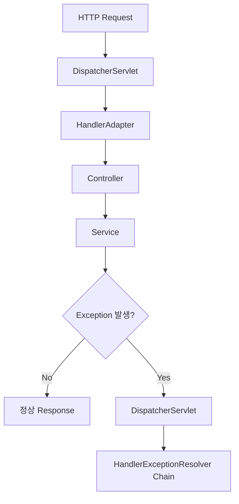
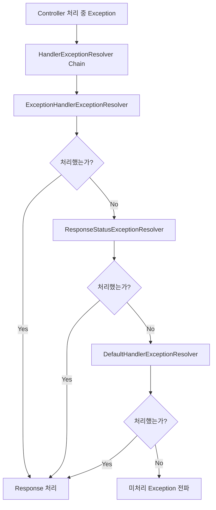

# 러로의 @RestConrollerAdvice를 이용한 예외처리
[https://youtu.be/TKjOf_AQ7l4?si=jJDxhWxMcCaJGeuU](https://youtu.be/TKjOf_AQ7l4?si=jJDxhWxMcCaJGeuU)

# 러로의 @RestConrollerAdvice를 이용한 예외처리
* toc
{:toc}

---

## @RestControllerAdvice는 어떻게 동작할까? Spring MVC 예외 처리 흐름 이해하기

Spring Boot로 REST API를 개발하다 보면 거의 반드시 다음과 같은 코드를 작성하게 된다.

```java
@RestControllerAdvice
public class GlobalExceptionHandler {

    @ExceptionHandler(MemberNotFoundException.class)
    public ResponseEntity<ErrorResponse> handleMemberNotFound(
            MemberNotFoundException e
    ) {
        return ResponseEntity
                .status(HttpStatus.NOT_FOUND)
                .body(new ErrorResponse(
                        "MEMBER_NOT_FOUND",
                        e.getMessage()
                ));
    }
}
```

Service에서 예외를 발생시킨다.

```java
public Member findMember(Long memberId) {
    return memberRepository.findById(memberId)
            .orElseThrow(
                    () -> new MemberNotFoundException(memberId)
            );
}
```

그러면 Controller에서 별도의 `try-catch`를 작성하지 않아도 `GlobalExceptionHandler`가 예외를 처리한다.

겉으로 보면 굉장히 단순하다.

```text
Service

↓

Exception 발생

↓

@RestControllerAdvice

↓

Error Response
```

그런데 조금만 더 생각하면 여러 질문이 생긴다.

```text
Service에서 발생한 예외가
어떻게 @RestControllerAdvice까지 전달될까?

Spring은 수많은 @ExceptionHandler 중
어떤 메서드를 실행해야 하는지 어떻게 알까?

Controller 내부에도 @ExceptionHandler가 있다면
어느 쪽이 먼저 실행될까?

아무 @ExceptionHandler도 처리하지 못한다면
그 예외는 어디로 갈까?

반환한 ErrorResponse는
누가 JSON으로 바꿀까?
```

이 질문에 답하려면 `@RestControllerAdvice` 하나만 보는 것이 아니라 **Spring MVC 전체 요청 처리 흐름**을 함께 봐야 한다.

---

## @RestControllerAdvice부터 정확하게 이해해보자

먼저 이름부터 나누어보자.

```text
@RestControllerAdvice

=

@ControllerAdvice

+

@ResponseBody
```

현재 Spring 공식 문서에서도 `@RestControllerAdvice`를 `@ControllerAdvice`와 `@ResponseBody`를 결합한 형태로 설명한다. 따라서 해당 클래스의 `@ExceptionHandler` 반환값은 View를 찾기보다 HTTP Response Body를 만드는 방향으로 처리된다.

예를 들어 다음 두 코드는 역할상 비슷하다.

```java
@ControllerAdvice
public class GlobalExceptionHandler {

    @ExceptionHandler(MemberNotFoundException.class)
    @ResponseBody
    public ErrorResponse handle(
            MemberNotFoundException e
    ) {
        return new ErrorResponse(
                "MEMBER_NOT_FOUND",
                e.getMessage()
        );
    }
}
```

그리고

```java
@RestControllerAdvice
public class GlobalExceptionHandler {

    @ExceptionHandler(MemberNotFoundException.class)
    public ErrorResponse handle(
            MemberNotFoundException e
    ) {
        return new ErrorResponse(
                "MEMBER_NOT_FOUND",
                e.getMessage()
        );
    }
}
```

REST API를 구현한다면 두 번째가 훨씬 자연스럽다.

---

## @ControllerAdvice는 전역 예외 처리 전용이 아니다

`@ControllerAdvice`를 처음 접하면 다음처럼 이해하기 쉽다.

```text
@ControllerAdvice

=

Global Exception Handler
```

하지만 정확히는 조금 다르다.

`@ControllerAdvice`는 여러 Controller에 공통적으로 적용할 Controller 관련 기능을 정의하기 위한 기능이다.

대표적으로 다음 세 종류의 메서드를 전역적으로 제공할 수 있다.

```text
@ExceptionHandler

@InitBinder

@ModelAttribute
```

현재 Spring 공식 문서도 이 세 기능이 Controller 내부에 선언되면 해당 Controller에만 적용되고, `@ControllerAdvice`에 선언되면 여러 Controller에 적용된다고 설명한다.

즉 전역 예외 처리는 `@ControllerAdvice`의 대표적인 사용 사례일 뿐이다.

---

## @ExceptionHandler

Controller 실행 중 발생한 Exception을 처리한다.

```java
@ExceptionHandler(MemberNotFoundException.class)
public ResponseEntity<ErrorResponse> handle(
        MemberNotFoundException e
) {
    // ...
}
```

우리가 가장 자주 사용하는 기능이다.

---

## @InitBinder

Web Request의 데이터를 객체에 바인딩하는 과정에 추가적인 설정이 필요한 경우 사용할 수 있다.

예를 들면 특정 Validator를 추가하거나 특정 필드의 바인딩을 제한하는 등의 작업이다.

```java
@InitBinder
public void initBinder(WebDataBinder binder) {
    // Binder 설정
}
```

---

## @ModelAttribute

여러 Controller Method에서 공통적으로 사용하는 Model Attribute를 추가하는 용도로 사용할 수 있다.

```java
@ModelAttribute
public void addCommonAttribute(Model model) {
    model.addAttribute("serviceName", "reservation");
}
```

REST API에서는 상대적으로 접할 일이 적지만 Spring MVC의 View 기반 애플리케이션에서는 사용할 수 있다.

---

## @ControllerAdvice도 결국 Spring Bean이다

`@ControllerAdvice`에는 `@Component`가 메타 애너테이션으로 포함되어 있다.

따라서 Component Scan의 대상이 되고 Spring Bean으로 등록될 수 있다.

개념적으로 보면 다음과 같다.

```text
@RestControllerAdvice

↓

@ControllerAdvice

↓

@Component

↓

Component Scan

↓

Spring Bean 등록
```

따라서 다음 클래스 역시 Spring Container가 관리한다.

```java
@RestControllerAdvice
public class GlobalExceptionHandler {
}
```

하지만 일반 Bean으로 등록되는 것에서 끝나지 않는다.

Spring MVC는 이 Bean이 Controller Advice라는 사실을 인식하고 내부의 `@ExceptionHandler` 정보를 예외 처리 과정에서 활용한다.

---

## 애플리케이션 시작 시 무슨 일이 일어날까?

요청마다 모든 `@ControllerAdvice` 클래스를 Reflection으로 탐색한다면 비효율적이다.

예외가 발생할 때마다 다음 작업을 반복한다고 생각해보자.

```text
모든 Bean 검색

↓

@ControllerAdvice 찾기

↓

각 Method 검색

↓

@ExceptionHandler 찾기

↓

처리 가능한 Exception 확인
```

요청 중에 매번 이런 작업을 하는 것은 불필요하다.

그래서 Spring MVC의 `ExceptionHandlerExceptionResolver`는 초기화 과정에서 Controller Advice를 찾아 `@ExceptionHandler` 관련 정보를 준비해두고 런타임에 재사용한다.

현재 공식 문서 역시 애플리케이션 시작 과정에서 `ExceptionHandlerExceptionResolver`가 Controller Advice Bean을 탐지하고 런타임에 적용한다고 설명한다.

큰 흐름은 다음처럼 이해하면 된다.

```text
Application 시작

↓

@ControllerAdvice Bean 검색

↓

@ExceptionHandler Method 정보 분석

↓

Resolver가 사용할 정보 준비

↓

Request 처리
```

여기에서 앞으로 가장 중요하게 볼 클래스가 있다.

```text
ExceptionHandlerExceptionResolver
```

---

## HTTP 요청은 DispatcherServlet에서 시작한다

이제 실제 요청을 살펴보자.

클라이언트가 다음 요청을 보낸다.

```text
GET /members/100
```

Servlet 기반 Spring MVC의 중심에는 `DispatcherServlet`이 있다.

전체 요청 흐름을 단순화하면 다음과 같다.



DispatcherServlet은 Front Controller 역할을 한다.

HTTP Request를 받아 적절한 Controller를 찾고 실행하는 Spring MVC의 중심 지점이다.

---

## DispatcherServlet의 doDispatch()

DispatcherServlet의 핵심적인 요청 처리 흐름은 `doDispatch()`에서 진행된다.

실제 구현은 복잡하지만 개념적으로 단순화하면 다음과 같다.

```java
protected void doDispatch(
        HttpServletRequest request,
        HttpServletResponse response
) throws Exception {

    HandlerExecutionChain handler = getHandler(request);

    HandlerAdapter adapter =
            getHandlerAdapter(handler.getHandler());

    ModelAndView mv =
            adapter.handle(
                    request,
                    response,
                    handler.getHandler()
            );

    // 후속 처리
}
```

실제 소스는 훨씬 많은 기능을 처리하지만 핵심적인 구조는

```text
Handler 찾기

↓

HandlerAdapter 찾기

↓

Handler 실행

↓

결과 처리
```

로 이해할 수 있다.

---

## HandlerMapping은 Controller를 찾는다

요청이 다음과 같다고 하자.

```text
GET /reservations/1
```

그리고 다음 Controller가 있다.

```java
@RestController
@RequestMapping("/reservations")
public class ReservationController {

    @GetMapping("/{id}")
    public ReservationResponse find(
            @PathVariable Long id
    ) {
        // ...
    }
}
```

Spring MVC는 HandlerMapping을 이용해

```text
GET /reservations/1
```

을 처리할 Handler를 찾는다.

결과적으로

```text
ReservationController.find()
```

가 선택된다.

---

## HandlerAdapter는 선택된 Handler를 실행한다

Handler를 찾았다고 바로 Java Method를 직접 호출하지 않는다.

DispatcherServlet은 해당 Handler를 처리할 수 있는 `HandlerAdapter`를 찾는다.

Annotation 기반 Controller에서는 일반적으로 `RequestMappingHandlerAdapter`가 중심적인 역할을 한다.

개념적으로 보면 다음과 같다.

```text
DispatcherServlet

↓

HandlerMapping

↓

ReservationController.find()

↓

HandlerAdapter

↓

실제 Method 호출
```

HandlerAdapter 안에서는 단순 Method 호출뿐 아니라

```text
ArgumentResolver

Request Binding

Validation

ReturnValueHandler
```

등 다양한 Spring MVC 기능이 함께 동작한다.

---

## Service에서 예외가 발생하면 어떻게 될까?

다음 코드를 생각해보자.

```java
@RestController
@RequiredArgsConstructor
public class ReservationController {

    private final ReservationService reservationService;

    @GetMapping("/reservations/{id}")
    public ReservationResponse find(
            @PathVariable Long id
    ) {
        return reservationService.find(id);
    }
}
```

Service에서는 데이터를 찾지 못하면 예외를 발생시킨다.

```java
@Service
@RequiredArgsConstructor
public class ReservationService {

    private final ReservationRepository repository;

    public ReservationResponse find(Long id) {

        Reservation reservation =
                repository.findById(id)
                        .orElseThrow(
                                ReservationNotFoundException::new
                        );

        return ReservationResponse.from(reservation);
    }
}
```

Exception이 발생한다.

```text
ReservationService.find()

↓

ReservationNotFoundException
```

Service에서 처리하지 않았다.

그러면 호출한 Controller로 전파된다.

```text
Service

↓

Controller
```

Controller에서도 처리하지 않았다.

그러면 HandlerAdapter를 거쳐 DispatcherServlet의 요청 처리 흐름까지 올라간다.

```text
ReservationNotFoundException

↓

Service

↓

Controller

↓

HandlerAdapter

↓

DispatcherServlet
```

---

## 예외가 발생해도 DispatcherServlet은 바로 요청을 끝내지 않는다

이 부분이 중요하다.

다음처럼 생각하기 쉽다.

```text
Controller에서 Exception

↓

Request 종료

↓

500 반환
```

하지만 Spring MVC에서는 예외를 처리할 수 있는 별도의 전략이 존재한다.

DispatcherServlet은 Controller 실행 과정에서 발생한 예외를 잡아 **HandlerExceptionResolver 체인에 전달한다.**

전체 흐름은 다음처럼 바뀐다.



즉 예외가 발생했다는 것은 Spring MVC 요청 처리가 끝났다는 뜻이 아니다.

오히려

```text
정상적인 Controller 처리 흐름

↓

예외 처리 흐름
```

으로 전환되는 것이다.

---

## HandlerExceptionResolver란 무엇인가?

`HandlerExceptionResolver`는 이름 그대로 Handler 실행 중 발생한 Exception을 HTTP 응답이나 View 등의 형태로 **해석하고 처리하기 위한 전략 인터페이스**다.

현재 Spring 공식 문서에서는 HandlerExceptionResolver가

```text
ModelAndView 반환

빈 ModelAndView 반환

null 반환
```

등을 통해 예외 처리 여부를 표현할 수 있다고 설명한다. `null`이면 해당 Resolver가 처리하지 않았다는 뜻이고 다음 Resolver로 넘어갈 수 있다.

개념적으로 다음과 같다.

```text
Exception 발생

↓

Resolver A

처리 가능?

NO

↓

Resolver B

처리 가능?

NO

↓

Resolver C
```

Chain of Responsibility와 유사한 구조로 이해할 수 있다.

---

## Spring MVC의 대표적인 세 가지 ExceptionResolver

Spring MVC 설정에서는 대표적으로 다음 Resolver들이 예외 처리에 관여한다.

```text
ExceptionHandlerExceptionResolver

ResponseStatusExceptionResolver

DefaultHandlerExceptionResolver
```

현재 Spring 공식 문서도 MVC Config가 `@ExceptionHandler`, `@ResponseStatus`, Spring MVC 기본 Exception을 처리하기 위한 Resolver들을 기본적으로 구성한다고 설명한다.

각 역할을 하나씩 살펴보자.

---

## ExceptionHandlerExceptionResolver

우리가 사용하는

```java
@ExceptionHandler(...)
```

를 처리하는 Resolver다.

Controller 내부 또는 `@ControllerAdvice`에 선언된 `@ExceptionHandler`를 찾아 호출한다.

예를 들어 다음 코드가 있다.

```java
@ExceptionHandler(
        ReservationNotFoundException.class
)
public ResponseEntity<ErrorResponse> handle(
        ReservationNotFoundException e
) {
    // ...
}
```

`ReservationNotFoundException`이 발생했을 때 이 메서드를 찾고 호출하는 핵심 주체가 `ExceptionHandlerExceptionResolver`다.

---

## ResponseStatusExceptionResolver

두 번째는 `ResponseStatusExceptionResolver`다.

대표적으로 `@ResponseStatus`가 선언된 Exception 등을 HTTP Status로 변환하는 역할을 한다.

예를 들어 다음과 같다.

```java
@ResponseStatus(HttpStatus.NOT_FOUND)
public class MemberNotFoundException
        extends RuntimeException {
}
```

Controller에서 해당 Exception이 발생한다.

```text
MemberNotFoundException

↓

ResponseStatusExceptionResolver

↓

HTTP 404
```

별도의 ErrorResponse Body가 복잡하게 필요하지 않고 상태 코드 중심으로 처리하고 싶다면 이런 방법을 사용할 수 있다.

---

## DefaultHandlerExceptionResolver

Spring MVC 자체에서 발생하는 여러 표준적인 Exception을 HTTP Status로 변환하는 Resolver다.

예를 들어 지원되지 않는 HTTP Method를 호출하는 경우 등이 있다.

```text
POST만 지원하는 Endpoint

↓

GET 요청

↓

Spring MVC Exception

↓

DefaultHandlerExceptionResolver

↓

적절한 HTTP Status
```

개발자가 발생시킨 도메인 Exception만이 아니라 **Spring MVC Framework 자체에서 발생한 Exception**을 처리하는 데 중요한 역할을 한다.

---

## Resolver Chain 전체 구조

정리하면 다음처럼 이해할 수 있다.



여기서 `@RestControllerAdvice`는 첫 번째 Resolver인

```text
ExceptionHandlerExceptionResolver
```

와 깊게 연결된다.

---

## @ExceptionHandler는 어디에서 먼저 찾을까?

이제 실제 `ExceptionHandlerExceptionResolver`의 중요한 동작을 보자.

예외가 발생했다고 하자.

```text
ReservationNotFoundException
```

Spring이 곧바로 `@RestControllerAdvice`부터 찾는 것은 아니다.

먼저 **현재 요청을 처리했던 Controller 내부에 적절한 `@ExceptionHandler`가 있는지 확인한다.**

예를 들어 다음과 같다.

```java
@RestController
public class ReservationController {

    @GetMapping("/reservations/{id}")
    public ReservationResponse find(
            @PathVariable Long id
    ) {
        // ...
    }

    @ExceptionHandler(
            ReservationNotFoundException.class
    )
    public ResponseEntity<ErrorResponse> handle(
            ReservationNotFoundException e
    ) {
        return ResponseEntity.notFound().build();
    }
}
```

이 Handler를 사용할 수 있다면 전역 Advice Handler보다 로컬 Handler가 우선한다.

현재 Spring 공식 문서도 `@ControllerAdvice`의 전역 `@ExceptionHandler`는 Controller 내부의 로컬 `@ExceptionHandler` 뒤에 적용된다고 명시한다.

---

## Local ExceptionHandler와 Global ExceptionHandler

구조적으로 보면 다음과 같다.

```text
Exception 발생

↓

현재 Controller 내부

@ExceptionHandler 존재?

↓

YES

Local Handler 실행


NO

↓

@ControllerAdvice 검색
```

따라서

```java
@RestControllerAdvice
public class GlobalExceptionHandler {

    @ExceptionHandler(Exception.class)
    public ErrorResponse handle(Exception e) {
        // ...
    }
}
```

가 있더라도 Controller가 더 구체적인 Handler를 가지고 있다면 해당 Controller의 Handler가 우선될 수 있다.

---

## 왜 Local Handler가 먼저일까?

Controller 내부에 ExceptionHandler를 선언했다는 것은

```text
이 Controller에서는
이 Exception을 특별하게 처리하겠다.
```

라는 의미가 강하다.

반면 ControllerAdvice는

```text
여러 Controller에서
공통적으로 처리하겠다.
```

라는 목적이다.

따라서 적용 범위가 더 좁고 구체적인 Controller 내부 Handler가 우선하는 구조가 자연스럽다.

---

## 그다음 @ControllerAdvice를 탐색한다

Controller 내부에서 처리할 수 없다면 Spring은 발견해둔 Controller Advice들을 확인한다.

예를 들어 다음 Handler가 있다고 하자.

```java
@RestControllerAdvice
public class GlobalExceptionHandler {

    @ExceptionHandler(
            ReservationNotFoundException.class
    )
    public ResponseEntity<ErrorResponse> handle(
            ReservationNotFoundException e
    ) {
        return ResponseEntity
                .status(HttpStatus.NOT_FOUND)
                .body(
                        new ErrorResponse(
                                "RESERVATION_NOT_FOUND",
                                e.getMessage()
                        )
                );
    }
}
```

`ReservationNotFoundException`을 처리할 수 있기 때문에 이 Method가 선택된다.

---

## 여러 ExceptionHandler가 있다면 어떻게 선택할까?

다음 Handler들을 생각해보자.

```java
@ExceptionHandler(Exception.class)
public ErrorResponse handleException(
        Exception e
) {
    // ...
}
```

그리고

```java
@ExceptionHandler(
        ReservationNotFoundException.class
)
public ErrorResponse handleReservation(
        ReservationNotFoundException e
) {
    // ...
}
```

실제로 발생한 Exception이

```text
ReservationNotFoundException
```

이라면 더 구체적으로 일치하는 Handler를 선택해야 한다.

개념적으로 다음과 같다.

```text
ReservationNotFoundException

        ↓

Exception

처리 가능하지만 너무 넓음


ReservationNotFoundException

정확한 Match
```

그래서 일반적으로 Exception Handler를 작성할 때 가능한 한 구체적인 Exception Type을 선언하는 것이 좋다.

Spring 공식 문서도 Exception Handler Mapping에서는 구체적인 Exception 유형을 사용하는 것을 권장한다.

---

## Exception.class를 남발하면 안 되는 이유

다음 코드는 편해 보인다.

```java
@ExceptionHandler(Exception.class)
public ResponseEntity<ErrorResponse> handle(
        Exception e
) {
    return ResponseEntity
            .internalServerError()
            .body(...);
}
```

모든 예외를 잡는다.

하지만 너무 광범위하다.

예를 들어 개발자가 예상하지 못했던

```text
NullPointerException

IllegalStateException

Database 장애

Framework 내부 오류
```

까지 모두 같은 비즈니스 Exception처럼 처리할 수 있다.

그러면 장애의 성격을 구분하기 어려워진다.

따라서 보통

```text
비즈니스적으로 예상 가능한 Exception

↓

구체적인 Handler
```

와

```text
예상하지 못한 Exception

↓

최종 fallback
```

을 구분하는 것이 좋다.

---

## @ExceptionHandler Method는 특별한 함수일까?

Spring 내부 구현에서 흥미로운 점이 하나 있다.

Handler를 찾은 뒤에는 `@ExceptionHandler` Method도 상당 부분 일반적인 Controller Method와 비슷한 방식으로 실행된다.

Spring MVC는 실행 대상 Method를 `ServletInvocableHandlerMethod` 같은 실행 가능한 Handler Method 형태로 다룬다.

그 결과 Exception Handler도 다양한 Parameter를 받을 수 있다.

예를 들어

```java
@ExceptionHandler(
        ReservationNotFoundException.class
)
public ResponseEntity<ErrorResponse> handle(
        ReservationNotFoundException e,
        HttpServletRequest request
) {
    // ...
}
```

와 같이 사용할 수 있다.

반환값 역시 Spring MVC의 Return Value Handling 흐름을 이용할 수 있다.

---

## ErrorResponse는 누가 JSON으로 바꿀까?

다음 Handler를 보자.

```java
@ExceptionHandler(
        ReservationNotFoundException.class
)
public ResponseEntity<ErrorResponse> handle(
        ReservationNotFoundException e
) {

    ErrorResponse response =
            new ErrorResponse(
                    "RESERVATION_NOT_FOUND",
                    e.getMessage()
            );

    return ResponseEntity
            .status(HttpStatus.NOT_FOUND)
            .body(response);
}
```

여기서 우리가 직접 JSON 문자열을 만드는 것은 아니다.

```java
"{\"code\":\"RESERVATION_NOT_FOUND\"}"
```

같은 코드를 작성하지 않는다.

Spring MVC가 반환값을 처리하고 적절한 `HttpMessageConverter`를 통해 객체를 HTTP Response Body로 직렬화한다.

일반적인 Spring Boot JSON 환경에서는 Jackson을 통해 JSON으로 변환된다.

```text
ErrorResponse Java Object

↓

HttpMessageConverter

↓

Jackson

↓

JSON
```

그래서 결과는 다음처럼 만들어질 수 있다.

```json
{
  "code": "RESERVATION_NOT_FOUND",
  "message": "예약을 찾을 수 없습니다."
}
```

즉 ExceptionHandler라고 해서 완전히 별도의 응답 시스템을 사용하는 것이 아니다.

Spring MVC가 기존에 가지고 있던 Controller 응답 처리 Infrastructure를 활용한다.

---

## 전체 @ExceptionHandler 실행 흐름

지금까지 내용을 하나로 연결하면 다음과 같다.

```mermaid
flowchart TD
    A[Service에서 Exception 발생] --> B[Controller로 전파]
    B --> C[HandlerAdapter로 전파]
    C --> D[DispatcherServlet]

    D --> E[HandlerExceptionResolver Chain]

    E --> F[ExceptionHandlerExceptionResolver]

    F --> G{Controller 내부 Handler 존재?}

    G -->|Yes| H[Local @ExceptionHandler]
    G -->|No| I[@ControllerAdvice 탐색]

    I --> J[처리 가능한 Handler 선택]

    H --> K[Handler Method 실행]
    J --> K

    K --> L[ReturnValueHandler]
    L --> M[HttpMessageConverter]
    M --> N[JSON Response]
```

이 흐름을 이해하면 `@RestControllerAdvice`를 단순한 마법처럼 생각할 필요가 없어진다.

---

## 아무 Resolver도 Exception을 처리하지 못하면?

여기에서 중요한 다음 단계가 있다.

다음 Exception이 발생했다고 하자.

```text
SomeUnexpectedException
```

그런데

```text
ExceptionHandlerExceptionResolver

처리 못함


ResponseStatusExceptionResolver

처리 못함


DefaultHandlerExceptionResolver

처리 못함
```

이다.

HandlerExceptionResolver의 계약상 아무 Resolver도 처리하지 못하면 Exception은 다시 밖으로 전파될 수 있다.

Servlet Container 관점의 Error 처리 흐름으로 넘어갈 수 있다.

Spring Boot에서는 여기서 `/error` 처리 구조와 `BasicErrorController`가 등장한다.

---

## BasicErrorController는 네 번째 HandlerExceptionResolver가 아니다

이 부분은 특히 구분해서 이해하는 것이 좋다.

다음처럼 생각하면 안 된다.

```text
1. ExceptionHandlerExceptionResolver

2. ResponseStatusExceptionResolver

3. DefaultHandlerExceptionResolver

4. BasicErrorController
```

`BasicErrorController`는 `HandlerExceptionResolver` Chain에 포함된 네 번째 Resolver가 아니다.

흐름은 다르다.

```text
HandlerExceptionResolver들이
Exception 처리 시도

↓

모두 처리하지 못함

↓

Exception이 Servlet Layer로 전파

↓

Servlet Error Dispatch

↓

/error

↓

BasicErrorController
```

현재 Spring Boot의 `BasicErrorController`는 기본적인 전역 Error Controller로서 ErrorAttributes를 이용해 `/error` 요청을 처리한다. Spring Boot 공식 API도 보다 구체적인 오류는 `@ExceptionHandler` 같은 Spring MVC 추상화로 먼저 처리할 수 있다고 설명한다.

---

## 두 예외 처리 경로를 구분하자

따라서 Spring Boot에서 크게 두 흐름을 생각할 수 있다.

### Spring MVC에서 처리되는 예외

```text
Controller Exception

↓

HandlerExceptionResolver

↓

@ExceptionHandler

↓

ErrorResponse
```

### Spring MVC에서 해결되지 않은 예외

```text
Controller Exception

↓

HandlerExceptionResolver

↓

처리 실패

↓

Servlet Container Error Dispatch

↓

/error

↓

BasicErrorController
```

이 차이를 알고 있으면 왜 어떤 Exception은 내가 만든 `@RestControllerAdvice` 응답을 사용하고, 어떤 경우에는 Spring Boot의 기본 Error JSON이 나타나는지 이해하기 쉬워진다.

---

## @RestControllerAdvice와 BasicErrorController의 역할 차이

두 개념을 비교하면 다음과 같다.

| 구분     | `@RestControllerAdvice`       | `BasicErrorController`     |
| ------ | ----------------------------- | -------------------------- |
| 위치     | Spring MVC Exception Handling | Spring Boot Error Handling |
| 주요 경로  | HandlerExceptionResolver      | `/error`                   |
| 목적     | 애플리케이션별 구체적 예외 처리             | 처리되지 않은 Error의 기본 응답       |
| 커스터마이징 | 매우 자유로움                       | Boot의 ErrorAttributes 기반   |
| 대표 사용  | 비즈니스 예외                       | Fallback Error             |

REST API에서는 일반적으로 예상 가능한 애플리케이션 Exception은 `@RestControllerAdvice`에서 처리하고, 정말 처리되지 않은 예외에 대해 Boot의 Error 처리 흐름이 fallback 역할을 하는 구조가 자연스럽다.

---

## @ResponseStatus와 @ExceptionHandler는 무엇이 다를까?

예를 들어 Exception 자체에 Status를 선언할 수 있다.

```java
@ResponseStatus(HttpStatus.NOT_FOUND)
public class ReservationNotFoundException
        extends RuntimeException {
}
```

간단하다.

하지만 응답 Body를 애플리케이션 규격에 맞게 만들고 싶다면 `@ExceptionHandler`가 더 유연하다.

```java
@ExceptionHandler(
        ReservationNotFoundException.class
)
public ResponseEntity<ErrorResponse> handle(
        ReservationNotFoundException e
) {
    return ResponseEntity
            .status(HttpStatus.NOT_FOUND)
            .body(
                    new ErrorResponse(
                            "R001",
                            "예약을 찾을 수 없습니다."
                    )
            );
}
```

비교하면 다음과 같다.

| 항목                   | `@ResponseStatus` | `@ExceptionHandler` |
| -------------------- | ----------------- | ------------------- |
| Status 지정            | 가능                | 가능                  |
| Response Body 세밀한 제어 | 제한적               | 자유로움                |
| Header 제어            | 제한적               | 가능                  |
| 공통 Error Format      | 불편할 수 있음          | 적합                  |
| 복잡한 예외 매핑            | 제한적               | 적합                  |

실제 REST API에서는 Error Response Spec을 통일해야 하는 경우가 많기 때문에 `@RestControllerAdvice`와 `@ExceptionHandler` 조합을 많이 사용한다.

---

## ErrorResponse 형식은 통일하는 것이 좋다

다음처럼 Handler마다 서로 다른 형태를 반환한다고 해보자.

```json
{
  "message": "회원이 없습니다."
}
```

다른 API에서는

```json
{
  "error": "INVALID_REQUEST",
  "reason": "요청 값이 잘못되었습니다."
}
```

또 다른 곳에서는

```json
{
  "code": 1003,
  "detail": "..."
}
```

클라이언트는 Exception마다 다른 구조를 처리해야 한다.

그래서 공통 ErrorResponse를 정의하는 것이 좋다.

```java
public record ErrorResponse(
        String code,
        String message
) {
}
```

Handler에서는 동일한 구조를 사용한다.

```java
@ExceptionHandler(
        ReservationNotFoundException.class
)
public ResponseEntity<ErrorResponse> handleReservation(
        ReservationNotFoundException e
) {
    return ResponseEntity
            .status(HttpStatus.NOT_FOUND)
            .body(
                    new ErrorResponse(
                            "RESERVATION_NOT_FOUND",
                            e.getMessage()
                    )
            );
}
```

```java
@ExceptionHandler(
        InvalidReservationException.class
)
public ResponseEntity<ErrorResponse> handleInvalidReservation(
        InvalidReservationException e
) {
    return ResponseEntity
            .badRequest()
            .body(
                    new ErrorResponse(
                            "INVALID_RESERVATION",
                            e.getMessage()
                    )
            );
}
```

클라이언트 입장에서는 항상

```text
code

message
```

라는 규칙을 기대할 수 있다.

---

## HTTP Status와 Business Error Code는 분리하는 것이 좋다

HTTP Status만으로 모든 비즈니스 오류를 표현하기는 어렵다.

예를 들어 다음 문제들이 모두 `400 Bad Request`일 수 있다.

```text
예약 시간이 잘못됨

예약 가능 인원 초과

이미 취소된 예약

사용할 수 없는 쿠폰
```

HTTP 관점에서는 모두 400이더라도 비즈니스 의미는 다르다.

따라서

```text
HTTP Status

+

Business Error Code
```

를 함께 사용할 수 있다.

예를 들어

```json
{
  "code": "RESERVATION_ALREADY_CANCELLED",
  "message": "이미 취소된 예약입니다."
}
```

처럼 만든다.

클라이언트는 `code`를 기준으로 세부적인 처리를 할 수 있다.

---

## Exception 자체에 HTTP 개념을 넣어야 할까?

다음처럼 Domain Exception이 HTTP Status를 알고 있는 설계도 가능하다.

```java
public class ReservationNotFoundException
        extends RuntimeException {

    public HttpStatus getStatus() {
        return HttpStatus.NOT_FOUND;
    }
}
```

하지만 Domain/Application 계층을 HTTP와 분리하고 싶다면 Exception은 비즈니스 의미만 표현하도록 만들 수도 있다.

```java
public class ReservationNotFoundException
        extends RuntimeException {
}
```

HTTP 변환은 Advice가 담당한다.

```text
ReservationNotFoundException

↓

@RestControllerAdvice

↓

HTTP 404
```

이 구조에서는 관심사가 분리된다.

```text
Domain / Application

비즈니스 Exception


Web Layer

HTTP Status 변환
```

REST API뿐 아니라 Batch, Messaging 등 다른 진입점에서도 같은 Service를 사용해야 한다면 이런 분리가 특히 유용할 수 있다.

---

## Validation Exception도 한 종류가 아니다

GlobalExceptionHandler를 만들 때 자주 실수하는 부분이다.

다음과 같은 DTO Validation이 있다고 하자.

```java
public record ReservationRequest(

        @NotBlank
        String name

) {
}
```

Controller에서는

```java
@PostMapping("/reservations")
public void reserve(
        @Valid
        @RequestBody
        ReservationRequest request
) {
}
```

를 사용한다.

이런 객체 단위 검증과 Controller Method Parameter Validation은 서로 다른 Exception 흐름을 가질 수 있다.

현재 Spring MVC에서는 상황에 따라

```text
MethodArgumentNotValidException

HandlerMethodValidationException
```

등을 처리하게 된다. Spring 공식 문서에서도 두 Exception을 각각 커스터마이징할 수 있다고 설명한다.

따라서

```text
Validation 실패는 무조건
MethodArgumentNotValidException
```

이라고 생각하면 최신 Spring MVC 환경에서는 부족할 수 있다.

---

## Spring MVC의 ProblemDetail도 알아두면 좋다

최근 Spring MVC는 RFC 9457 기반 Error Response를 위한 `ProblemDetail`을 지원한다.

현재 공식 문서에서는 다음 요소를 제공한다.

```text
ProblemDetail

ErrorResponse

ErrorResponseException

ResponseEntityExceptionHandler
```

예를 들어 다음과 같이 작성할 수 있다.

```java
@ExceptionHandler(
        ReservationNotFoundException.class
)
public ProblemDetail handle(
        ReservationNotFoundException e
) {

    ProblemDetail problem =
            ProblemDetail.forStatus(
                    HttpStatus.NOT_FOUND
            );

    problem.setTitle("Reservation Not Found");
    problem.setDetail(e.getMessage());

    return problem;
}
```

HTTP 응답은 `application/problem+json` 형태로 표현될 수 있다.

---

## 직접 ErrorResponse를 만들까, ProblemDetail을 사용할까?

둘 다 가능하다.

직접 ErrorResponse를 만든다면 애플리케이션 요구사항에 완전히 맞는 형태를 만들기 쉽다.

```json
{
  "code": "R001",
  "message": "예약을 찾을 수 없습니다."
}
```

`ProblemDetail`을 사용한다면 HTTP API 오류 표현 표준과 Spring이 제공하는 지원 기능을 활용할 수 있다.

```json
{
  "type": "about:blank",
  "title": "Reservation Not Found",
  "status": 404,
  "detail": "예약을 찾을 수 없습니다.",
  "instance": "/reservations/1"
}
```

어느 하나가 절대적인 정답은 아니다.

중요한 것은 프로젝트 전체에서 오류 응답 규칙을 일관되게 유지하는 것이다.

---

## ResponseEntityExceptionHandler도 활용할 수 있다

Spring MVC에는 `ResponseEntityExceptionHandler`라는 클래스도 제공된다.

Spring MVC가 기본적으로 정의한 Web Exception을 공통적으로 처리하고 `ProblemDetail` 기반 응답으로 확장하기 편하도록 제공되는 기반 클래스다.

예를 들어

```java
@RestControllerAdvice
public class GlobalExceptionHandler
        extends ResponseEntityExceptionHandler {

    // 추가적인 custom exception 처리
}
```

와 같이 사용할 수 있다.

Validation Error나 Spring MVC 기본 Exception을 일관된 Error Format으로 만들고 싶다면 검토할 수 있다.

---

## 여러 @ControllerAdvice가 있다면 어떻게 될까?

프로젝트가 커지면 Advice를 하나만 사용하지 않을 수도 있다.

```text
ValidationExceptionAdvice

AuthenticationExceptionAdvice

DomainExceptionAdvice

FallbackExceptionAdvice
```

이때 어떤 Advice를 먼저 적용할지도 중요해진다.

Spring에서는 `@Order`나 `Ordered`를 이용해 Advice의 우선순위를 구성할 수 있다.

예를 들어

```java
@RestControllerAdvice
@Order(1)
public class DomainExceptionAdvice {
}
```

그리고

```java
@RestControllerAdvice
@Order(100)
public class FallbackExceptionAdvice {
}
```

처럼 구성할 수 있다.

특히 광범위한 `Exception.class` Handler를 가진 Advice는 낮은 우선순위의 fallback으로 두는 전략을 생각할 수 있다.

---

## @ControllerAdvice 적용 범위도 제한할 수 있다

모든 Controller에 Advice를 적용해야 하는 것은 아니다.

Spring에서는 package나 annotation, 특정 타입을 기준으로 Advice의 적용 대상을 제한할 수 있다.

예를 들어 REST Controller에만 적용하고 싶다면

```java
@ControllerAdvice(
        annotations = RestController.class
)
public class RestExceptionAdvice {
}
```

특정 package에만 적용할 수도 있다.

```java
@ControllerAdvice(
        basePackages = "com.example.api"
)
public class ApiExceptionAdvice {
}
```

프로젝트 규모가 커지고 API 영역이 나뉘어 있다면 유용할 수 있다.

---

## 예외 처리는 Controller에서 해야 할까?

다음처럼 Controller마다 `try-catch`를 작성할 수도 있다.

```java
@GetMapping("/members/{id}")
public ResponseEntity<?> find(
        @PathVariable Long id
) {
    try {
        return ResponseEntity.ok(
                memberService.find(id)
        );
    } catch (MemberNotFoundException e) {
        return ResponseEntity
                .notFound()
                .build();
    }
}
```

하지만 Controller가 많아지면 같은 코드가 반복된다.

```text
MemberController

try-catch


OrderController

try-catch


ReservationController

try-catch
```

Controller 본래의 책임도 흐려진다.

일반적으로 Controller는

```text
HTTP 요청 받기

↓

Application Service 호출

↓

응답 반환
```

에 집중하는 것이 좋다.

예외를 HTTP 응답으로 변환하는 공통 책임은 `@RestControllerAdvice`로 분리할 수 있다.

---

## @RestControllerAdvice가 주는 구조적인 장점

구조를 비교해보자.

### Controller마다 직접 처리

```text
Controller

├── 정상 Request 처리
├── Business Service 호출
├── Exception Mapping
├── ErrorResponse 생성
└── HTTP Status 결정
```

### Advice를 사용

```text
Controller

├── Request 처리
└── Service 호출


@RestControllerAdvice

├── Exception Mapping
├── HTTP Status
└── Error Response
```

관심사가 훨씬 명확해진다.

---

## ExceptionHandler에서는 로그 레벨도 구분해야 한다

모든 Exception을 ERROR로 기록하는 것도 좋은 방법은 아니다.

예를 들어 사용자가 존재하지 않는 예약을 요청했다.

```text
GET /reservations/999999
```

비즈니스적으로 예상 가능한 404다.

이런 상황을 매번 ERROR로 기록하면 운영 로그에 불필요한 Noise가 생길 수 있다.

반면 DB 연결 실패는 성격이 다르다.

```text
Database Connection Failure
```

서비스 장애 가능성이 있다.

따라서 Exception 유형에 따라

```text
INFO

WARN

ERROR
```

를 구분할 수 있다.

예를 들어

```java
@ExceptionHandler(
        ReservationNotFoundException.class
)
public ResponseEntity<ErrorResponse> handle(
        ReservationNotFoundException e
) {

    log.info(
            "예약 조회 실패. message={}",
            e.getMessage()
    );

    // ...
}
```

예상하지 못한 Exception은

```java
@ExceptionHandler(Exception.class)
public ResponseEntity<ErrorResponse> handle(
        Exception e
) {

    log.error(
            "예상하지 못한 서버 오류",
            e
    );

    // ...
}
```

처럼 Stack Trace까지 남길 수 있다.

---

## Exception을 삼키지 않는 것도 중요하다

다음 코드는 위험하다.

```java
@ExceptionHandler(Exception.class)
public ErrorResponse handle(Exception e) {

    return new ErrorResponse(
            "ERROR",
            "오류가 발생했습니다."
    );
}
```

응답은 만들어졌지만 아무런 로그도 남지 않았다.

운영에서는 사용자에게

```text
오류가 발생했습니다.
```

만 보이고 서버에는 원인이 남지 않을 수 있다.

예상하지 못한 Exception에 대해서는 최소한 원인 추적이 가능하도록 기록하는 것이 좋다.

---

## 사용자에게 Stack Trace를 그대로 보내면 안 된다

반대로 다음처럼 Exception 정보를 그대로 노출해서도 안 된다.

```json
{
  "message": "java.sql.SQLException ...",
  "trace": "...",
  "query": "select ..."
}
```

이는 내부 구현 세부사항이나 민감한 정보를 노출할 수 있다.

외부 응답과 내부 로그의 목적을 구분해야 한다.

```text
Client Response

↓

안전하고 일관된 Error 정보


Server Log

↓

문제 분석에 필요한 상세 정보
```

---

## @RestControllerAdvice의 전체 구조

지금까지 살펴본 내용을 하나로 연결해보자.

```mermaid
flowchart TD
    A[HTTP Request] --> B[DispatcherServlet]

    B --> C[HandlerMapping]
    C --> D[HandlerAdapter]
    D --> E[Controller]
    E --> F[Service]

    F --> G{Exception 발생?}

    G -->|No| H[정상 응답]
    G -->|Yes| I[DispatcherServlet 예외 처리]

    I --> J[HandlerExceptionResolver Chain]

    J --> K[ExceptionHandlerExceptionResolver]
    J --> L[ResponseStatusExceptionResolver]
    J --> M[DefaultHandlerExceptionResolver]

    K --> N{Local ExceptionHandler?}

    N -->|Yes| O[Controller @ExceptionHandler]
    N -->|No| P[@ControllerAdvice 검색]

    P --> Q[가장 적절한 Handler 선택]

    O --> R[Handler 실행]
    Q --> R

    R --> S[Return Value 처리]
    S --> T[HttpMessageConverter]
    T --> U[JSON Response]

    M --> V{Resolver들이 처리했는가?}
    V -->|No| W[Servlet Error Dispatch]
    W --> X[/error]
    X --> Y[BasicErrorController]
```

이 구조를 기억하면 Spring MVC의 예외 처리가 훨씬 명확해진다.

---

## 실무에서는 예외를 계층화하는 것도 좋다

프로젝트가 커지면 Exception을 아무 기준 없이 계속 추가하기보다 성격에 따라 나눌 수 있다.

예를 들어

```text
BusinessException

├── MemberNotFoundException
├── ReservationNotFoundException
├── InvalidReservationException
└── AlreadyCancelledException
```

공통적인 ErrorCode를 가지도록 만들 수도 있다.

```java
public enum ErrorCode {

    MEMBER_NOT_FOUND(
            HttpStatus.NOT_FOUND,
            "M001",
            "회원을 찾을 수 없습니다."
    ),

    RESERVATION_NOT_FOUND(
            HttpStatus.NOT_FOUND,
            "R001",
            "예약을 찾을 수 없습니다."
    );

    private final HttpStatus status;
    private final String code;
    private final String message;

    // constructor
}
```

Exception에서는 ErrorCode를 가진다.

```java
public class BusinessException
        extends RuntimeException {

    private final ErrorCode errorCode;

    public BusinessException(
            ErrorCode errorCode
    ) {
        super(errorCode.getMessage());

        this.errorCode = errorCode;
    }

    public ErrorCode getErrorCode() {
        return errorCode;
    }
}
```

Global Handler에서는 공통으로 처리할 수도 있다.

```java
@ExceptionHandler(BusinessException.class)
public ResponseEntity<ErrorResponse> handle(
        BusinessException e
) {

    ErrorCode errorCode =
            e.getErrorCode();

    return ResponseEntity
            .status(errorCode.getStatus())
            .body(
                    new ErrorResponse(
                            errorCode.getCode(),
                            errorCode.getMessage()
                    )
            );
}
```

이렇게 하면 Exception마다 Handler Method가 계속 늘어나는 것을 줄일 수 있다.

---

## 하지만 Exception 계층을 너무 추상화하는 것도 피해야 한다

반대로 모든 Exception을 하나로 만들어버리는 것도 문제다.

```java
throw new BusinessException(
        "SOMETHING_WRONG"
);
```

이런 구조만 남으면 실제 코드에서

```text
무슨 문제가 발생했는지

어디에서 발생했는지

어떤 정책 위반인지
```

알기 어려워진다.

좋은 Exception은 비즈니스 의미를 드러내야 한다.

```text
ReservationNotFoundException

AlreadyCancelledReservationException

InsufficientStockException
```

처럼 이름만 보고도 어느 정도 상황을 알 수 있는 것이 좋다.

---

## @RestControllerAdvice를 사용할 때 기억할 10가지

### 1. @ControllerAdvice는 전역 예외 처리 전용이 아니다

`@ExceptionHandler`, `@InitBinder`, `@ModelAttribute`를 여러 Controller에 공통 적용하기 위한 기능이다.

### 2. @RestControllerAdvice는 @ResponseBody가 포함된다

REST API에서 객체를 Response Body로 반환하기 편하다.

### 3. 예외는 DispatcherServlet까지 전파될 수 있다

Controller나 Service에서 처리하지 않은 Exception은 Spring MVC 요청 처리 흐름으로 올라간다.

### 4. HandlerExceptionResolver가 예외 처리를 담당한다

Spring MVC는 하나의 거대한 `try-catch`가 아니라 Resolver 전략을 통해 Exception을 처리한다.

### 5. @ExceptionHandler는 ExceptionHandlerExceptionResolver가 처리한다

`@RestControllerAdvice`를 이해하려면 가장 중요한 클래스 중 하나다.

### 6. Controller 내부 Handler가 Global Handler보다 먼저 적용된다

Local Handler가 있다면 우선적으로 검토된다.

### 7. 가능한 한 구체적인 Exception을 처리한다

모든 예외를 `Exception.class` 하나로 처리하지 않는다.

### 8. BasicErrorController는 HandlerExceptionResolver가 아니다

Resolver에서 처리하지 못한 Error가 Servlet Error Handling으로 넘어갔을 때 `/error`를 처리하는 Spring Boot의 fallback 구조다.

### 9. Error Response와 Server Log를 구분한다

사용자에게 내부 Stack Trace를 노출하지 않으면서 서버에는 분석 가능한 정보를 남긴다.

### 10. Exception Handler도 Web Layer의 일부다

비즈니스 Exception을 HTTP Status와 Error Response로 변환하는 책임을 가진다.

---

## 정리

`@RestControllerAdvice`는 Spring MVC에서 여러 Controller에 공통된 기능을 제공하는 `@ControllerAdvice`와 응답을 HTTP Body로 작성하도록 하는 `@ResponseBody`가 결합된 형태다.

우리가 가장 자주 사용하는 기능은 `@ExceptionHandler`를 이용한 전역 예외 처리다.

하지만 실제 흐름은

```text
Exception

↓

@RestControllerAdvice
```

처럼 단순하지 않다.

HTTP 요청은 먼저 DispatcherServlet을 중심으로 처리된다.

```text
Client

↓

DispatcherServlet

↓

HandlerMapping

↓

HandlerAdapter

↓

Controller

↓

Service
```

Service나 Controller에서 처리되지 않은 Exception이 발생하면 Exception은 DispatcherServlet의 예외 처리 흐름까지 전파된다.

그리고 Spring MVC는 등록된 `HandlerExceptionResolver`들을 이용해 해당 Exception을 처리할 수 있는지 확인한다.

대표적으로

```text
ExceptionHandlerExceptionResolver

ResponseStatusExceptionResolver

DefaultHandlerExceptionResolver
```

가 있다.

우리가 사용하는 `@ExceptionHandler`와 `@RestControllerAdvice`는 이 중

```text
ExceptionHandlerExceptionResolver
```

를 통해 동작한다.

예외가 발생하면 먼저 현재 Controller에 처리 가능한 `@ExceptionHandler`가 있는지 확인하고, 없다면 Controller Advice에서 적절한 Handler를 찾는다.

```text
Exception

↓

Local @ExceptionHandler?

↓

없음

↓

@ControllerAdvice

↓

@ExceptionHandler 선택
```

Handler를 찾으면 Spring MVC는 해당 Method를 실행하고 반환값을 일반적인 Controller Response와 비슷한 Infrastructure를 통해 처리한다.

```text
@ExceptionHandler

↓

ErrorResponse Object

↓

Return Value Handling

↓

HttpMessageConverter

↓

JSON
```

따라서 예외 처리라고 완전히 새로운 HTTP 응답 시스템이 동작하는 것이 아니다.

Spring MVC의 기존 Method 실행과 반환값 처리 구조 안에 예외 처리 기능이 자연스럽게 연결되어 있다.

그리고 어떤 HandlerExceptionResolver도 Exception을 처리하지 못한다면 Exception은 더 바깥으로 전파될 수 있다.

Spring Boot에서는 Servlet Error Dispatch를 거쳐 `/error`가 호출되고 `BasicErrorController`가 기본 Error Response를 제공하는 fallback 구조가 존재한다.

따라서

```text
@RestControllerAdvice

=

Spring Boot의 모든 Error를 처리하는 최종 지점
```

이라고 이해하면 안 된다.

보다 정확한 전체 흐름은 다음과 같다.

```text
Controller / Service

↓

Exception

↓

DispatcherServlet

↓

HandlerExceptionResolver

↓

@ExceptionHandler

↓

처리 성공

→ HTTP Response


처리 실패

↓

Servlet Error Dispatch

↓

/error

↓

BasicErrorController
```

결국 `@RestControllerAdvice`의 핵심은 단순히 `try-catch` 코드를 없애주는 데 있지 않다.

**비즈니스 계층에서 발생한 Exception을 Web 계층의 HTTP Status와 Error Response로 변환하는 책임을 한곳에 모으고, Spring MVC의 HandlerExceptionResolver 체계 안에서 일관되게 예외를 처리하도록 만드는 것**이 핵심이다.

### 한 줄 요약

**`@RestControllerAdvice`의 `@ExceptionHandler`는 `DispatcherServlet`에서 시작되는 Spring MVC 예외 처리 흐름 중 `ExceptionHandlerExceptionResolver`에 의해 탐색·호출되며, 처리되지 않은 예외만 이후 Servlet Error Dispatch와 Spring Boot의 `BasicErrorController`까지 넘어간다.**
